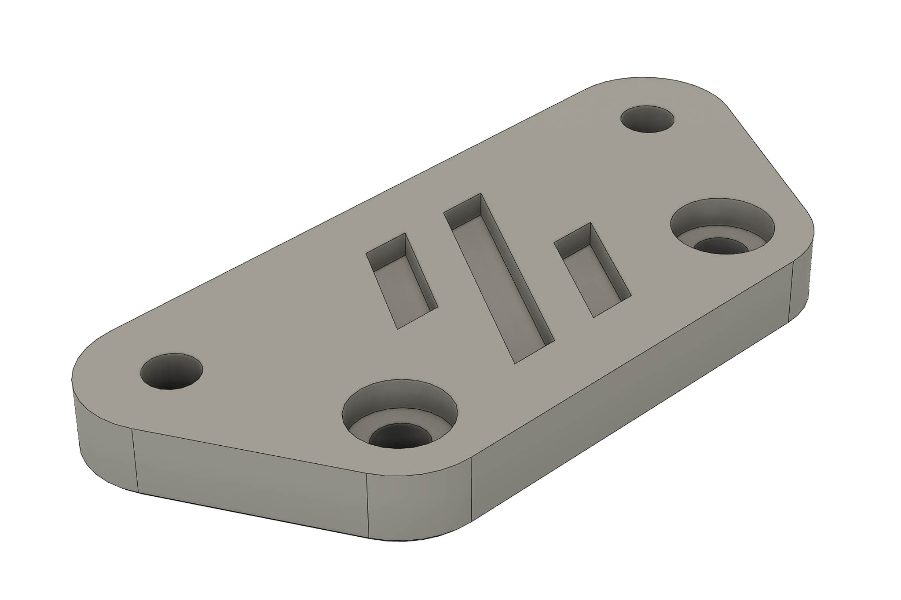
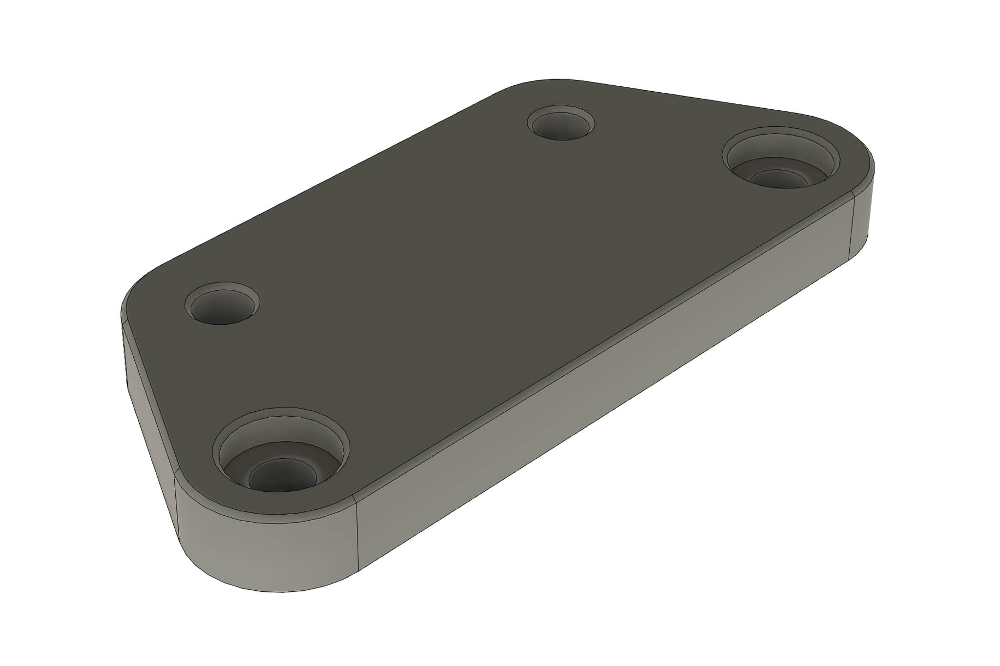
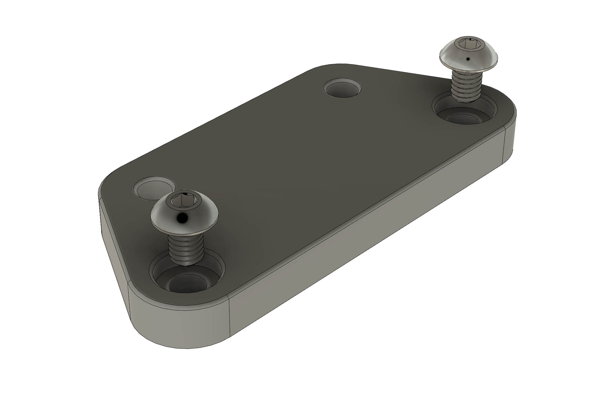
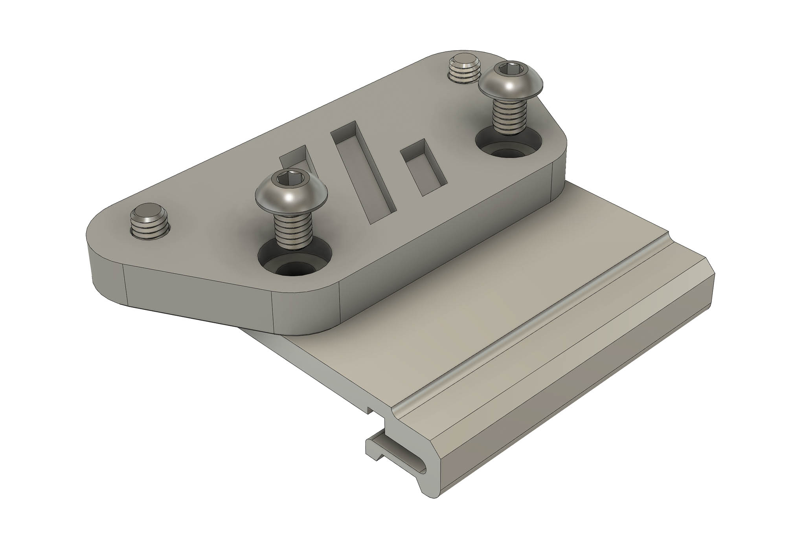
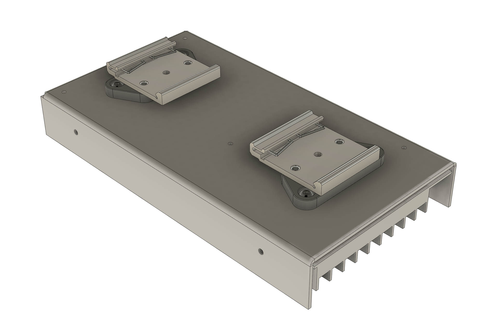
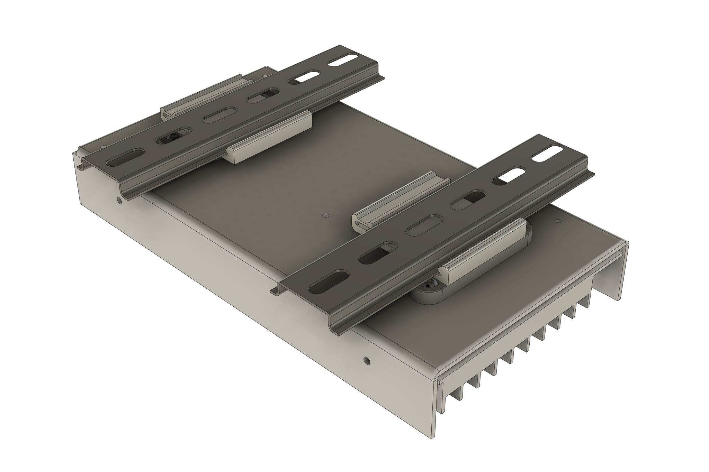

** Crossrail **

~~Crossrail is a railway construction project underway mainly in central London. Its aim is to provide...~~

Crossrail is an adapter for an RSP-200-24 or LRP-200-24 power supply, or other device with a 150x50mm M4 threaded hole pattern. With two DRP-03 DIN rail mounts it allows a power supply to be mounted across the rails (or vertically as it's sometimes called).

** Bill of materials **
 - 2 x DRP-03 DIN rail power supply plate (Mouser, Digikey, Time, Ebay, powersuppliesonline.co.uk etc)
 - 4 x M4x6 socket button screws (should already have these)

 Insert M4x6 button head screws into the power supply side

 Attach to DRP-03 with 2 more M4x6 button head screws

Attach to the power supply

And clip onto the DIN rails

