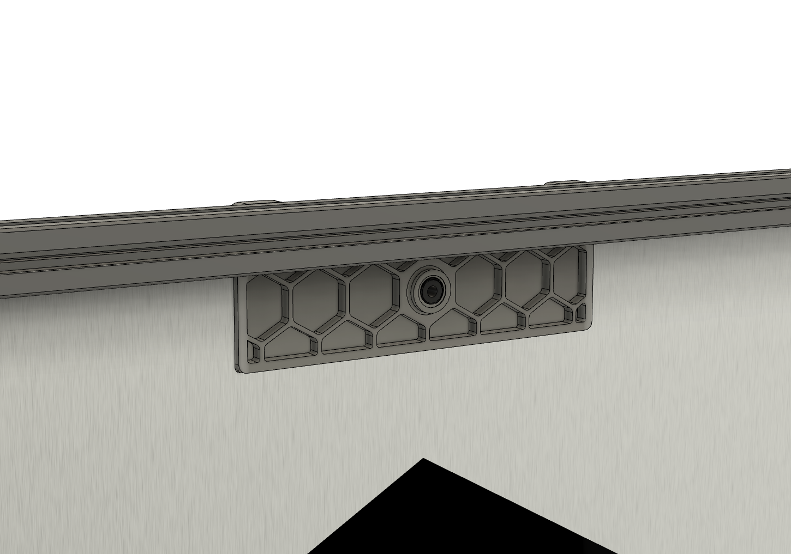
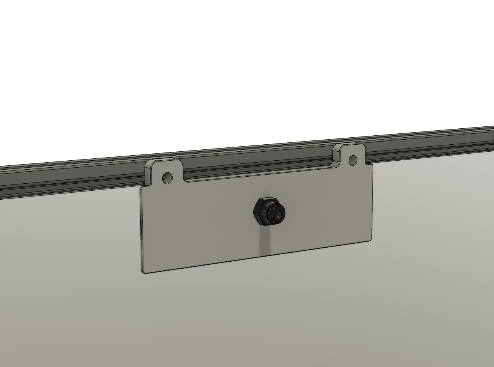
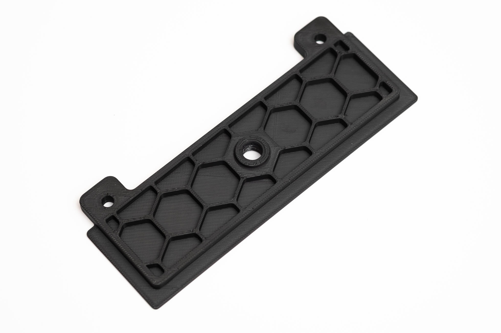
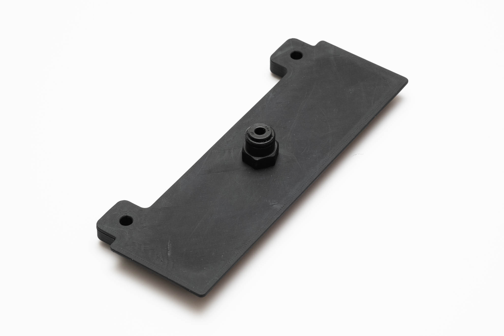

# Exhaust cover

The STLs will work with 3mm foam (compressed to 2.5mm) but other thicknesses are possible

Design influenced by https://github.com/VoronDesign/VoronUsers/tree/master/printer_mods/falo/magnetic_grill_cover

Fiction#5826 on Discord
