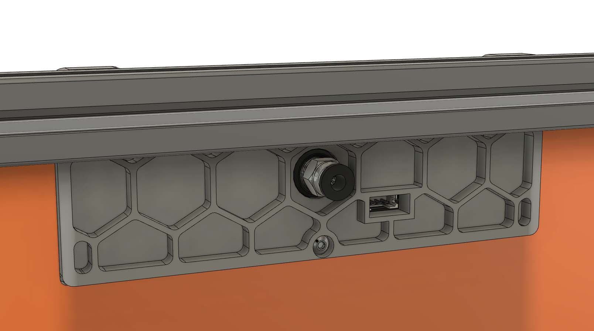

# Voron V2.4 exhaust cover and BTT Smart Filament Sensor mount

The STLs will work with 3mm foam (compressed to 2.5mm) but other thicknesses are possible

The same cover without the filament sensor mount https://github.com/Autocrit/VoronUsers/tree/master/printer_mods/Fiction/Exhaust_cover

Design "influenced" by https://github.com/VoronDesign/VoronUsers/tree/master/printer_mods/falo/magnetic_grill_cover

Fiction#5826 on Discord
