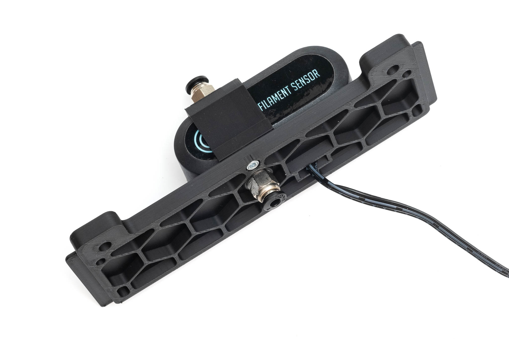
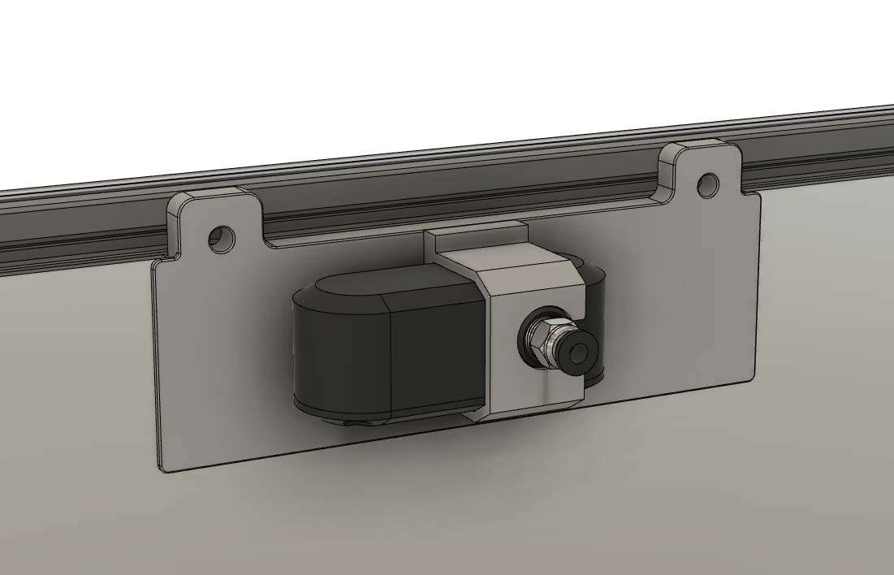
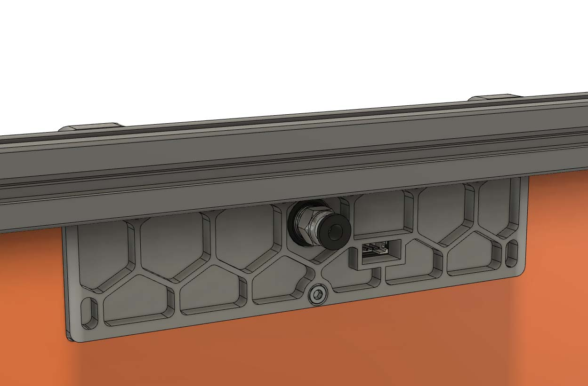
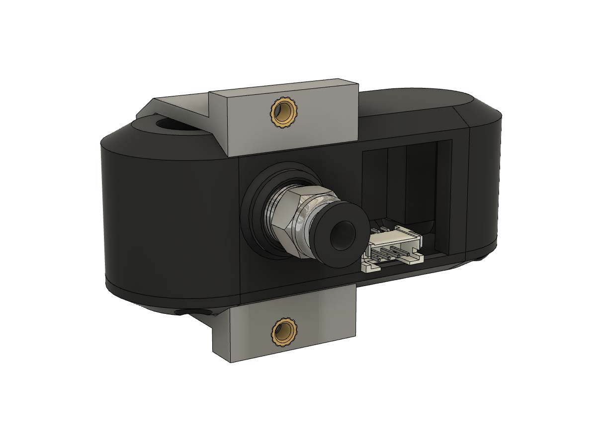
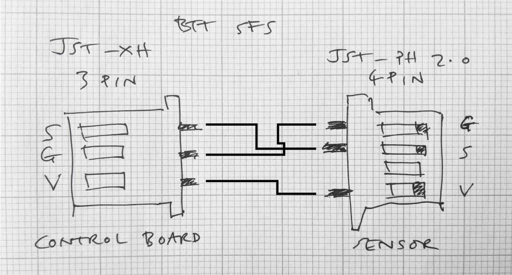
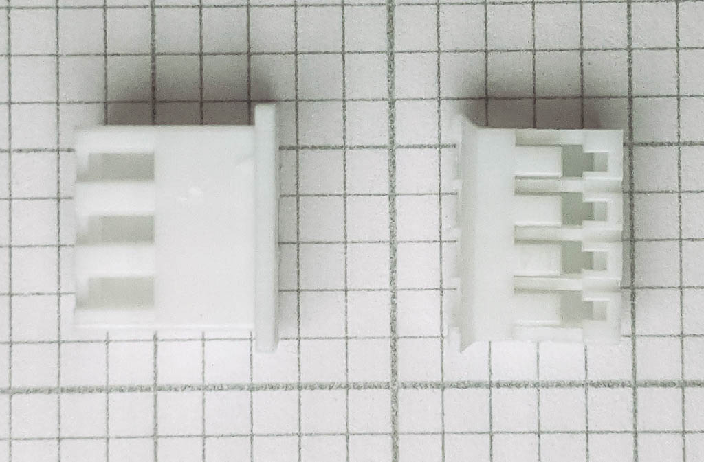

# Voron V2.4 exhaust cover and BTT Smart Filament Sensor mount

The STLs will work with 3mm foam (compressed to 2.5mm) but other thicknesses are possible

The same cover without the filament sensor mount https://github.com/Autocrit/VoronUsers/tree/master/printer_mods/Fiction/Exhaust_cover

Design influenced by https://github.com/VoronDesign/VoronUsers/tree/master/printer_mods/falo/magnetic_grill_cover

## BTT Smart Filament Sensor wiring

The supplied cable works as-is with the Fysetc Spider V1.1; I'm using it on Y-MIN which is PB13. A longer cable might be required in which case a 4-pin JST PH 2.0 connector is needed for the sensor end, and a 3-pin JST XH connector for the control board end.

Fiction#5826 on Discord
