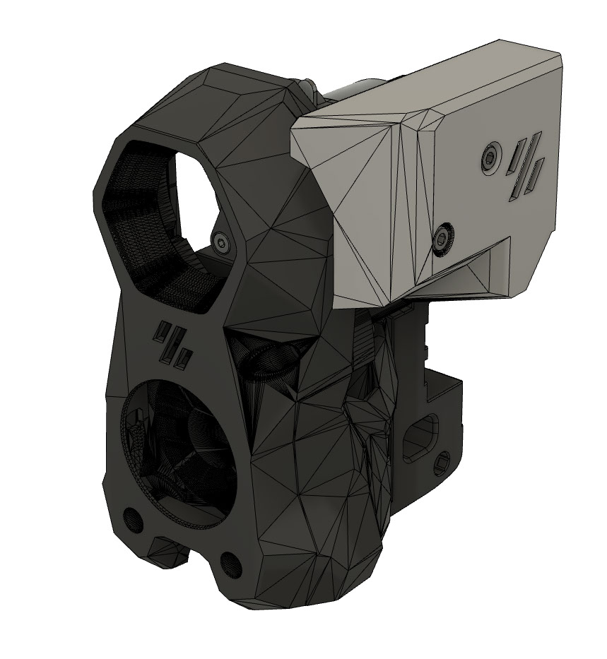
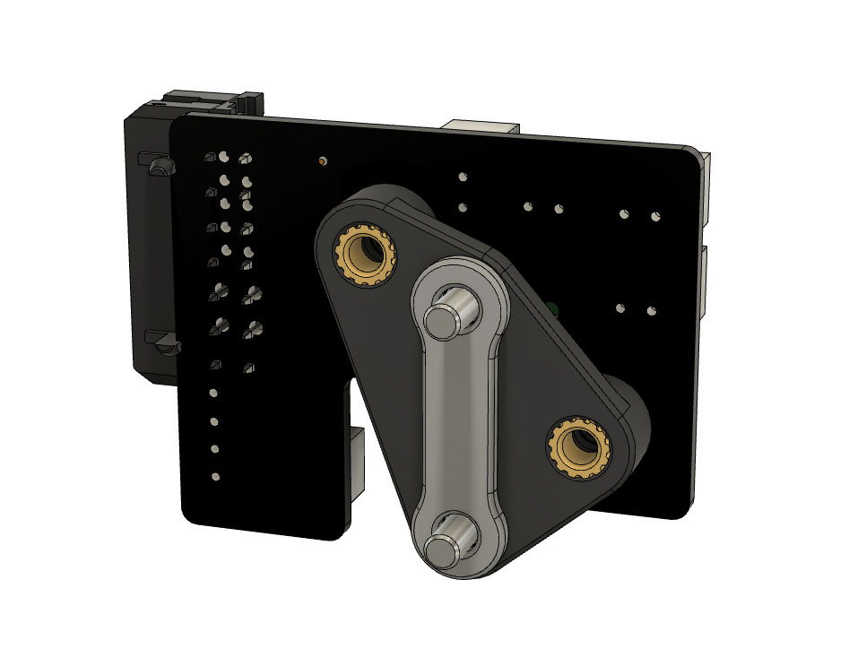

# LGX Lite toolhead PCB cover for Stealthburner

This is a (probably temporary) cover for the toolhead PCB on LGX Lite based on a model posted by Hartk in Discord chat; it requires a different toolhead PCB mount. Tested with version 3.2 of the toolhead PCB but it might work with the ERCF version.

Screws should be M3x20; longer than that and they might contact the extruder body.

## Images

