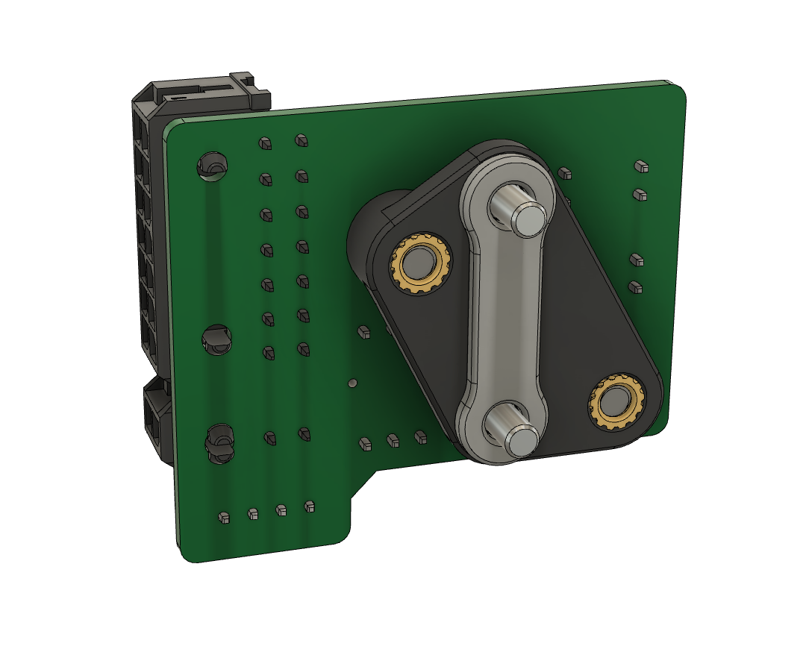
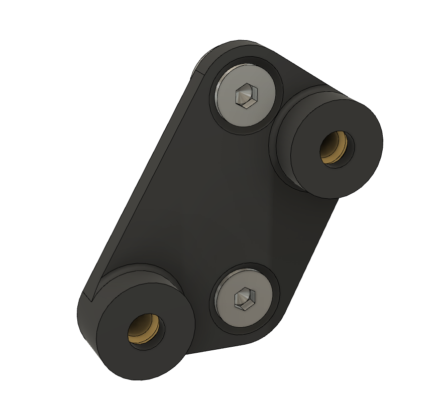

# LGX Lite toolhead PCB mount
Use with Mrgl-Mrgl's LGX Lite and cable chain mounts https://github.com/Mrgl-Mrgl/VoronUsers/tree/master/printer_mods/Mrgl-Mrgl/LGX_Lite_Mount

Tested with version 3.2 of the toolhead PCB https://github.com/VoronDesign/Voron-Hardware/tree/master/Afterburner_Toolhead_PCB

## Fasteners
- 2 x M3x5x4 threaded inserts (the standard Voron M3 threaded inserts)
- 2 x M3x8 countersunk socket head screws to attach the toolhead PCB mount to the LGX Lite body side (with square nuts installed)
- 2 x M3x8 socket head cap screws to attach the toolhead PCB to the mount (use plastic washers)
- 2 x M3 plastic washers

## Notes
- install the threaded inserts from the flat side of the mount. This will leave some plastic between the threaded insert and the PCB to prevent damage to traces etc
- use the spacer or washers between the mount and the LGX Lite body to avoid interference with the gears

## Images

Fiction#5826 on Discord
