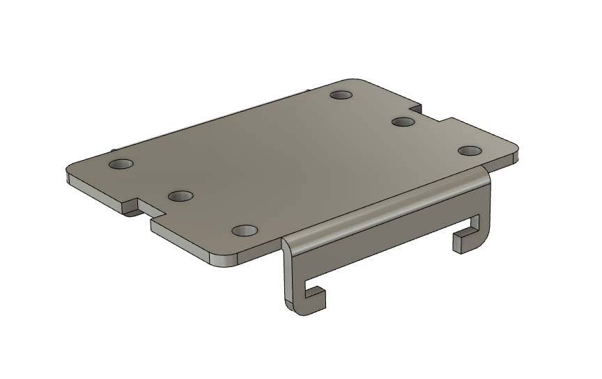

# SSR bracket mounts
A collection of mounts that use the SSR DIN rail brackets

## Pi SSR bracket mount
Mounts a Pi in a Geekworm armour heatsink case to a SSR DIN rail bracket. M2.5x16 SHCSs for the case

