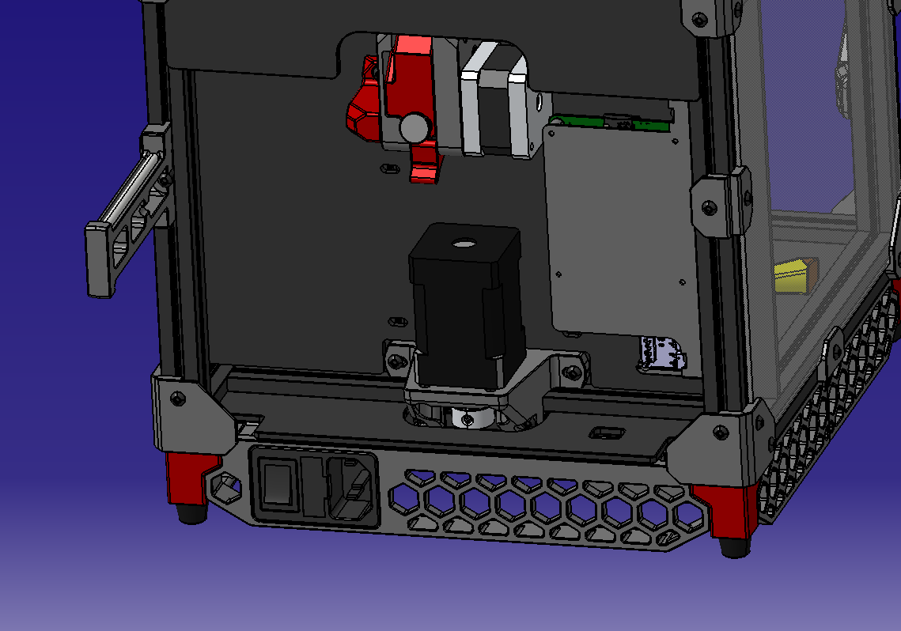
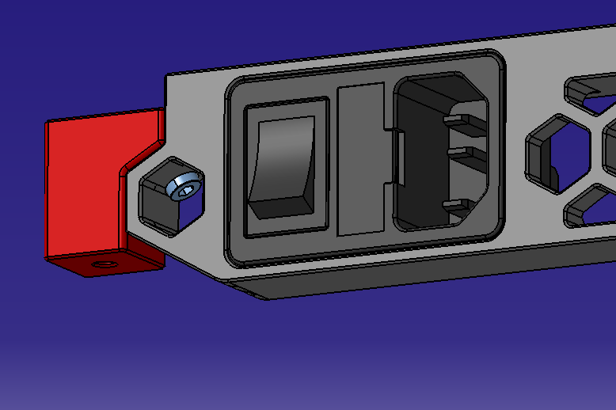

# Rear skirt with C14 inlet

One part rear skirt for V0.

## Requirements

1. Bigger printer than V0
2. New feet to mount the skirt to
3. C14 inlet (I used [this](https://www.conrad.com/p/tru-components-1378457-iec-connector-plug-vertical-mount-total-number-of-pins-2-pe-10-a-black-1-pcs-1568883))

## Installation

1. Remove BOM feet
2. Melt heatset inserts into modded feet
3. Install modded feet
4. Install rear skirt
5. Install C14 inlet

## Pictures
### Rear skirt
 

### Mounting
