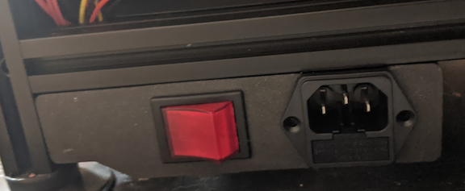
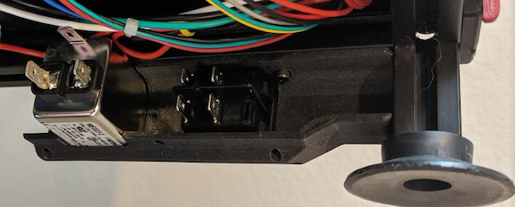

# Filtered Power for Voron 1.8
This mod allows the use of the prior spec TycoElectronics filtered power inlet and ZF rocker switch. The skirt can be configured to a custom X-Spec as needed (assuming you modify the other skirts) using parameters in Fusion 360.

## Pictures

A special thanks to Venny#8759 on discord for testing and providing the pictures!
