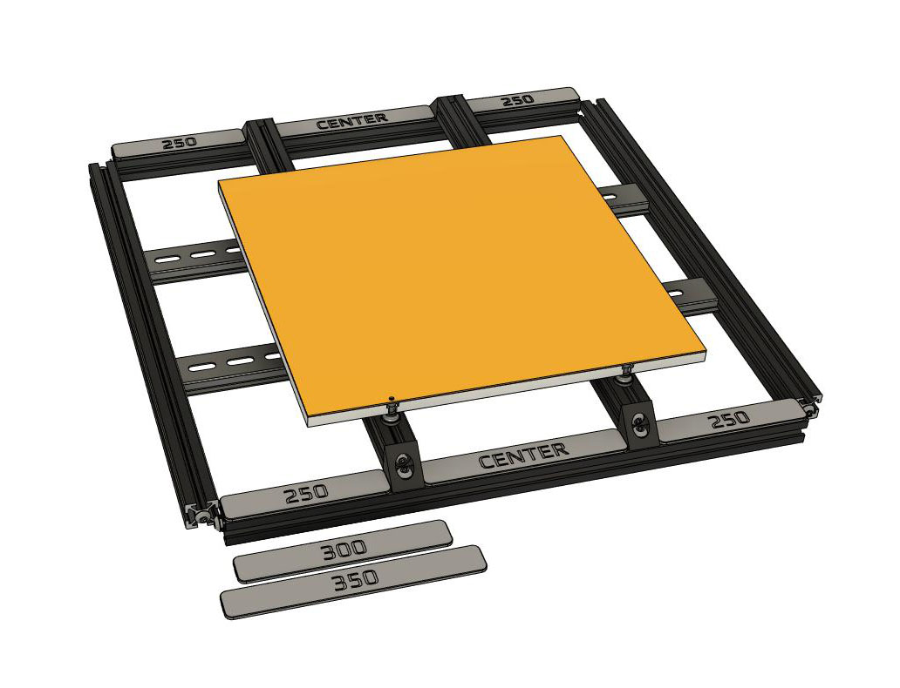
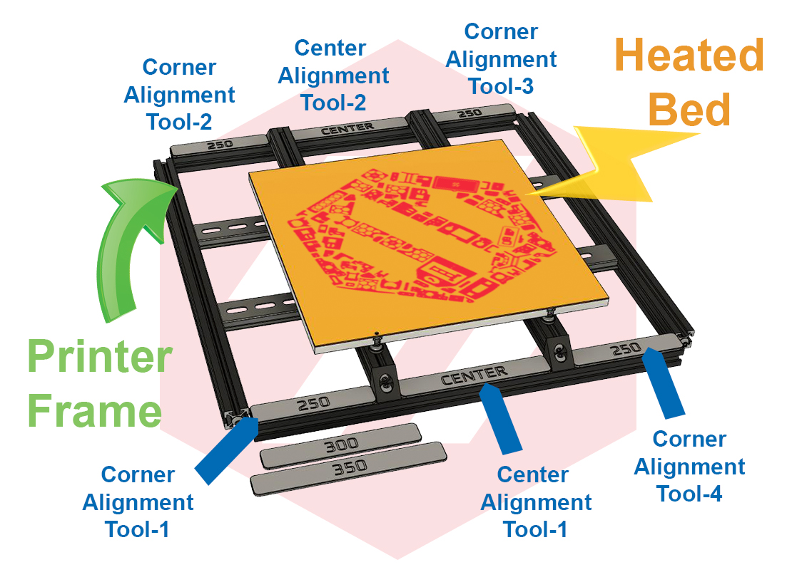

# Bed Support Alignment Tools for Voron 2.4 and Trident

This repository contains .stl files of bed support aligment tools for each of the standard Voron builds. The Bed support alignment tools will assist in helping align the Bed support extrustions to the frame.  The Voron assembly manual does not state where the Bed support extrusions should be placed so I created this very simple tool that you can 3D print.  When the alignment tools are placed in all four corners the Bed supports extrusions will butt up agains them so that you can screw the bed support extrusions down to the frame.  For completeness, I also created a piece that you can place in between the two bed supports as a second way to check to see if everything is correctly placed.

## Picture of Bed Support Alignment Tool:

## This is how to use the Alignment Tools:

