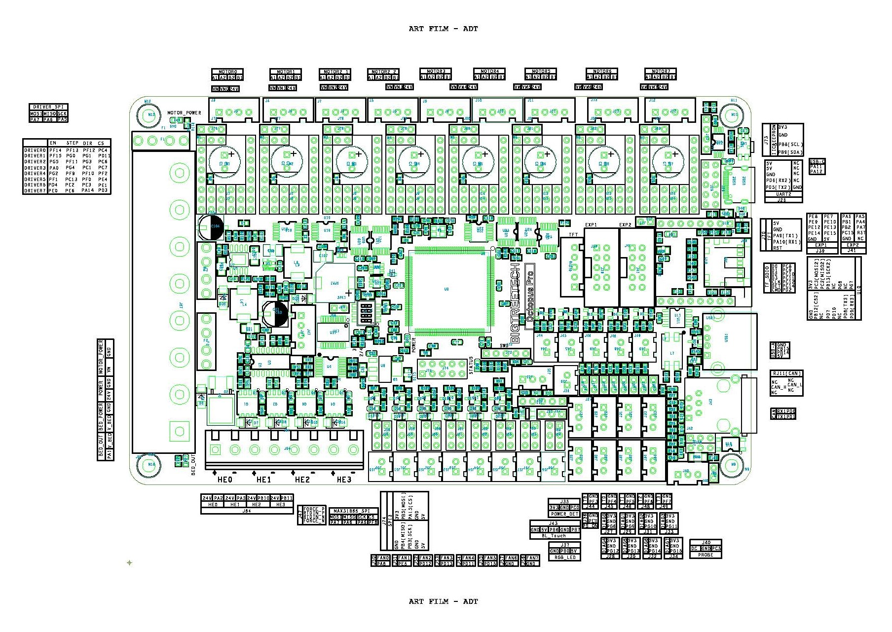

# Color PIN Diagram for Bigtreetech Octopus Pro V1.0 Bpard

This repository contains .jpg and .pdf files for the BIGTREETECH's Octopus Pro V1.0 board.

## The PDF file of the Color PIN Diagram for the Octopus Pro V1.0:

### Why use the PDF file of the Color PIN Diagram:

The PDF file looks the same as the JPG file. You can enlarge the image for both file types to 
get all the details, but the PDF file contains URL links that will take you to websites that contain further information.  For example there are URL links that will take you to the processor datasheet.  If the color diagram contains a URL in text then just click on the URL and the PDF  will take you to that URL.

You can view the PDF in your browser by clicking on the filename "BIGTREETECH-Octopus-Pro-color-PIN.pdf" and then hit the download button.

## A Picture of the Color PIN Diagram for the Octopus Pro V1.0:

You can download the .jpg file for this Color PIN Diagram by clicking on the file "BIGTREETECH-Octopus-Pro-color-PIN.jpg" and then hit the download button.

## Picture of the Original PIN Diagram from Bigtreetech for the Octopus Pro V1.0:

## The Original Bigtreetech Wiring Diagram for the Octopus Pro V1.0:

## Bigtreetech has a Github repository for the Octopus Pro V1.0:

The Bigtreetech Github repository is located at https://github.com/bigtreetech/BIGTREETECH-OCTOPUS-Pro

## Klipper firmware supports the Octopus Pro V1.0 board:

Here is the link to the config file on github for the Octopus V1.1 board https://github.com/Klipper3d/klipper/blob/master/config/generic-bigtreetech-octopus.cfg.

There are differences between the Octopus V1.1 pin-out and the Octopus Pro V1.0 pin-out.  Please use this color pin diagram in this repository to obtain the correct PIN assigments.

If you decide to flash a new bootloader to the Octopus Pro V1.0 board (you should not need to because you can upload the new Klipper firmware using the micro-SD card reader) and find that the micro-SD card bootloader no longer works you will want to return the board to it's shipment state by finding the original bootloader and "bootlaoder+firmware" files at https://github.com/GadgetAngel/BTT_SKR_13_14_14T_SD-DFU-Bootloader/tree/main/bootloader_bin/backed_up_original_bootloaders

