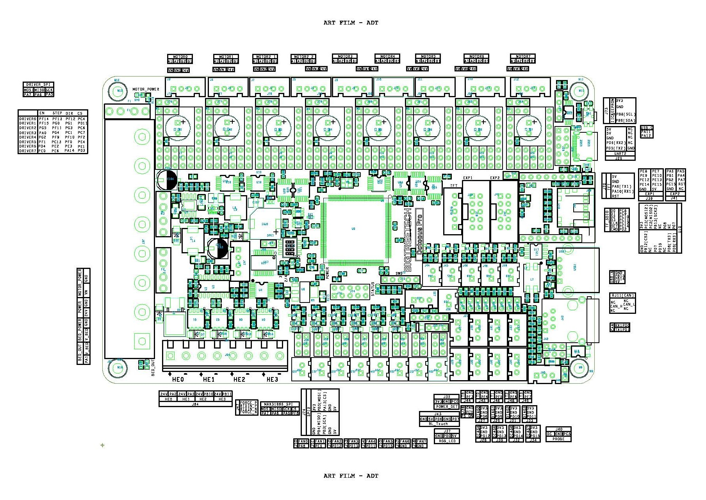
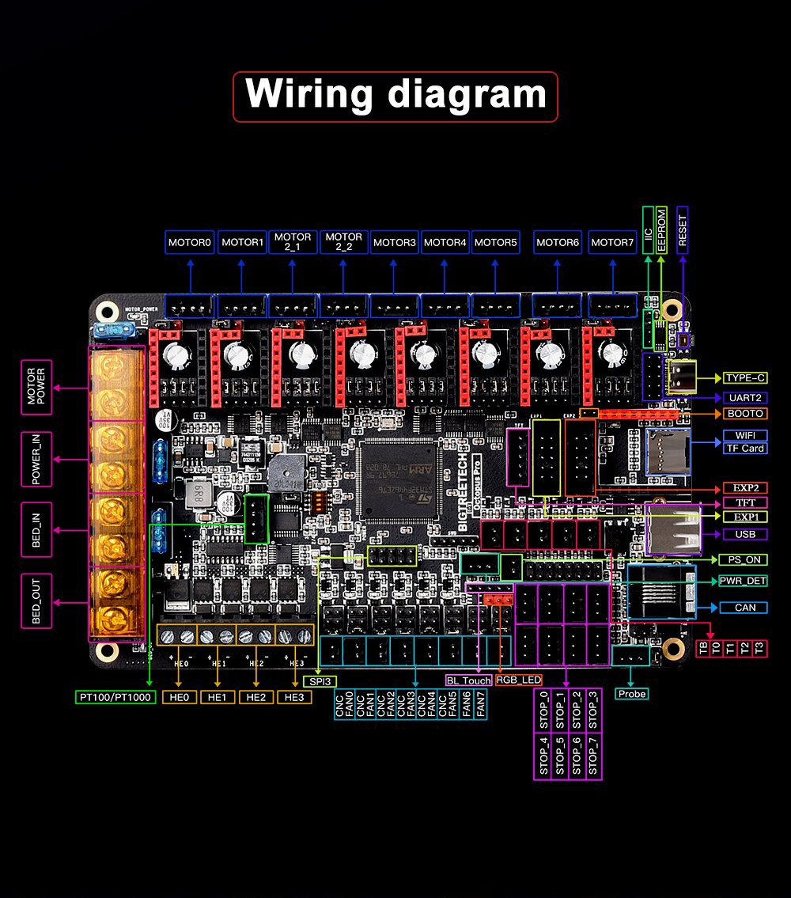

# "Color PIN Diagram" for Bigtreetech Octopus Pro V1.0 Board

This repository contains JPG and PDF files for the BIGTREETECH's Octopus Pro V1.0 board.

## The PDF file of the "Color PIN Diagram" for the Octopus Pro V1.0:

### Why use the PDF file of the "Color PIN Diagram":

The PDF file looks the same as the JPG file. You can enlarge the image for both file types to
get all the details, but the PDF file contains URL links that will take you to websites that contain further information.  For example there are URL links that will take you to the processor datasheet.  If the color diagram contains a URL in text then just click on the URL and the PDF  will take you to that URL.

You can view the PDF in your browser by clicking on the filename "BIGTREETECH-Octopus-Pro-color-PIN-V2.0.pdf" and then hit the download button.

## A Picture of the "Color PIN Diagram" for the Octopus Pro V1.0:

You can download the JPG file for this "Color PIN Diagram" by clicking on the file "BIGTREETECH-Octopus-Pro-V1.0-color-PIN-V2.0.jpg" and then hit the download button.  Again, to download the PDF just click on the filename "BIGTREETECH-Octopus-Pro-color-PIN-V2.0.pdf" and hit the download button.

## Picture of the Original PIN Diagram from Bigtreetech for the Octopus Pro V1.0:

## The Original Bigtreetech Wiring Diagram for the Octopus Pro V1.0:

## Bigtreetech has a Github repository for the Octopus Pro V1.0:

The Bigtreetech Github repository is located at https://github.com/bigtreetech/BIGTREETECH-OCTOPUS-Pro

## Klipper firmware supports the Octopus Pro V1.0 board:

Here is the link to the config file on github for the Octopus pro V1.0 board https://github.com/Klipper3d/klipper/blob/master/config/generic-bigtreetech-octopus.cfg.

If you are using the "PROBE" connector for a proximity sensor you will need to add a [probe] section to the "generic-bigtreetech-octopus.cfg" file and ensure that the sensor_pin: PC5

There is only two PIN that are different between the Octopus V1.1 pin-out and the Octopus Pro V1.0 pin-out. The Octopus V1.1 pin-out has PC5 on the EXP2 connector but on the Octopus Pro V1.0 this pin on the EXP2 connector is now "Not Connected (NC)".

The second PIN difference is that on the Octopus V1.1 pin-out PB7 is the signal PIN used on the PROBE/SENSOR connector and on the BLTouch header but on the Octopus Pro V1.0 the signal pin on the PROBE connector is PC5.  Which means that on the Octopus V1.1 board you can only use either a BLTouch or a Proximity Sensor but NOT both. On the Octopus Pro V1.0 since the signal pins for the PROBE connector is different from the BLTouch, if you wanted to, you could use both ports.

If you plan to use a voltage higher than 24V on MOTOR_POWER_IN then please pay attention to the following footnotes on the "Color PIN Diagram": 1 and 5.

Please use the "Color PIN Diagram" in this repository to obtain the correct PIN assigments.

If you decide to flash a new bootloader to the Octopus Pro V1.0 board (you should not need to because you can upload the new Klipper firmware using the micro-SD card reader) and find that the micro-SD card bootloader no longer works you will want to return the board to it's shipment state by finding the original bootloader and "bootlaoder+firmware" files at https://github.com/GadgetAngel/BTT_SKR_13_14_14T_SD-DFU-Bootloader/tree/main/bootloader_bin/backed_up_original_bootloaders

