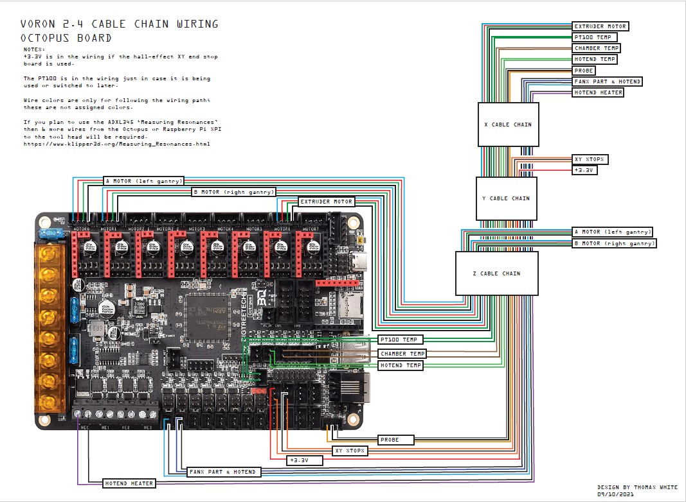

# "Color PIN Diagram" for Bigtreetech Octopus V1.0 and Octopus V1.1 Board:

This repository contains JPG and PDF files for the BIGTREETECH's Octopus V1.1 board.

## The PDF file of the "Color PIN Diagram" for the Octopus V1.0 and Octopus V1.1 Board:

### Why use the PDF file of the "Color PIN Diagram":

The PDF file looks the same as the JPG file. You can enlarge the image for both file types to
get all the details, but the PDF file contains URL links that will take you to websites that contain further information.  For example there are URL links that will take you to the processor datasheet.  If the color diagram contains a URL in text then just click on the URL and the PDF  will take you to that URL.

You can view the PDF in your browser by clicking on the filename "BIGTREETECH-Octopus-V1.1-color-PIN.pdf" and then hit the download button.

## A Picture of the "Color PIN Diagram" for the Octopus V1.0 and Octopus V1.1 Board:

You can download the JPG file for this "Color PIN Diagram" by clicking on the file "BIGTREETECH-Octopus-1.1-color-PIN.jpg" and then hit the download button.  Again, to download the PDF just click on the filename "BIGTREETECH-Octopus-V1.1-color-PIN.pdf" and hit the download button.

## Picture of the Original PIN Diagram from Bigtreetech for the Octopus V1.0 and Octopus V1.1 Board:

## The Original Bigtreetech Wiring Diagram for the Octopus V1.0 and Octopus V1.1 Board:

### For general purposes:

## For Voron 2.4 builders:

You can find Bigtreetech's Voron 2.4 wiring diagram at https://github.com/bigtreetech/BIGTREETECH-OCTOPUS-V1.0/blob/master/Octopus%20works%20on%20Voron%20v2.4/Firmware/BTT_OctoPus_Voron2.4_Wiring_English.pdf

Here is a picture of the Voron 2.4 wiring harness diagram by Thomas White for the Octopus V1.0 or Octopus V1.1 baord to the tool head (no tool head PCB). You can find Thomas White's Voron 2.4 wiring harness diagram in PDF format here in this repository.  To download the PDF just click on the filename "Voron_2.4_Octopus_Cable_Chain_wiring_by_Thomas_White.pdf" and hit the download button.

## Bigtreetech has a Github repository for the Octopus V1.0 and Octopus V1.1 Board:

The Bigtreetech Github repository is located at https://github.com/bigtreetech/BIGTREETECH-OCTOPUS-V1.0

## Klipper firmware supports the Octopus V1.0 and Octopus V1.1 Board:

Here is the link to the config file on github for the Octopus V1.1 board https://github.com/Klipper3d/klipper/blob/master/config/generic-bigtreetech-octopus.cfg.

Since the PB7 PIN is shared between the PROBE connector and the BLTouch header you will only be able to use one of these two connectors.

If you decide later you want to look for a free I/O pin please do not make the mistake and think that if you use the PROBE connector for the proximity sensor then you have a free I/O pin on the BLTouch header.  That is NOT the case since PB7 is tied to both connectors.

If you are using the "PROBE" connector for a proximity sensor you will need to add a [probe] section to the "generic-bigtreetech-octopus.cfg" file and ensure that the sensor_pin: PB7

Please use the "Color PIN Diagram" in this repository to obtain the correct PIN assigments.

If you decide to flash a new bootloader to the Octopus V1.1 board (you should not need to because you can upload the new Klipper firmware using the micro-SD card reader) and find that the micro-SD card bootloader no longer works you will want to return the board to it's shipment state by finding the original bootloader and "bootlaoder+firmware" files at https://github.com/GadgetAngel/BTT_SKR_13_14_14T_SD-DFU-Bootloader/tree/main/bootloader_bin/backed_up_original_bootloaders

