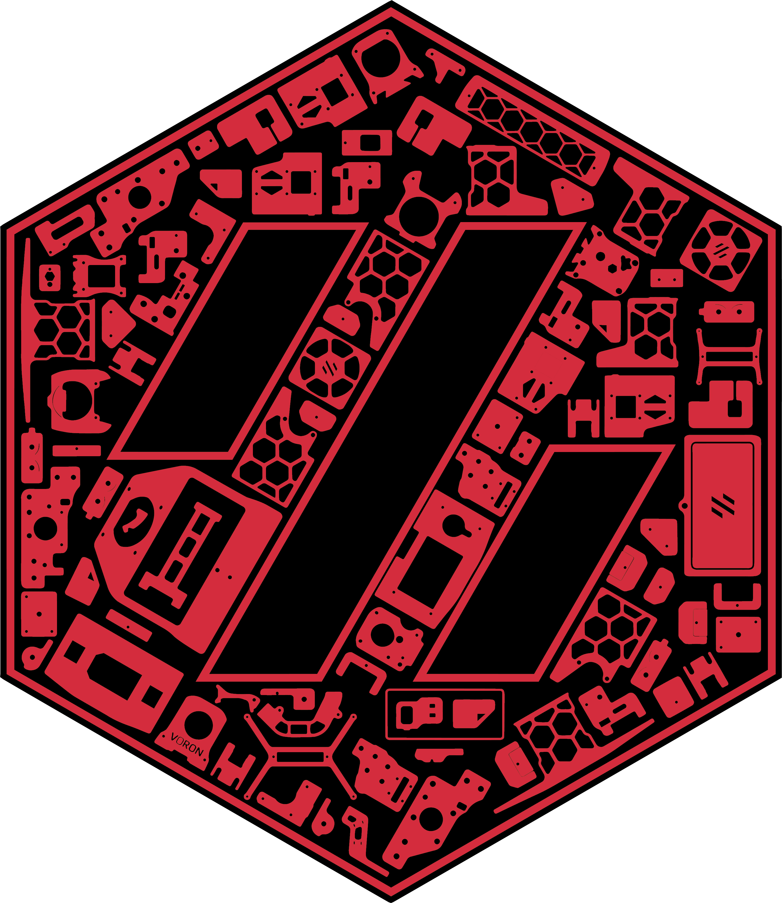
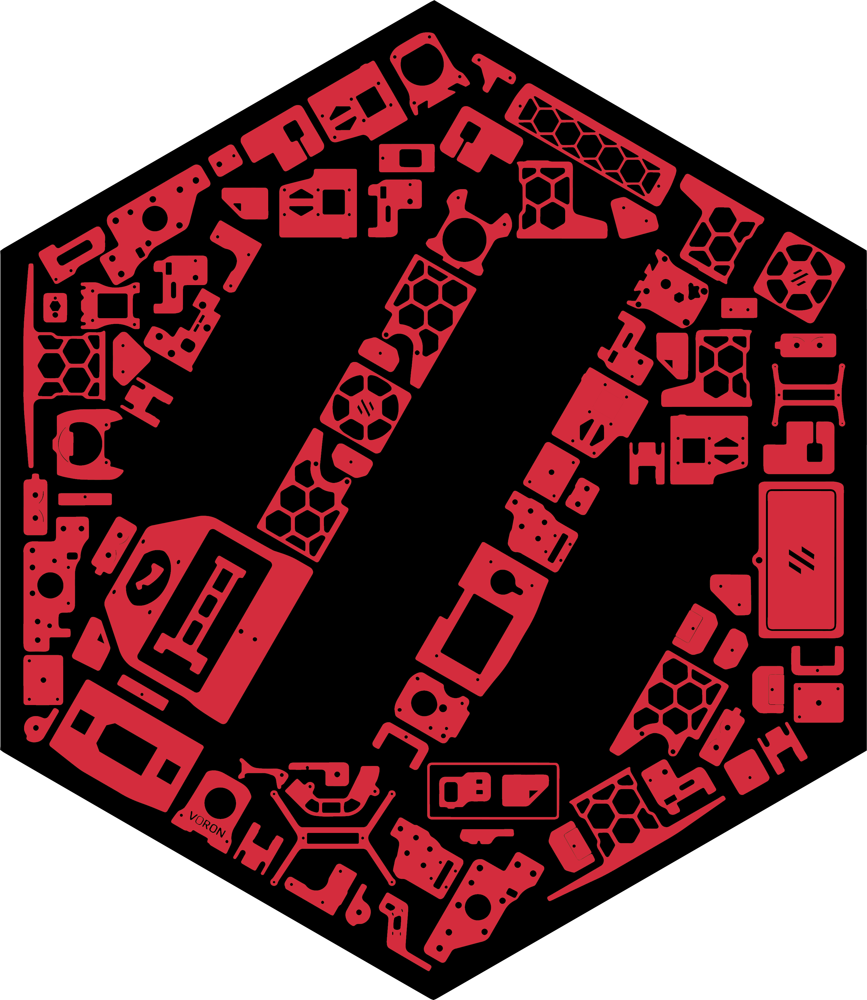
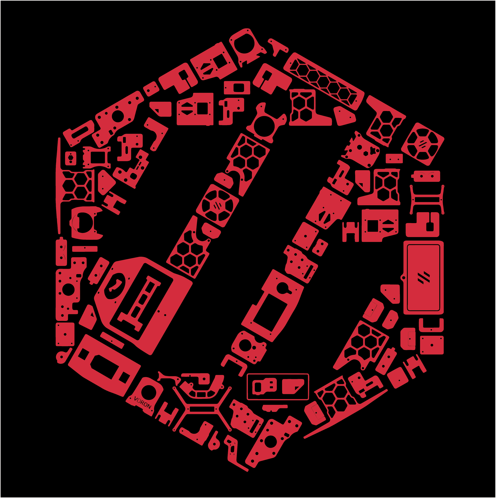
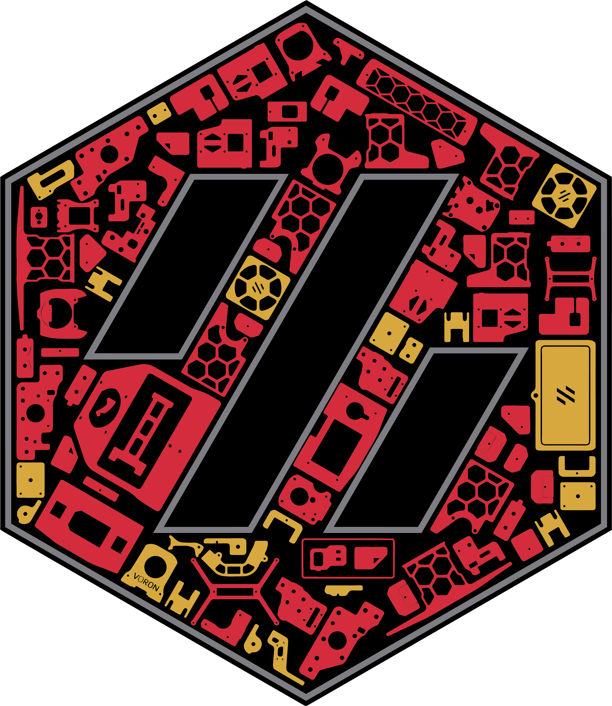
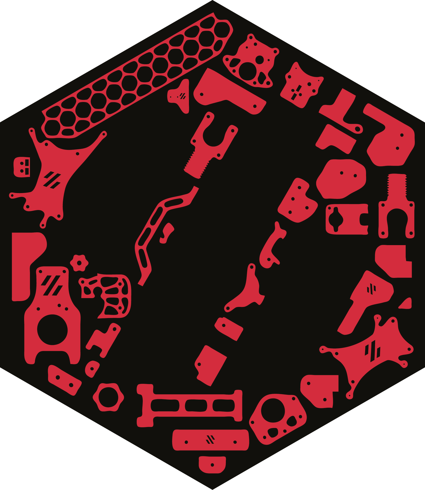
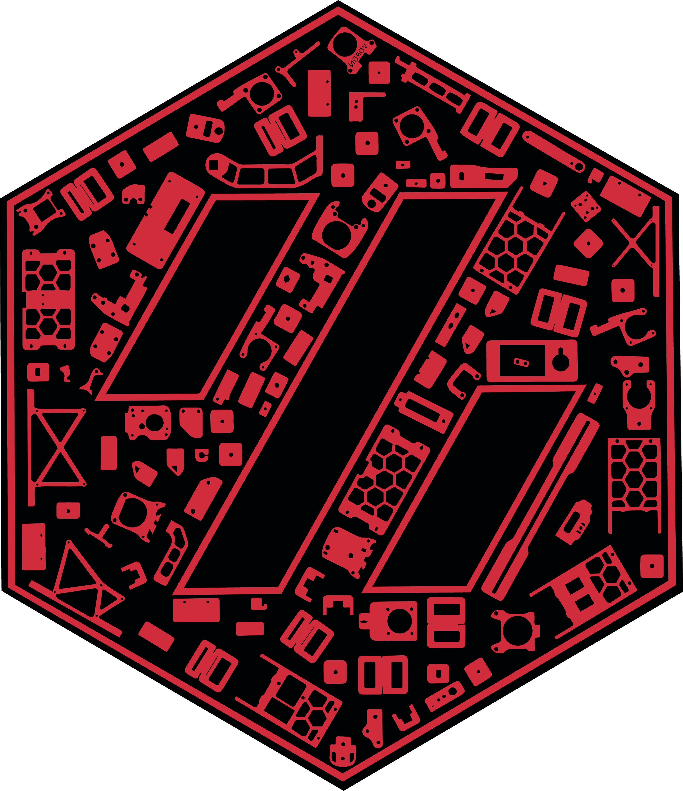
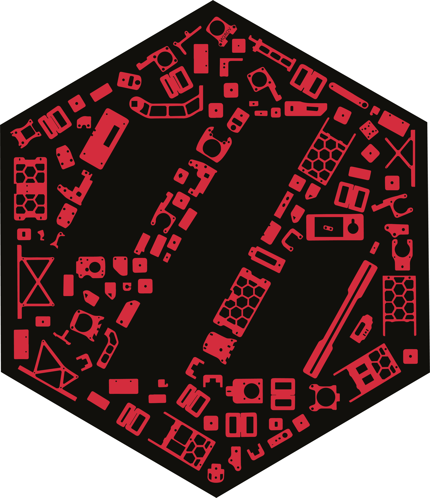
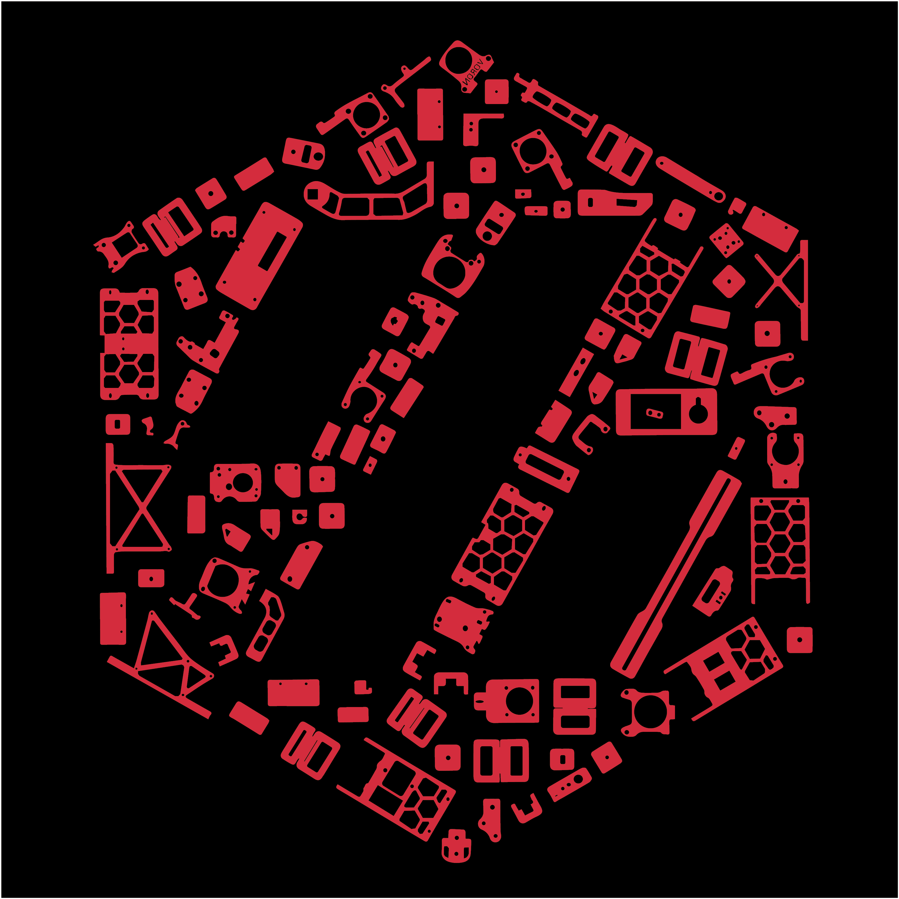
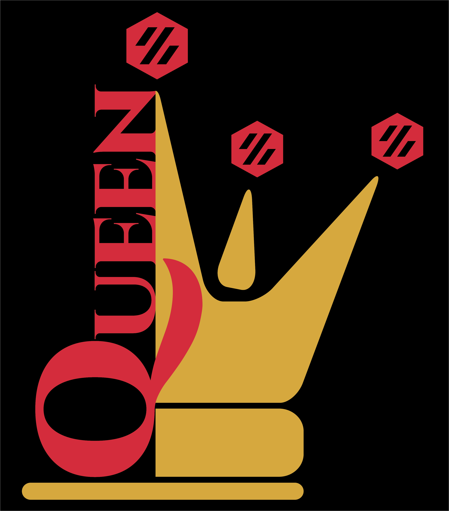

# Cricut_Voron_Logos
This repository contains vector files I have created for the Voron community and for my own Voron builds.

---

# Purpose of this repository

The purpose of this repository is to share vector files that I have created for my Voron Builds.

---
---

## For "Voron 2.4 Build with 1 Color"

### Link to Cricut Design Space for "Voron 2.4 1_Color_Layer":
### https://design.cricut.com/landing/project-detail/6137795f68f6f90001d7abfd

### Link to my Repository on Github that contains all files I used to produce the "Voron 2.4 1_Color_Layer" .svg file: https://github.com/GadgetAngel/Cricut_Voron_Logos/tree/main/Voron_2.4_Logo/1_Color_Layer/Current_Design_Files

### Picture of "Voron 2.4 Build with 1 Color":

---

## For "Voron 2.4 Build with 1 Color and Without LOGO outline" with a Silhouette Layer

### Link to Cricut Design Space for "Voron 2.4 1_Color_Layer_WithOut_Logo_Outline_With_Silhouette":
### https://design.cricut.com/landing/project-detail/614501c2623cde00018a4fe6

### Link to my Repository on Github that contains all files I used to produce the "Voron 2.4 1_Color_Layer_WithOut_Logo_Outline_With_Silhouette" .svg file: https://github.com/GadgetAngel/Cricut_Voron_Logos/tree/main/Voron_2.4_Logo/1_Color_Layer_WithOut_Logo_Outline/Current_Design_Files

### Picture of "Voron 2.4 Build with 1 Color and Without LOGO outline" with a Silhouette Layer:

---

## For "Voron 2.4 Build with 1 Color and Without LOGO outline" WITHOUT the Silhouette Layer

### Link to Cricut Design Space for "Voron 2.4 1_Color_Layer_WithOut_Logo_Outline_WithOut_Silhouette":
### https://design.cricut.com/landing/project-detail/614502f434e2330001c7de37

### Link to my Repository on Github that contains all files I used to produce the "Voron 2.4 1_Color_Layer_WithOut_Logo_Outline_WithOut_Silhouette" .svg file: https://github.com/GadgetAngel/Cricut_Voron_Logos/tree/main/Voron_2.4_Logo/1_Color_Layer_WithOut_Logo_Outline/Current_Design_Files

### Picture of "Voron 2.4 1_Color_Layer_WithOut_Logo_Outline_WithOut_Silhouette and BackPanel":

---

## For "Voron 2.4 Build with 3 Colors"

### Link to Cricut Design Space for "Voron 2.4 3_Color_Layer":
### https://design.cricut.com/landing/project-detail/6137b53b0b4942000143ea8c

### Link to my Repository on Github that contains all files I used to produce the "Voron 2.4 3_Color_Layers" .svg file: https://github.com/GadgetAngel/Cricut_Voron_Logos/tree/main/Voron_2.4_Logo/3_Color_Layers/Current_Design_Files

### Picture of "Voron 2.4 Build with 3 Colors":

---
---

## For "Voron 0.1 Build with 1 Color"

### Link Cricut Design Space for "Voron 0.1 1_Color_Layer":
### https://design.cricut.com/landing/project-detail/613569712ecf490001974996

### Link to my Repository on Github that contains all files I used to produce the "Voron 0.1 1_Color_Layer" .svg file: https://github.com/GadgetAngel/Cricut_Voron_Logos/tree/main/Voron_0.1_Logo/1_Color_Layer/Current_Design_Files

### Picture of "Voron 0.1 Build with 1 Color":

---

## For "Voron 0.1 Build with 1 Color and without LOGO Outline" with a Silhouette Layer

### Link for "Voron 0.1 1Color_WithOut_Logo_Outline_With_Silhouette":
### https://design.cricut.com/landing/project-detail/6147bad19e2fcb000119bb71

### Link to my Repository on Github that contains all files I used to produce the "Voron 0.1 1Color_WithOut_Logo_Outline_With_Silhouette" .svg file: https://github.com/GadgetAngel/Cricut_Voron_Logos/tree/main/Voron_0.1_Logo/1_Color_Layer_WithOut_Logo_Outline/Current_Design_Files

### Picture of "Voron 0.1 Build with 1 Color and without LOGO Outline" with a Silhouette Layer:

---

## For "Voron 0.1 Build with 1 Color and without LOGO Outline" WITHOUT the Silhouette Layer

### Link for "Voron 0.1 1Color_WithOut_Logo_Outline_WithOut_Silhouette":
### https://design.cricut.com/landing/project-detail/6147bc71d61aad00013c14f6

### Link to my Repository on Github that contains all files I used to produce the "Voron 0.1 1Color_WithOut_Logo_Outline_WithOut_Silhouette" .svg file: https://github.com/GadgetAngel/Cricut_Voron_Logos/tree/main/Voron_0.1_Logo/1_Color_Layer_WithOut_Logo_Outline/Current_Design_Files

### Picture of "Voron 0.1 1Color_WithOut_Logo_Outline_WithOut_Silhouette and BackPanel":

---
---

## For "Voron Switch Wire Build with 1 Color"

### Link Cricut Design Space for "Voron Switch Wire 1_Color_Layer":
### https://design.cricut.com/landing/project-detail/613bf24c5dddf60001c14fbb

### Link to my Repository on Github that contains all files I used to produce the "Voron Switch Wire 1_Color_Layer" .svg file: https://github.com/GadgetAngel/Cricut_Voron_Logos/tree/main/Voron_SW_Logo/1_Color_Layer/Current_Design_Files

### Picture of "Voron Switch Wire Build with 1 Color":

---

## For "Voron Switch Wire Build with 1 Color and without LOGO Outline" with a Silhouette Layer

### Link for "Voron Switch Wire 1Color_WithOut_Logo_Outline_With_Silhouette":
### https://design.cricut.com/landing/project-detail/6147c7da7e75d400012c4684

### Link to my Repository on Github that contains all files I used to produce the "Voron Switch Wire 1Color_WithOut_Logo_Outline_With_Silhouette" .svg file: https://github.com/GadgetAngel/Cricut_Voron_Logos/tree/main/Voron_SW_Logo/1_Color_Layer_WithOut_Logo_Outline/Current_Design_Files

### Picture of "Voron Switch Wire Build with 1 Color and without LOGO Outline" with a Silhouette Layer:

---

## For "Voron Switch Wire Build with 1 Color and without LOGO Outline" WITHOUT the Silhouette Layer

### Link for "Voron Switch Wire 1Color_WithOut_Logo_Outline_WithOut_Silhouette":
### https://design.cricut.com/landing/project-detail/6147c95a2a3d570001fae277

### Link to my Repository on Github that contains all files I used to produce the "Voron Switch Wire 1Color_WithOut_Logo_Outline_WithOut_Silhouette" .svg file: https://github.com/GadgetAngel/Cricut_Voron_Logos/tree/main/Voron_SW_Logo/1_Color_Layer_WithOut_Logo_Outline/Current_Design_Files

### Picture of "Voron Switch Wire 1Color_WithOut_Logo_Outline_WithOut_Silhouette and BackPanel":

---
---

## For "Voron Plain Logo with 1 Color" to be used by ANY Voron Build

### Link Cricut Design Space for "Voron Plain Logo 1_Color_Layer":
### https://design.cricut.com/landing/project-detail/6137b8cce6ad93000134232e

### Link to my Repository on Github that contains all files I used to produce the "Voron Plain Logo 1_Color_Layer" .svg file: https://github.com/GadgetAngel/Cricut_Voron_Logos/tree/main/Voron_Plain_Logo/1_Color_Layer/Current_Design_Files

### Picture of "Voron Plain Logo with 1 Color":

---
---

## For MY OWN Voron 2.4 Build

### Link Cricut Design Space for "Voron 2.4 QueenWithPlainVoronLogo2":
### https://design.cricut.com/landing/project-detail/6137e15bd254460001dad096

### Link to my Repository on Github that contains all files I used to produce the "Voron 2.4 QueenWithPlainVoronLogo2" .svg file: https://github.com/GadgetAngel/Cricut_Voron_Logos/tree/main/Voron_2.4_Queen_Logo/QueenWithPlainVoronLogo2/Current_Design_Files

### Picture of "Voron 2.4 QueenWithPlainVoronLogo2":

---

# All Cricut Design Space Files can be found at https://www.pinterest.com/joannmanges/voron_logo_simplified/
