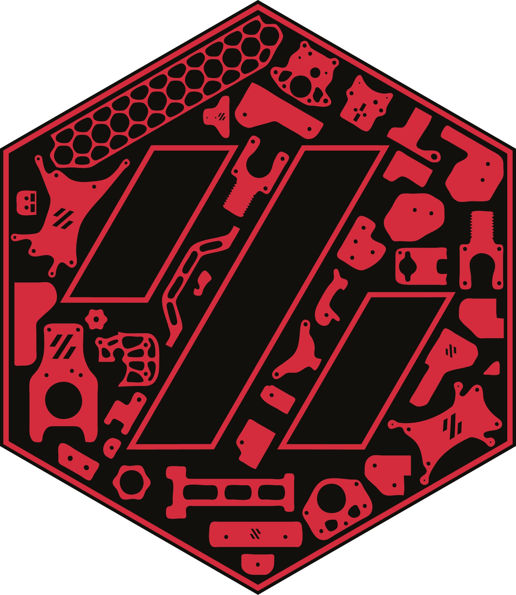

## Link to All Cricut Design Space Files that are shared for "everyone": https://www.pinterest.com/joannmanges/voron_logo_simplified/

---

## For "Voron 0.1 Build with 1 Color"

### Link Circuit Design Space for "Voron 0.1 1_Color_Layer":
### https://design.cricut.com/landing/project-detail/613569712ecf490001974996

### Link to my Repository on GitHub that contains all files I used to produce the "Voron 0.1 1_Color_Layer" .svg file: https://github.com/GadgetAngel/Cricut_Voron_Logos/tree/main/Voron_0.1_Logo/1_Color_Layer/Current_Design_Files

### Picture of "Voron 0.1 Build with 1 Color":

### If you encounter a problem what should I do?

If you have a problem with the file cutting properly, please contact me on the Voron Discord channel.

I recently was contacted by a Voron user @Tulli and was informed that the file labeled "CombinedRedPath.svg" was not cutting properly.  The tool path for the Red Hexagon Outline in the file was getting shifted out of positioning when the Circuit machine would cut the file. Please see this link for a discussion of the issue:https://discord.com/channels/460117602945990666/635687829254701107/943314036240560148

The "CombinedRedPath.svg" file was fine, but for some reason the tool head path was not cutting correctly.

To solve the issue, I separated the Hexagon Outline tool head path from the rest of the file. So, the two new files I created are called "Boarderonly.svg" and "Partsonly.svg".

Load these two files into Cricut Design Space, and make sure that you set them to two different colors.  Also make sure that you make each group (file) "attached", so the parts stay in the correct position.

Even though, you tell Cricut Design Space software that each file is a different color (this forces the software to place each file on a separate cutting mat), when loading the mats use the same color for each file.

The Cricut Design Space software will now cut the parts and hexagon boarder out properly.  Use some transfer tape to join the two cutting mats together into one project.

This issue is not with the file, the problem is the Cricut Design Space software.  I did not change any vertices in the file "CombinedRedPath.svg".  All I did was separate the Hexagon outline from the rest of the file.
