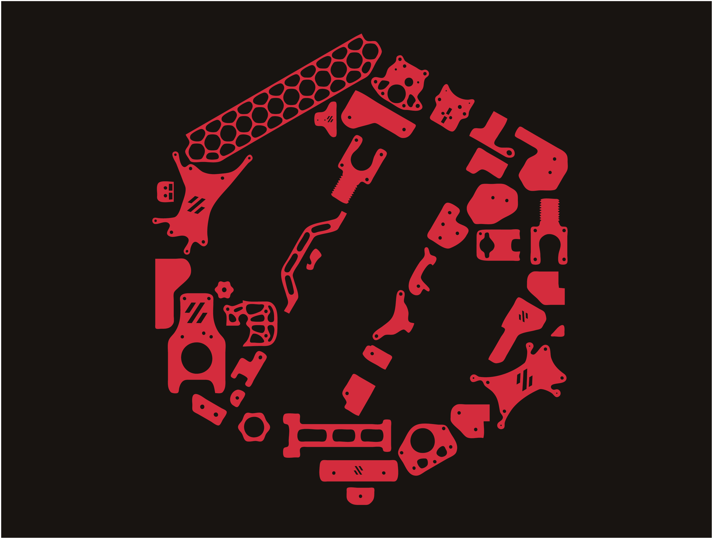

## Link to All Cricut Design Space Files that are shared for "everyone": https://www.pinterest.com/joannmanges/voron_logo_simplified/

---

## For "Voron 0.1 Build with 1 Color"

### Link Cricut Design Space for "Voron 0.1 1_Color_Layer":
### https://design.cricut.com/landing/project-detail/613569712ecf490001974996

### Link to my Repository on Github that contains all files I used to produce the "Voron 0.1 1_Color_Layer" .svg file: https://github.com/GadgetAngel/Cricut_Voron_Logos/tree/main/Voron_0.1_Logo/1_Color_Layer/Current_Design_Files

### Picture of "Voron 0.1 Build with 1 Color":

---

## For "Voron 0.1 Build with 1 Color and without LOGO Outline" with a Silhouette Layer

### Link for "Voron 0.1 1Color_WithOut_Logo_Outline_With_Silhouette":
### https://design.cricut.com/landing/project-detail/6147bad19e2fcb000119bb71

### Link to my Repository on Github that contains all files I used to produce the "Voron 0.1 1Color_WithOut_Logo_Outline_With_Silhouette" .svg file: https://github.com/GadgetAngel/Cricut_Voron_Logos/tree/main/Voron_0.1_Logo/1_Color_Layer_WithOut_Logo_Outline/Current_Design_Files

### Picture of "Voron 0.1 Build with 1 Color and without LOGO Outline" with a Silhouette Layer:

---

## For "Voron 0.1 Build with 1 Color and without LOGO Outline" WITHOUT the Silhouette Layer

### Link for "Voron 0.1 1Color_WithOut_Logo_Outline_WithOut_Silhouette":
### https://design.cricut.com/landing/project-detail/6147bc71d61aad00013c14f6

### Link to my Repository on Github that contains all files I used to produce the "Voron 0.1 1Color_WithOut_Logo_Outline_WithOut_Silhouette" .svg file: https://github.com/GadgetAngel/Cricut_Voron_Logos/tree/main/Voron_0.1_Logo/1_Color_Layer_WithOut_Logo_Outline/Current_Design_Files

### Picture of "Voron 0.1 1Color_WithOut_Logo_Outline_WithOut_Silhouette and BackPanel":

