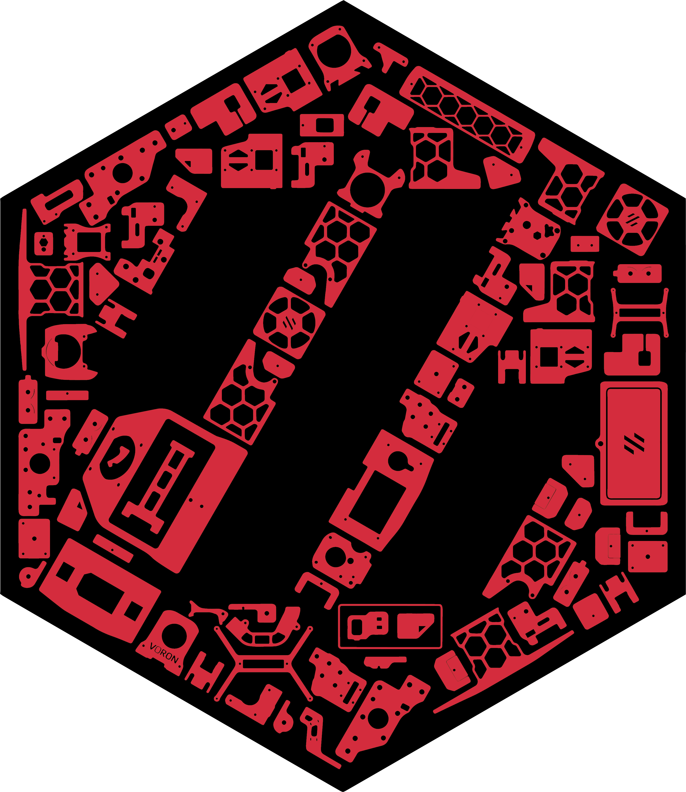

## Link to All Cricut Design Space Files that are shared for "everyone": https://www.pinterest.com/joannmanges/voron_logo_simplified/

---

## For "Voron 2.4 Build with 1 Color and Without LOGO outline" with a Silhouette Layer

### Link to Cricut Design Space for "Voron 2.4 1_Color_Layer_WithOut_Logo_Outline_With_Silhouette":
### https://design.cricut.com/landing/project-detail/614501c2623cde00018a4fe6

### Link to my Repository on Github that contains all files I used to produce the "Voron 2.4 1_Color_Layer_WithOut_Logo_Outline_With_Silhouette" .svg file: https://github.com/GadgetAngel/Cricut_Voron_Logos/tree/main/Voron_2.4_Logo/1_Color_Layer_WithOut_Logo_Outline/Current_Design_Files

### Picture of "Voron 2.4 Build with 1 Color and Without LOGO outline" with a Silhouette Layer:

