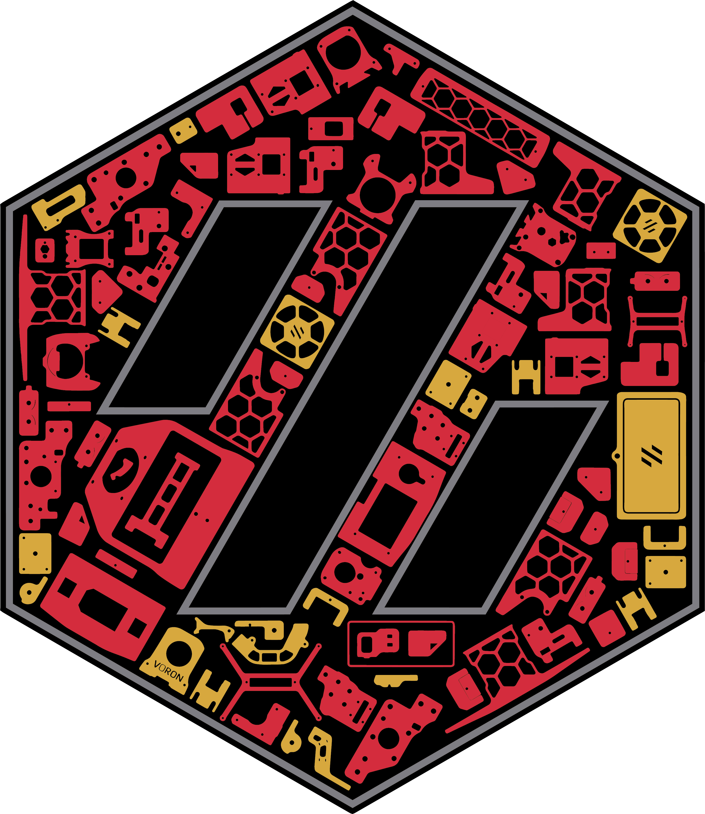

## Link to All Cricut Design Space Files that are shared for "everyone": https://www.pinterest.com/joannmanges/voron_logo_simplified/

---

## For Voron 2.4 Build "Cricut_Voron2.4Logo_BackPanel"

### Link Cricut Design Space for Voron 2.4 Build "Cricut_Voron2.4Logo_BackPanel":
### https://design.cricut.com/landing/project-detail/6137b53b0b4942000143ea8c

### Link to my Repository on Github that contains all files I used to produce the "Cricut_Voron2.4Logo_BackPanel" .svg file: https://github.com/GadgetAngel/Cricut_Voron_Logos/tree/main/Voron_2.4_Queen_Logo/Cricut_Voron2.4Logo_BackPanel/Current_Design_Files

### Picture of "Cricut_Voron2.4Logo_BackPanel":

---

## For "Voron 2.4 QueenWithComplexVoronLogo"

### Link Cricut Design Space for "Voron 2.4 QueenWithComplexVoronLogo":
### https://design.cricut.com/landing/project-detail/6137e791463f0f0001a7857d

### Link to my Repository on Github that contains all files I used to produce the "Voron 2.4 QueenWithComplexVoronLogo" .svg file: https://github.com/GadgetAngel/Cricut_Voron_Logos/tree/main/Voron_2.4_Queen_Logo/QueenWithComplexVoronLogo/Current_Design_Files

### Picture of "Voron 2.4 QueenWithComplexVoronLogo":

---

## For "Voron 2.4 QueenWithPlainVoronLogo"

### Link Cricut Design Space for "Voron 2.4 QueenWithPlainVoronLogo":
### https://design.cricut.com/landing/project-detail/6137c0370806ce00019b5413

### Link to my Repository on Github that contains all files I used to produce the "Voron 2.4 QueenWithPlainVoronLogo" .svg file: https://github.com/GadgetAngel/Cricut_Voron_Logos/tree/main/Voron_2.4_Queen_Logo/QueenWithPlainVoronLogo/Current_Design_Files

### Picture of "Voron 2.4 QueenWithPlainVoronLogo":

---

## For "Voron 2.4 QueenWithPlainVoronLogo2"

### Link Cricut Design Space for "Voron 2.4 QueenWithPlainVoronLogo2":
### https://design.cricut.com/landing/project-detail/6137e15bd254460001dad096

### Link to my Repository on Github that contains all files I used to produce the "Voron 2.4 QueenWithPlainVoronLogo2" .svg file: https://github.com/GadgetAngel/Cricut_Voron_Logos/tree/main/Voron_2.4_Queen_Logo/QueenWithPlainVoronLogo2/Current_Design_Files

### Picture of "Voron 2.4 QueenWithPlainVoronLogo2":

