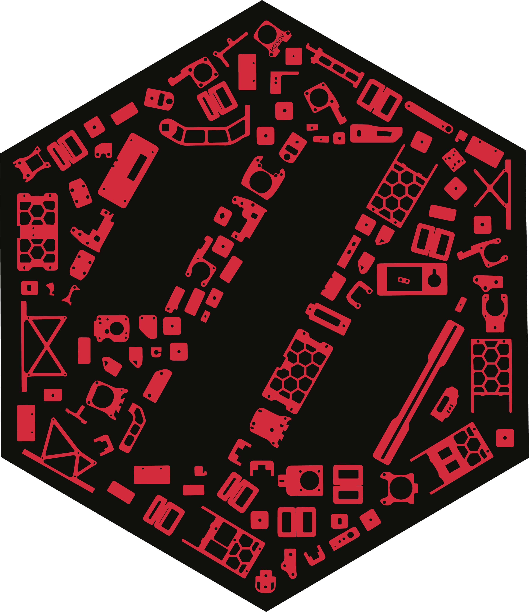

## Link to All Cricut Design Space Files that are shared for "everyone": https://www.pinterest.com/joannmanges/voron_logo_simplified/

---

## For "Voron Switch Wire Build with 1 Color and without LOGO Outline" with a Silhouette Layer

### Link for "Voron Switch Wire 1Color_WithOut_Logo_Outline_With_Silhouette":
### https://design.cricut.com/landing/project-detail/6147c7da7e75d400012c4684

### Link to my Repository on Github that contains all files I used to produce the "Voron Switch Wire 1Color_WithOut_Logo_Outline_With_Silhouette" .svg file: https://github.com/GadgetAngel/Cricut_Voron_Logos/tree/main/Voron_SW_Logo/1_Color_Layer_WithOut_Logo_Outline/Current_Design_Files

### Picture of "Voron Switch Wire Build with 1 Color and without LOGO Outline" with a Silhouette Layer:

