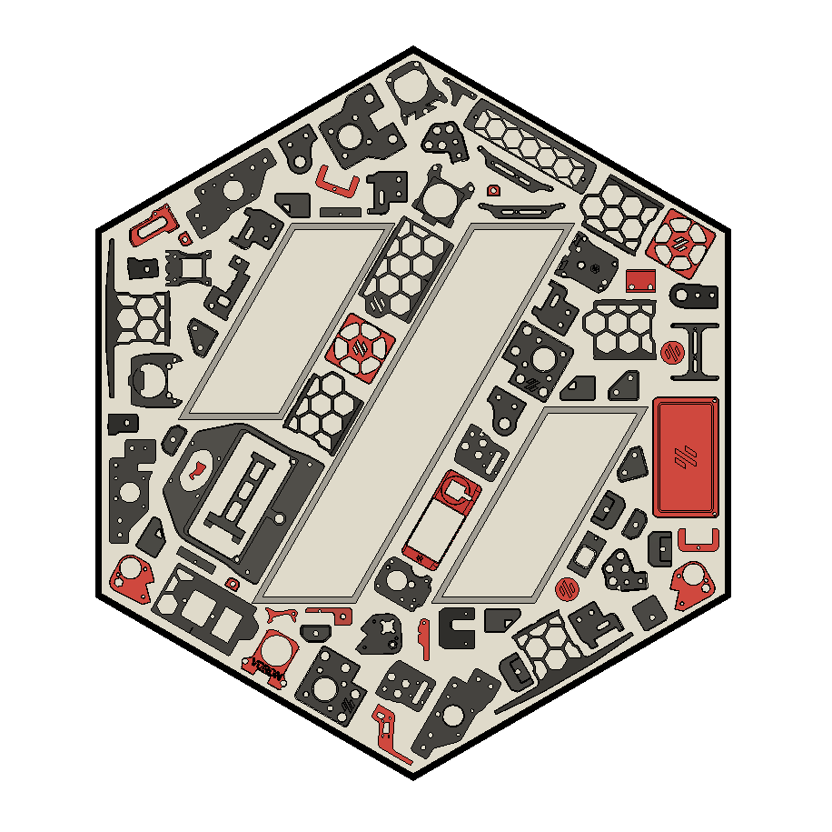
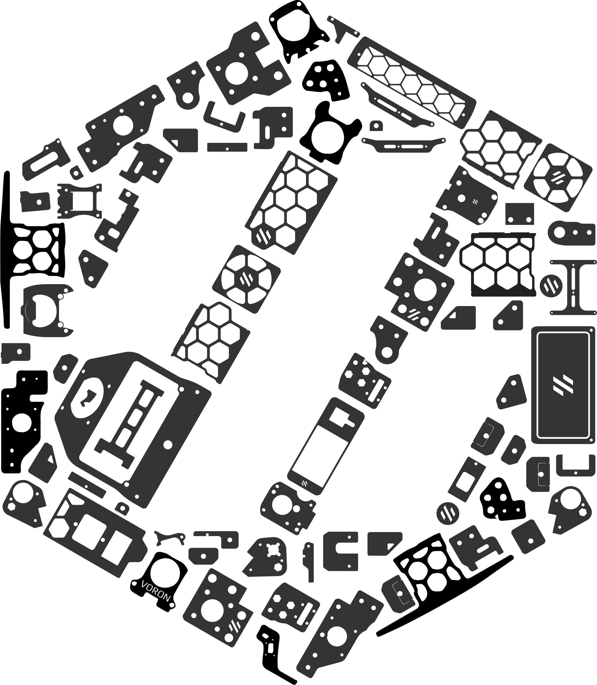
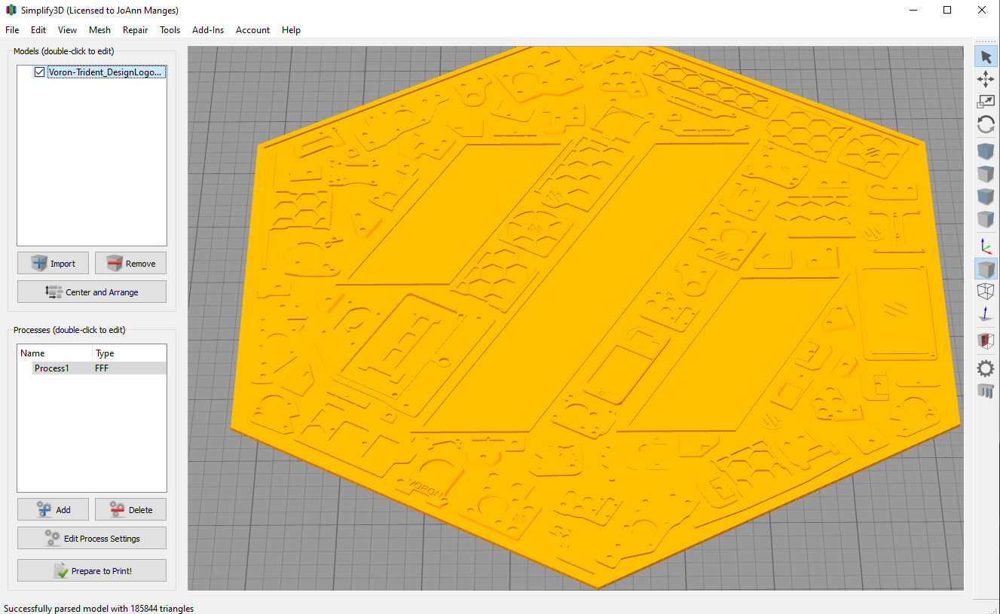
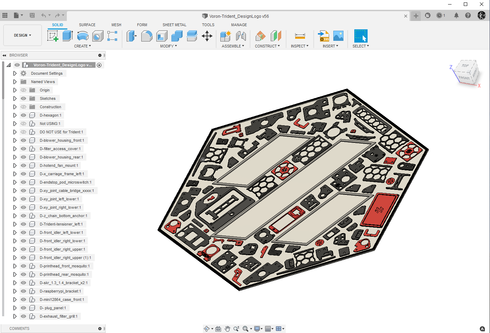
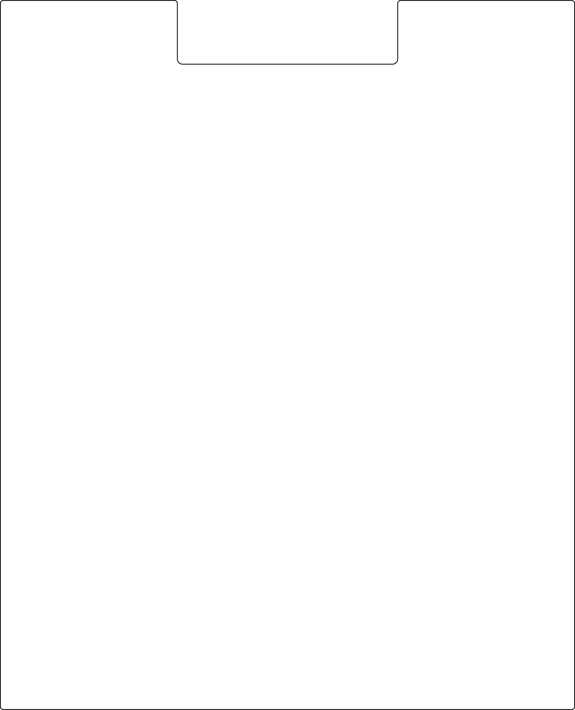

## [Directory "1ColorLayer"](./1ColorLayer) contains the .svg files for the "Trident Parts Design Logo" with the Voron Hex Outline:

### Picture of "Trident Parts Design Logo with 1 Color":

---

##  [Directory "1ColorLayerWOWOSil"](./1ColorLayerWOWOSil) contains the .svg files for the "Trident Parts Design Logo" without the Voron Hex Outline:

### Picture of "Trident Parts Design Logo" without the Voron Hex Outline:

---

## [Directory ".stl_files"](./.stl_files) contains the .stl files for the Voron-Trident Parts Design Logo that you can print:

### Picture of Voron-Trident Parts Design Logo that you can print:

---

## [Directory "CAD"](./CAD) contains the .STEP and .f3d files for the printable Voron-Trident Parts Design Logo:

### Picture of printable Voron-Trident Parts Design Logo:

---

## [Directory "RD_ALL_correct_dim"](./RD_ALL_correct_dim) contains the .ai and .dxf files for the Voron-Trident Panels (200 mm³, 300 mm³, 350 mm³):

### Picture of Voron-Trident Rear 250 mm³ Panel:

