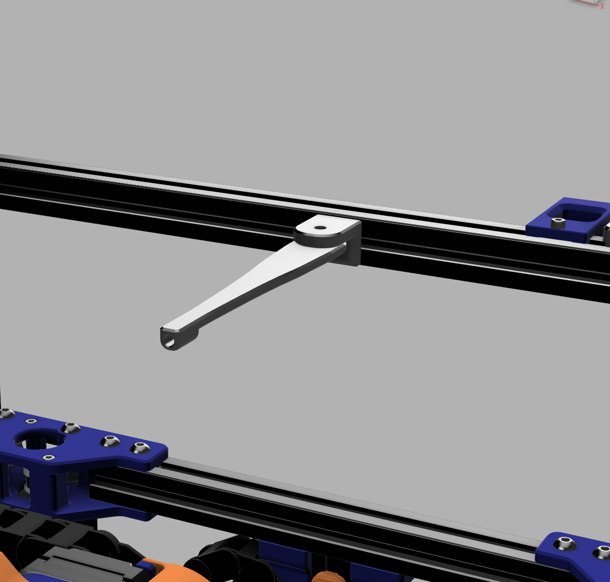
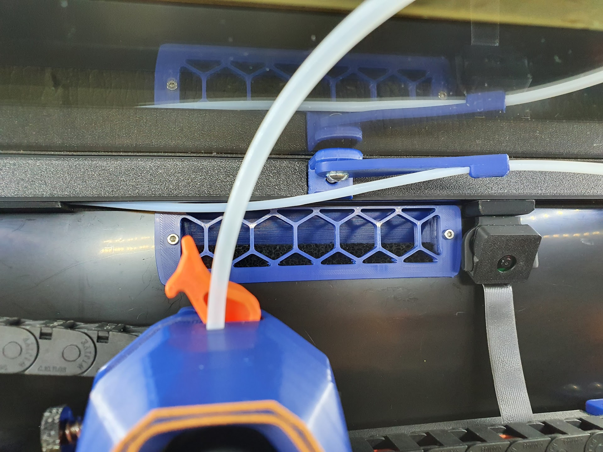
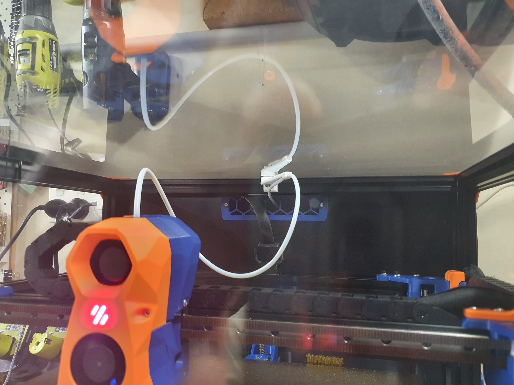

# PTFE Bowden Tube Guide and Canbus Wire Support

## Required Hardware:
- M3x8 Bolt and M3 T-nut
- M5x10 Bolt or a M5x8
- Optional 4mm drill bit for cleaning out bowden tube path 

## About

In my 350 build the PTFE tube kept getting caught so I made this arm to keep it up. The shorter arm works better so I recommend using it instead

## Install

- Drill out bowden guide with 4mm drill bit for a perfect fit (optional)
- Bolt mount to rear frame with M3x8 and tnut putting the lip at the top
- Screw arm on with M5x10 (I used a M5x8mm and it works fine) into the plastic allowing the arm to still be able to swivel 

