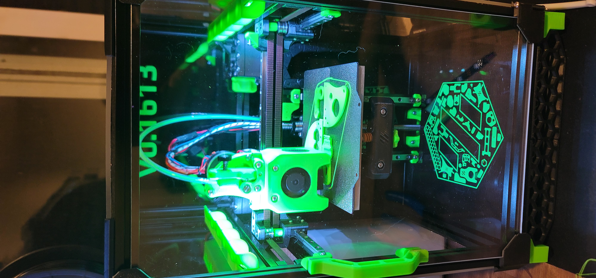
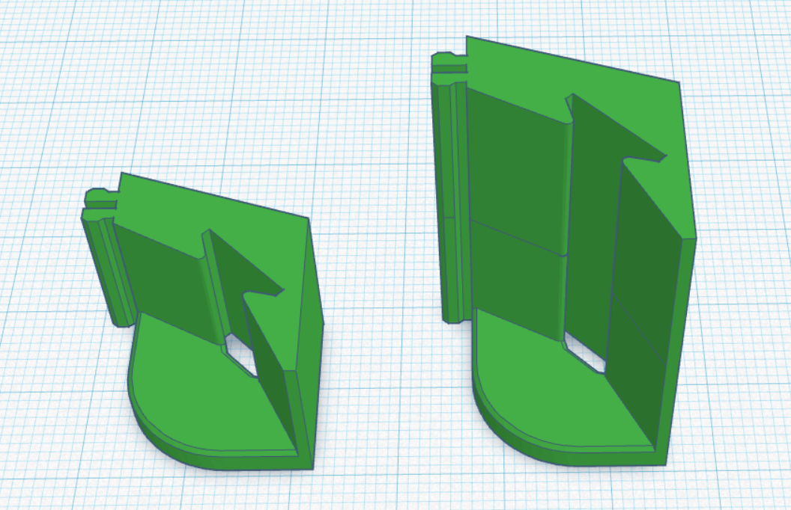

V0 Misumi Led mount

These were modified from [Eddie's Misumi Led clips](../../eddie/LED_Bar_Clip) as I like the design with them in my V2.4 and VT. They should fit most WS2812b Led strips you can find online though If it has the silicone cover on them you may need to peel them off or file down the inside track a touch.

I did include both the extended version I have tested and use personally as well as the shorter version If youre LED strip as more LEDs per meter than mine did, while it will print and install just fine they are as of now untested.

Assembly is fairly straight forward. Solder directly to the LED strip or solder on a JST connector to the end and slide the strip inside. If your leds come with a clear silicone layer over the top you may need to peel it off the strip or file down the insides of the led tracks, the bare pcb backed LEDs should fit in snugly. 

You will need 5 per side and standard voron print settings are probably overkill for these but its what I used. For install on a stock V0 simply remove the extrusion and slide inside. Fitment for me was tight and the extrusion did shave a little bit off the mounting points. This was intentional to make it as tight as possible.

These did go through several variations and attempts with Tinkercad to get right but I hope you enjoy them!

