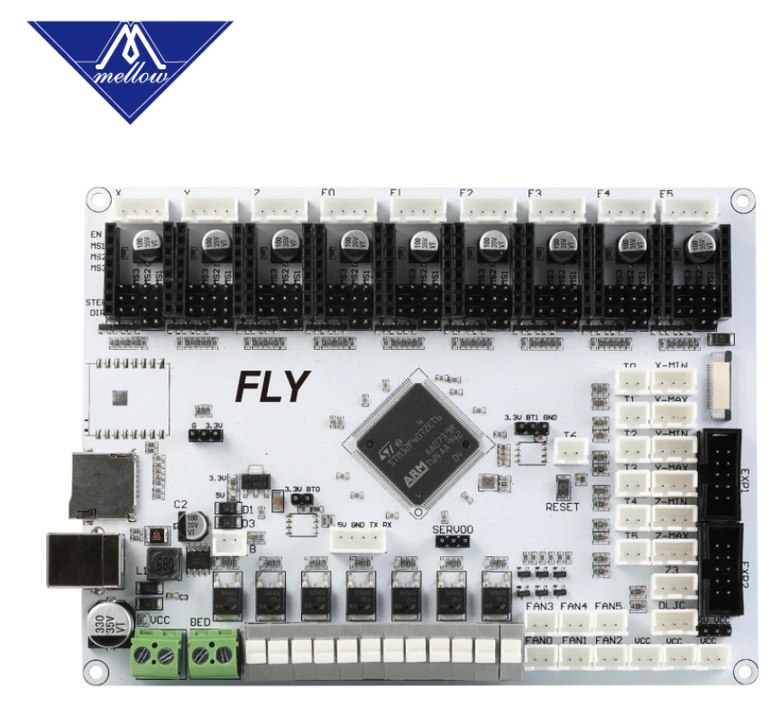
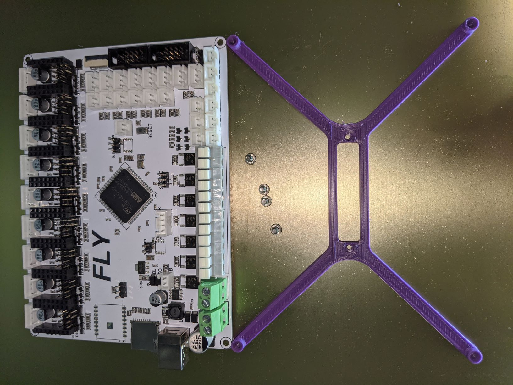
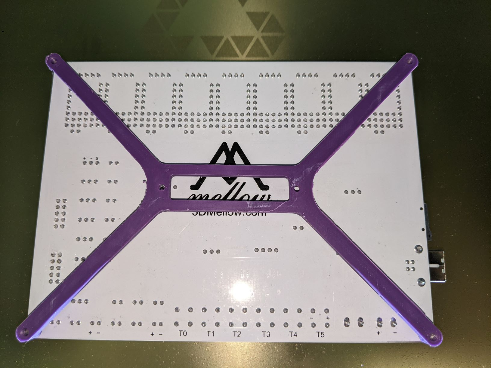

Voron V2 Mount for the Fly F407ZG board:

https://github.com/FLYmaker/FLYF407ZG

https://www.aliexpress.com/item/4000609195834.html

Designed from scratch to match the existing mount shapes/styles, with slightly thicker arms to support the larger board.

Recommend printing at standard Voron specs:

0.4mm nozzle, 0.2mm layer height.
Infill 40%.
4 wall perimeters.

Add a 6mm brim to ensure bed adhesion.

Printed and confirmed fits the Fly F407ZG:

