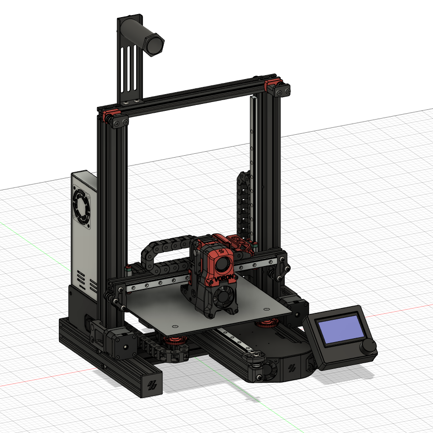
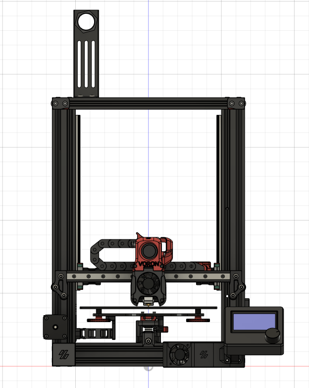
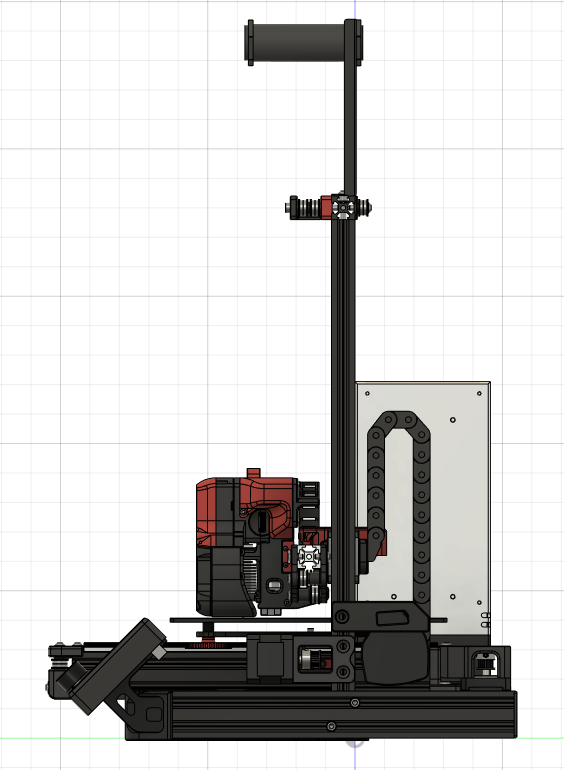
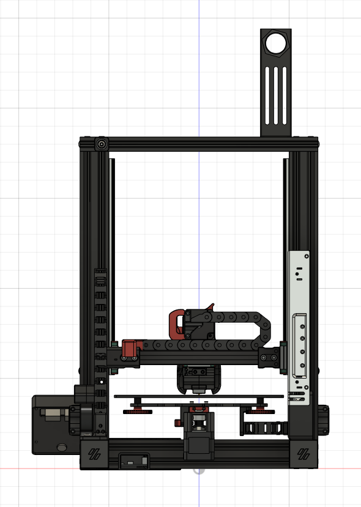
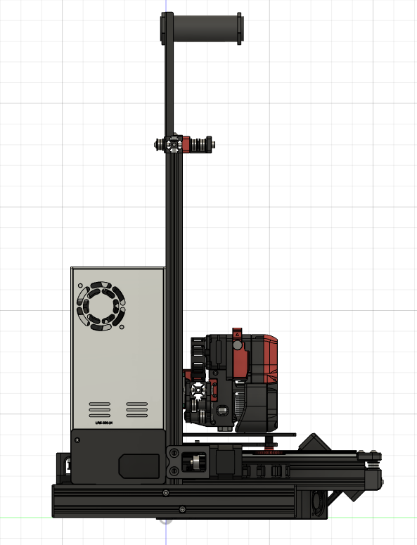
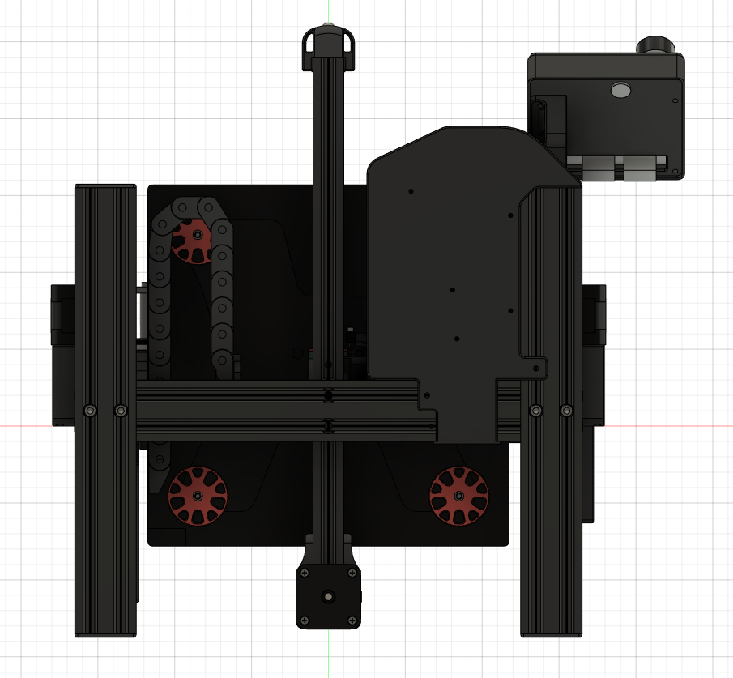

# Ender 3 and Ender 3 Pro Switchwire Mod

This is my interpretation of a Ender 3 and Ender 3 Pro Switchwire mod. This is the basic version without the possibility to enclose the Ender like the original Switchwire.

## General Information

  - Most of the parts are used from a stock Ender 3 (Pro) which leads to a cheap entry into the world of Voron
  - It differs a little bit from the og Switchwire, like at the motor mounts of the X- and Z-axis. There is no explizit tightening mechanism!
  - You'll need to drill the Y-carriage for the mounting holes of the rail, Y-endstop and chain mount. You can get the positioning for the Ender 3 from the CAD model.
    For the Pro version, the positioning of the belt holder and the rail in Y direction are the same. Regarding the X direction, the mounting holes for the rail and
    the belt holder are logically moved 10mm to the right. The belt holder uses in the Pro version also one mounting hole of one of the wheels! If you need help, feel
    free to ask.
  - The X-movement is slightly limited because of the rails
  - You'll need to move the Y extrusion 20mm forward to get the full 235mm movement of the Y-Axis. You can use one of the existing holes in the Y-extrusion and add one
    hammernut
  - There is no explicit keybak mount at the gantry in the basic version. The left bearing block has two holes like the og Switchwire, where a holder for the Keybak
    fitsin. You can use this method if you are going to build the advanced version of my mod, which includes the grills and the electronics under the printer.
    For now, feel free to mount the Keybak anywhere you want!
  - The original Afterburner is mostly used (located in the Voron V2.4 repository). You can check which parts are needed in the BOM of the V2.4
    Some parts are different/additionally needed (e.g. the X carriage frames). Be sure to check everything twice!
  - I tried to add all of the used screws to the CAD model but had to abort it since my PC couldn't handle it. Because of this, I could not get a list of each type
    of screw. Forgive me!
  - You'll need to add longer bed cables and route them between the bed and the Y-carriage to the chain mount

## What you need

  - An Ender 3 or 3 Pro (obviously...)
  - The print parts according to your printer (explicit Pro parts are named like that, e.g. Y-Motor_Mount_Pro_x1.stl)
  - MGN12H rails: 3x 300mm and 1x 280mm
  - New stepper motors (3x 17HS15-1504S-X1 and 1x 17HS08-1004S from OMC)
  - 3x GT2 6mm pulleys
  - 20x F695-2RS bearings
  - Belts: approximately 4m are enough
  - Igus chains (10x11mm)
  - M3 and M5 Nut6 hammernuts/drop in nuts or whatever you like
  - M3 and M5 screws: Look up the Afterburner assembly guide and my CAD model. There you will see which screws you need.
  - SKR E3 Mini or SKR V1.3/V1.4 (only advanced version)
  - Raspberry Pi
  - some wire
  
## Some more pictures

  
  

