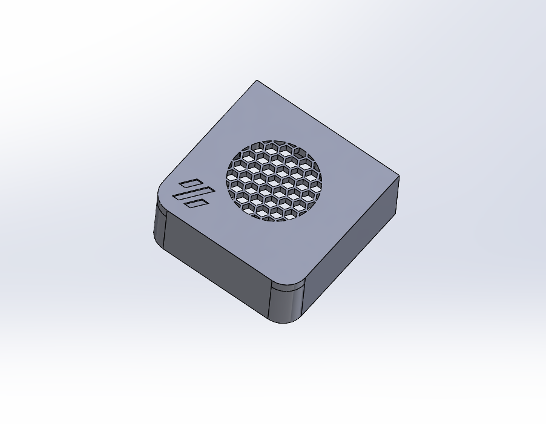
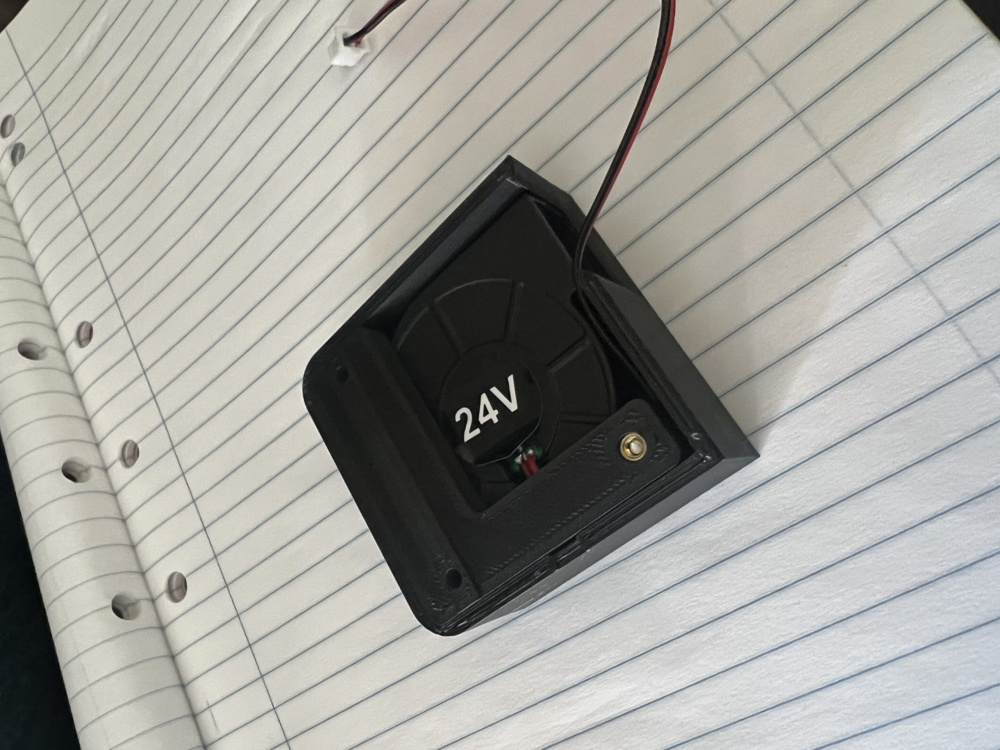

# Ellis Bed Fan Mod Cover

I didnt really like the look of the fan 5015 on its own, but thought the mount itself was fine....so I made this little cover to go over the top.

There are two versions.

1) The full cover  
2) The cover with the back removed so that you should be able to pop this over the top without taking the bed off etc.
   
You can get the mount to go with this - Original Mount - Bed Fans by Ellis - https://mods.vorondesign.com/detail/28xgztUufAtAfV4XUL5l4w

Print in ABS / ASA / PCCF or some other material that can stand the heat of the bed.

No supports needed

Please let me know if this doesnt fit your fan for any reason, while it works for my fans, im sure there are slight variances between fans.

