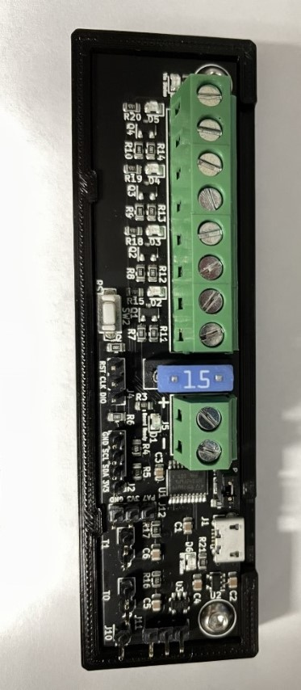

# Voron-Mods

Mounting tray for the Klipper Expander Board. I didn't care for the other 2 mounts i tried. Requires 2 M3 x 6mm screws.
There are 2 versions of this mount. 

1: Only has a logo on the back for use with VHB tape

2: Has logo and 4 M3 countersunk holes for bhcs for mounting on rails

