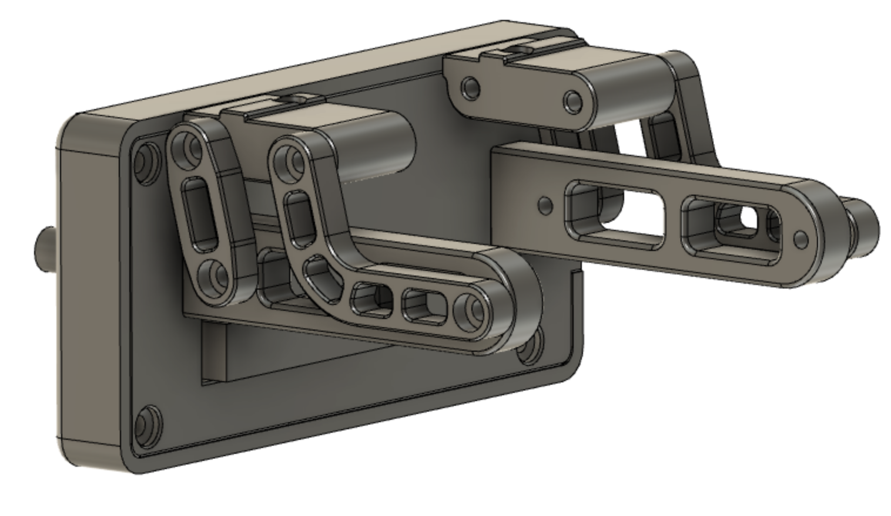

This case for a Fysetc Mini12864 uses all standard hardware from a Voron V2 so you shouldn't need to order any extra parts. The "Case Arms"
must be attached to the case back with button head screws (M3x8 BHCS) due to clearance. The "Mount Blocks" attach to the extrusion with
M5x12 BHCS (cap head should work fine as well). All other screws are intended to be socket head M3 but are non-critical
