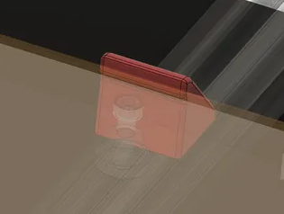

# PEI Stop

## Description

Here's an easy way to position your PEI.

Simply fix it to the back of the heating plate using an M5 x 10 screw and an M5 Tnut compatible with your alu profile.

## BOM

### Part to print
* 2x pei_stop_x2

### Hardware
* 2x 2020 T-Nut M5
* 2x M5 x 10 SHCS
