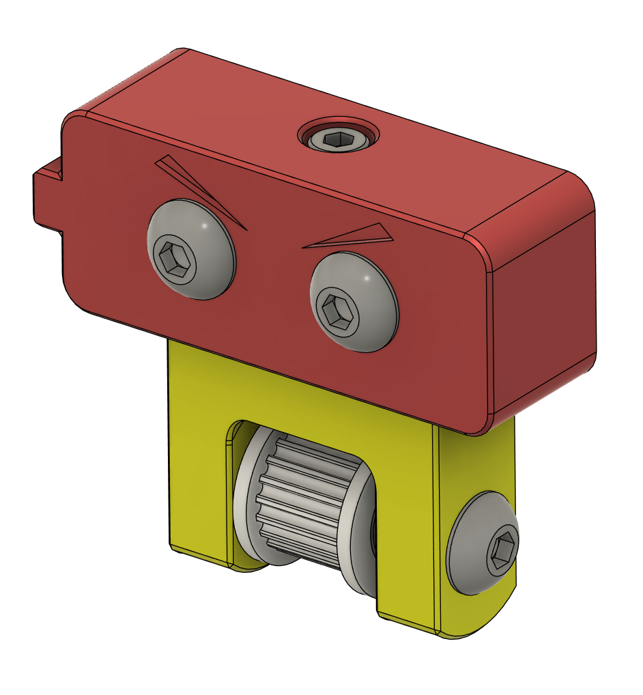
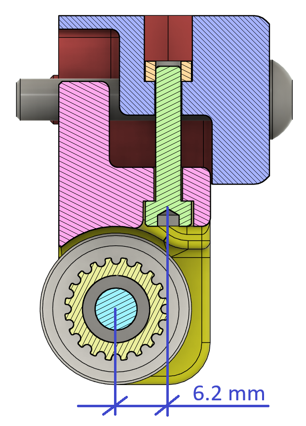
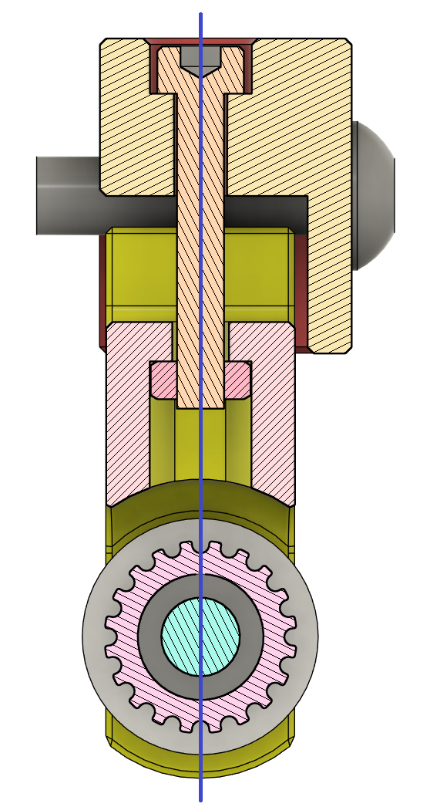

# Z-Top Idlers 9mm

## Description
Z-axis tensioner tightened from above, with the screw aligned with the toothed wheel

<table>
	<tr>
		<td>
<h1><b>Original</b></h1>
</td>
		<td>
<h1><b>My Mod</b></h1>
</td>
	</tr>
	<tr>
		<td></td>
		<td></td>
	</tr>
	<tr>
		<td></td>
		<td></td>
	</tr>
</table>

## Why this mod

I noticed a deformation of the belts. It's moving forwards causing the belt to be a few millimetres out of alignment.
* Consequence: the Z height cannot be respected without a correction in klipper (with `distance_rotation`).

My model makes it possible to correct this phenomenon.

Tightening the screw from above to tension the belt is much easier than from below.

## BOM
* [a]_ztop_tensioner_9mm_x4
* ztop_tensioner_bracket_a_x2
* ztop_tensioner_bracket_b_x2
* 4x Hex nuts M3 DIN 934
* 4x M3 x 20 SHCS
* 8x M5 x 20 BHCS
* 4x GT2 20 Tooth Idler 9mm wide
