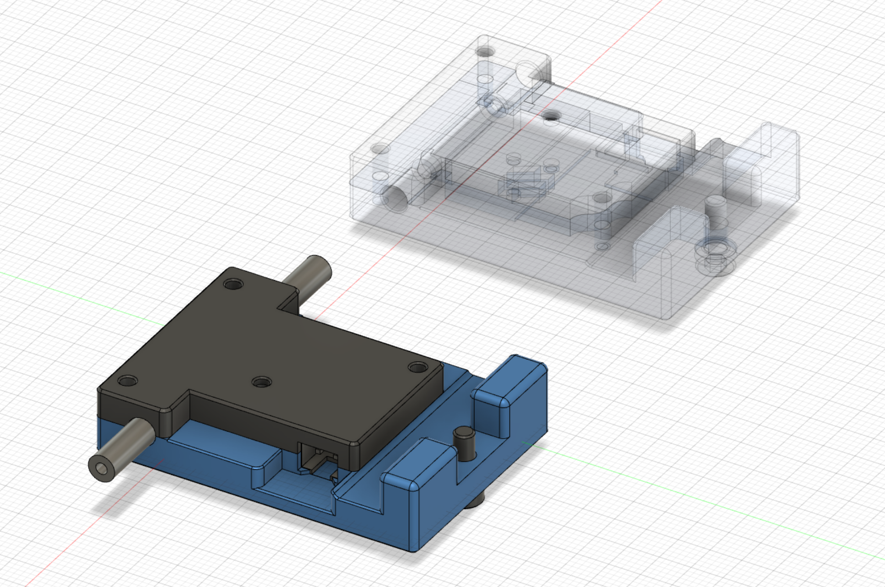
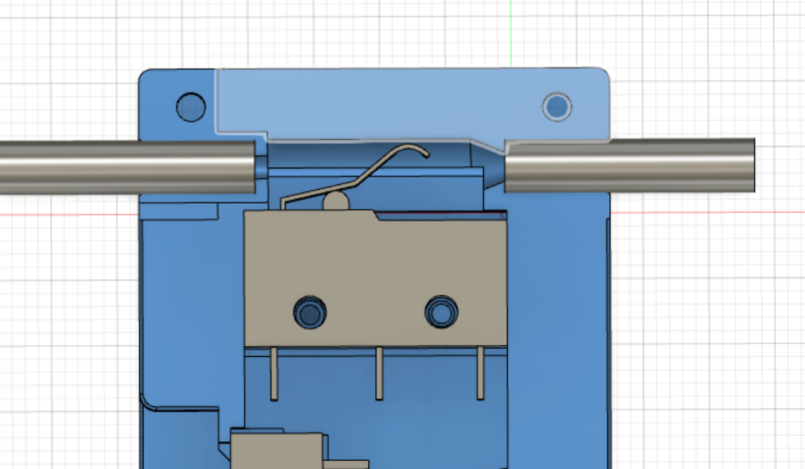
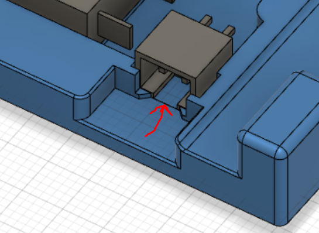

# RefillPlease

> Your mission, should you choose to accept it, is to build a simple yet cool looking filament runout sensor for your Voron printer. 
As always, should you or any of your printers be hurt in the process, the Secretary and myself will disavow any knowledge of your actions. 
This readme will not self-destruct in five seconds, cause we're not on TV.  
Good luck.

## BOM

This part is designed to replace the stock bowden tube holder, so you can reuse the M3x8 SHCS and the M3 Hammer Head T nut.

You will need :
* 1 x micro switch (body : 20x6x10mm) with a lever (search for 'SPDT 5A, 125V 250V 29mm')
* 1 x JST 2 pins female connector
* 4 x M2x10 self tapping screws
* two piece of wire (30mm length each)

And some tools :
* pair of pliers
* small Philips screwdriver
* soldering iron
* a multimeter (optional, but it makes you look smart when using it)

## What does it do, and why should I do this mod?

It is a drop in replacement for the stock bowden tube holder with the benefits of being a filament runout sensor. So you know, it will mainly tell you when your printer need a refill (hence the name).

#### Print Settings:

Standard Voron print settings are fine, ABS+ (but PLA or PETG are fine too since it will not stand in the enclosure).

* 0.4 mm Nozzle
* 0.2 mm layer height
* 30% infill
* no supports
* 4 vertical shells
* 5 solid layers top and bottom

##### What files need to be printed?

Select the *_right* parts if you want to put the filament sensor on the right of the printer, *_left* parts otherwise (when you stand in front of the printer).

You'll need:
* [a]\_core\_(left/right).stl
* cover_(left/right).stl
 
# Assembly:

Step 1: Take a refill of coffee

Step 2: Bring out your inner artist\
Using your pliers, try to form the lever to look like the picture (cut the lever if needed).\
You may have to adjust the lever shape and length after trying to insert the filament so the switch is depressed each time the filament is inserted.

Step 3: Prepare the electronics\
Put the micro switch and the JST connector in the Core part 
Be careful:
* the switch lever must go UP / in the oposite direction of the JST connector location.
* the JST connector notched face should go directly on the core part (you should see a matching notch)
Use this as a template to cut the piece of wires to the correct length.\
Strip the wire with pliers.

Step 4: Soldering\
Tin plate the JST pins and the wires.\
*You could use the printed part as a support when soldering the wires, but be carefull not to go too close to the plastic parts*\
Solder according to the picture

Step 5: Testing\
Using the multimeter in continuity mode, be sure that the current is going through when the switch is depressed.

Step 6: Close everything\
Put the cover on using the M2x10 self tapping screws, but let the top ones loose.\
Insert the PTFE tubes on each sides, and tighten the screws to block everything in place. 

## Software

Sample configuration for Klipper can be found in the `/klipper` directory.

To use it, add the file `filament_runout_detection.cfg` from your UI and load it in your `printer.cfg` file using the following directive :
`[include filament_runout_detection.cfg]`.

Adapt the switch_pin according to your mcu configuration (sample file is for an Octopus mcu).
The sample config come with a M600 filament change macro provided by VintageGriffin on Discord.
