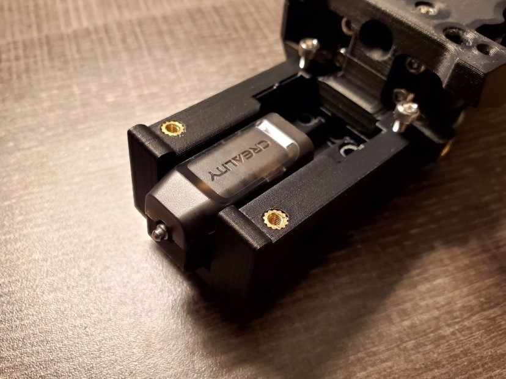
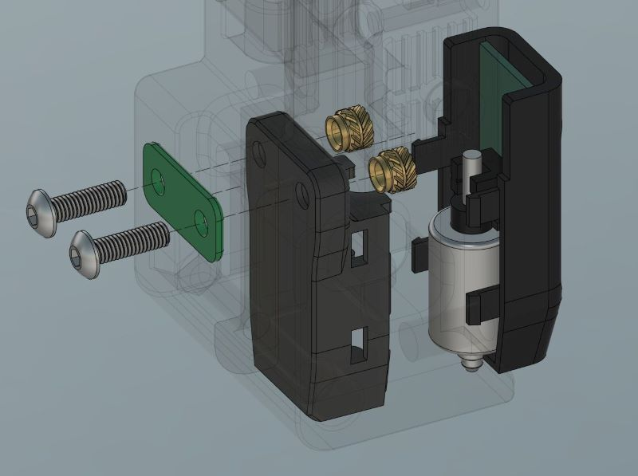
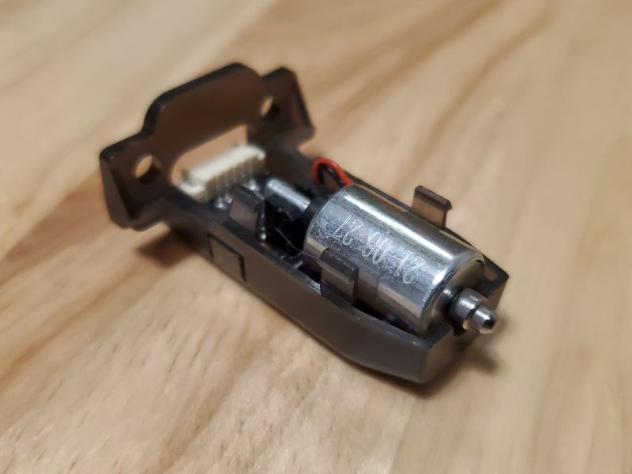
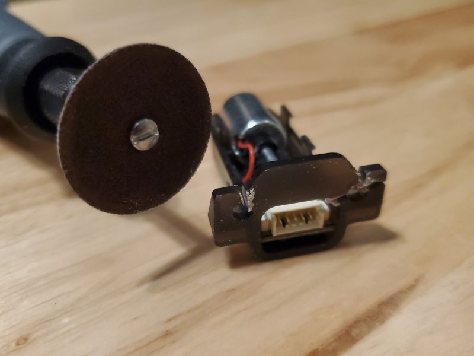
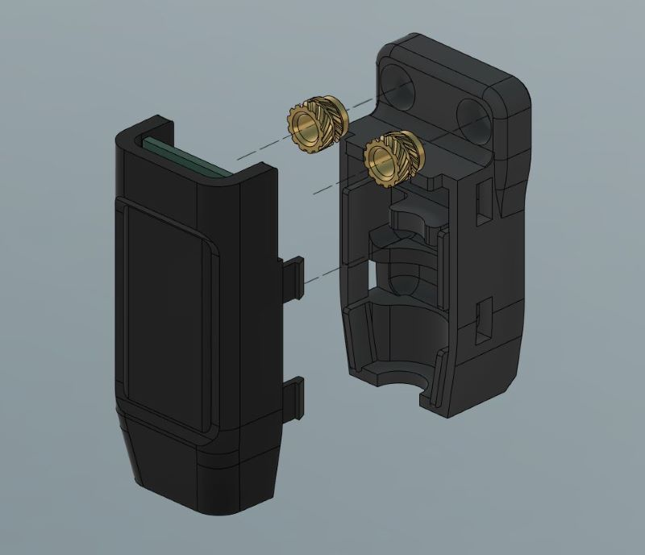
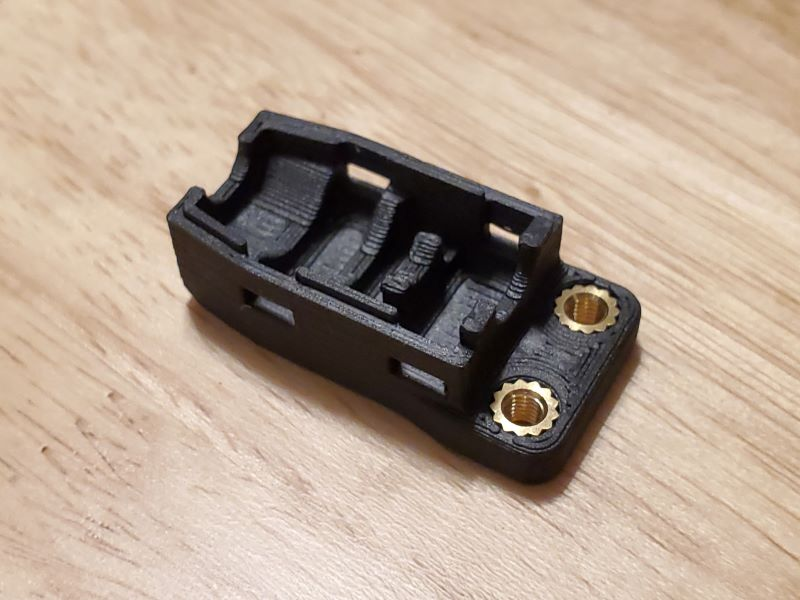
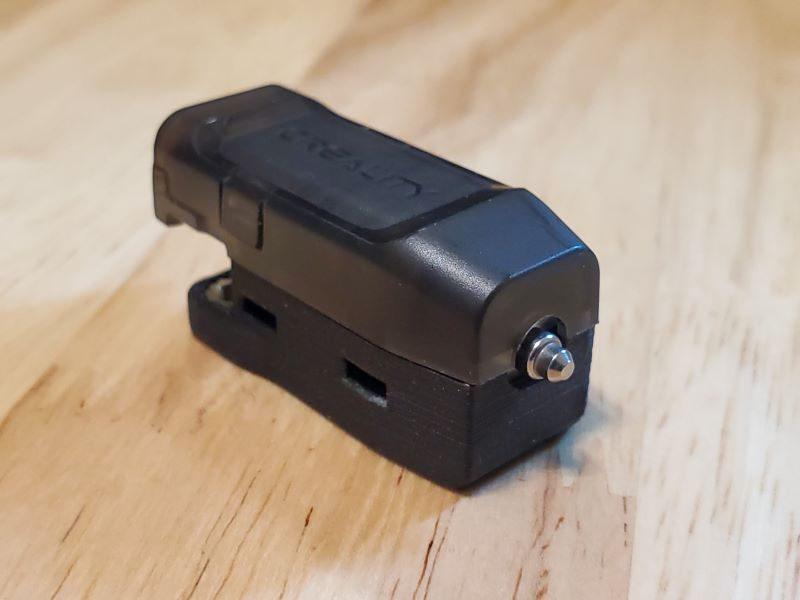
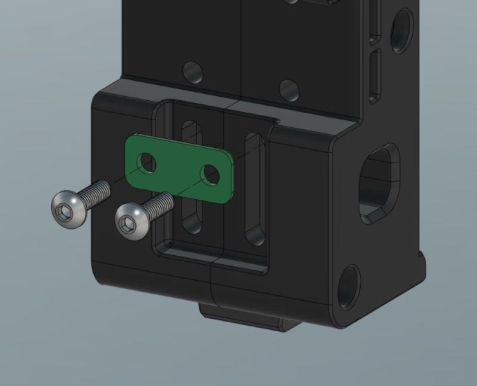
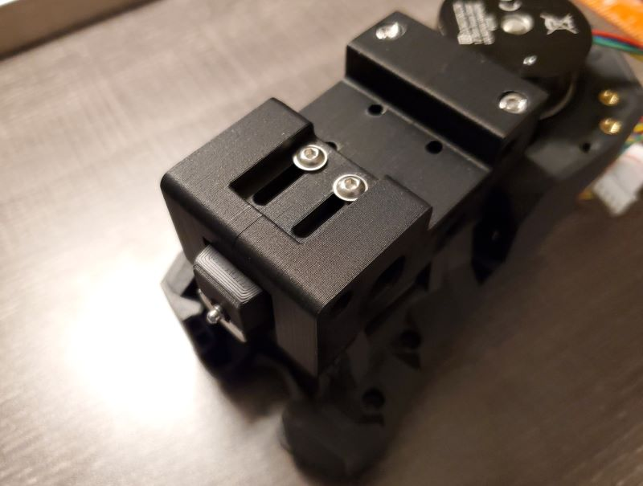
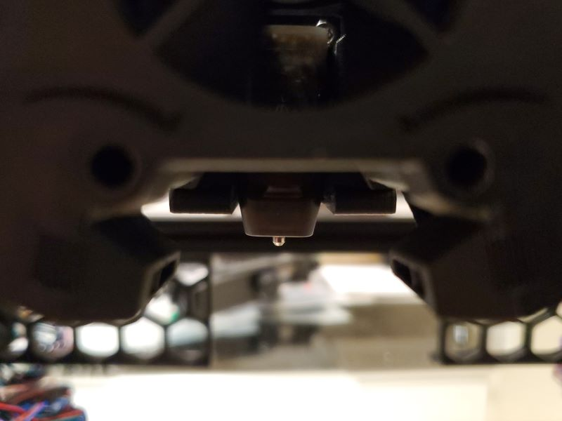

# Voron 2.4 CR Touch Probe Mount (Beta)
##
### Drop-in Probe Replacement for v2.4 (Single or Double MGN9 Rail)

#### *Stealthburner Compatible but Will NOT Fit an MGN12 Rail (Trident or V2.4r2)!*

 

I've been looking for alternatives to the common probe mods that are also compatible with the standard MGN9 mounts. This mount requires no modifications to the printer and uses the existing mounting holes/wire routing. It does require part of the probe's shell to be cut off and can only use 5V!

The big question is, are these probes even reliable on a Voron? Well, it is well known that BL Touch probes have issues with heat in closed chambers but the CR Touch photoelectric sensor and metal pin design seem to be better suited for this. I'm currently testing reliability but so far have had no significant issues inside an enclosure with temperatures ranging from ~45-60C. Creality lists a max operating temp of 65C but I haven't found much more information. I'm now testing on my v2.4 and will update with any issues. 

I'd appreciate feedback from anyone who has used a CR Touch on their Voron. I suggest newer builders stay with the standard options or the well-tested clicky mod.

Finalized CAD files will be posted after beta.

### BOM		
|Size|Qty|
|---|---|	
|Creality CR Touch |1|	
|M3x10 (BHCS or SHCS) |2|
|M3x5 Heat-Set Insert |2|

    
*Rear Spacer is Optional*

### Instructions

With the wiring detached, carefully seperate the 2 shell pieces by gently pressing the 2 clips on each side. Only the probe side will be used. *Be careful not to break the clips off*.

Cut off the top mounting section so nothing extends past the sides of the shell. I used a dremel finished off by a file in about 5 min. Careful not to damage the components and blow off any debris that builds up around the sensor.

Press the two M3 heat-set inserts into the printed mount *then* snap the shells together. Make sure all snaps are secured. Tolerances are intentionally tight.

Slide in the probe then attach it from the back with two M3x10 screws. The optional spacer can be used to help with alignment.

    
*Examples shown are on a single MGN9 rail mod*
