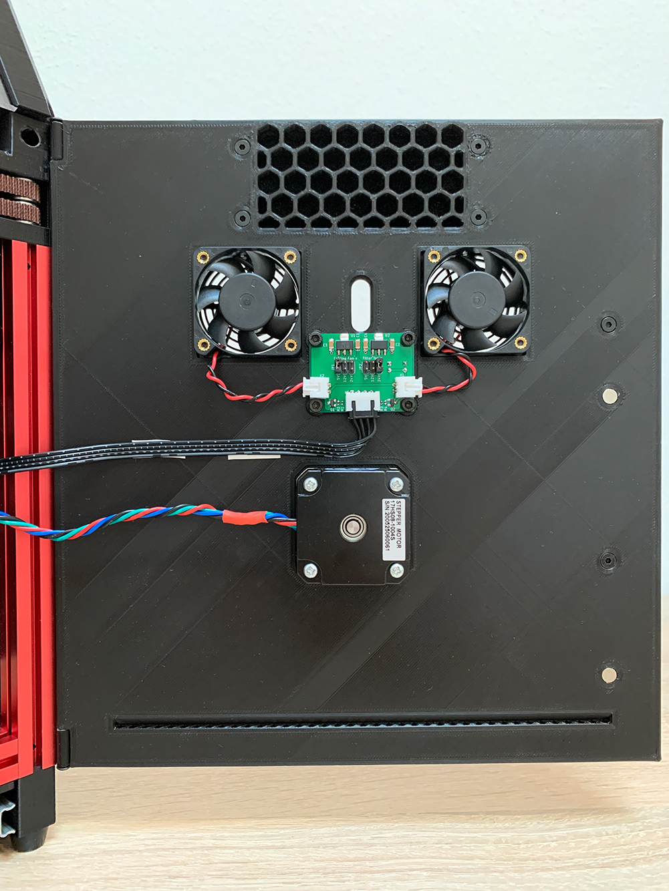

Door for easy access to electronics

Carefully drill the 1mm hole to 3mm for the hinge

Required material:

2x M3x30 BHCS as hinge

4x M3x6 BHCS for PCB

6x M3x8 countersunk flat head for filter and handle mounting

2x Magnets 6x3mm

10x M3x4mm heat inserts for handle and fan mounting

