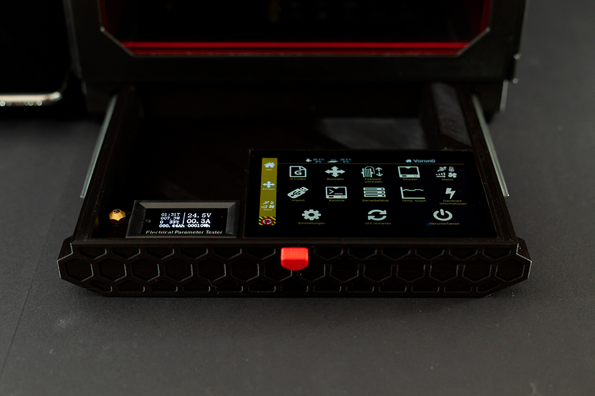
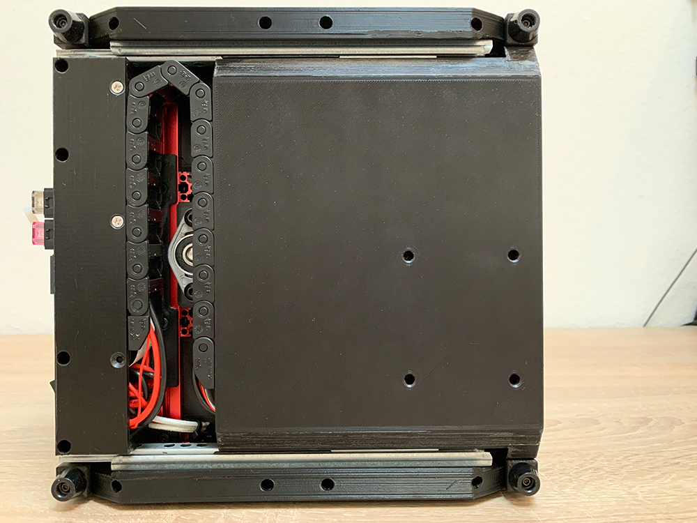
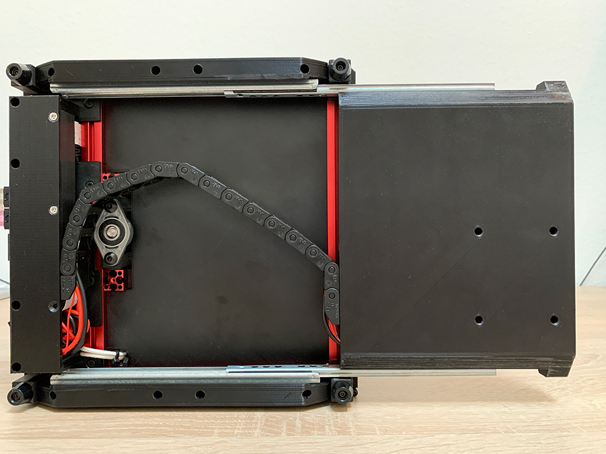
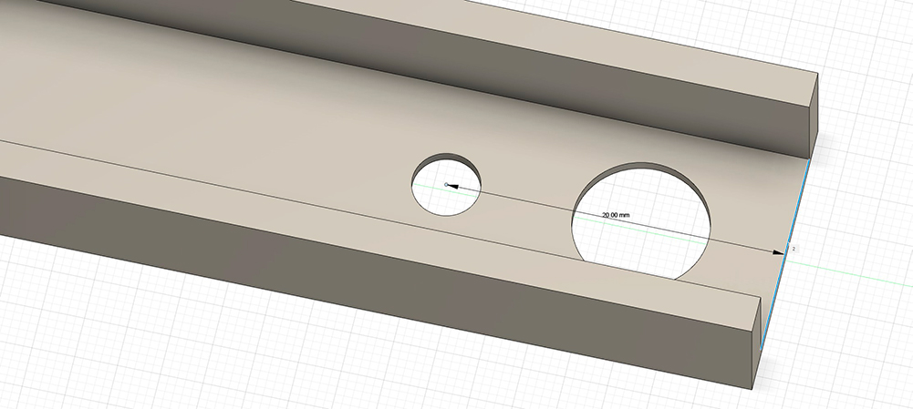

Drawer in four different versions

you have to drill a 4mm hole yourself on the drawer rail (s. image)

Required material:

Cable Chain with 15 chain links:

https://www.igus.com/iPro/iPro_01_0002_0007_USen.htm?ArtNr=04-16-015-0&c=US&l=en (or similar)

8x M3x4mm heat inserts

4x M3x6mm BHCS to mount the rails on skirts

5x M3x6 countersunk flat head to mount the drawer on the rails, one for the knob

182mm Slide Rails:

https://www.amazon.com/Drawer-Sections-Furniture-Hardware-Fittings/dp/B087SKB3LW

