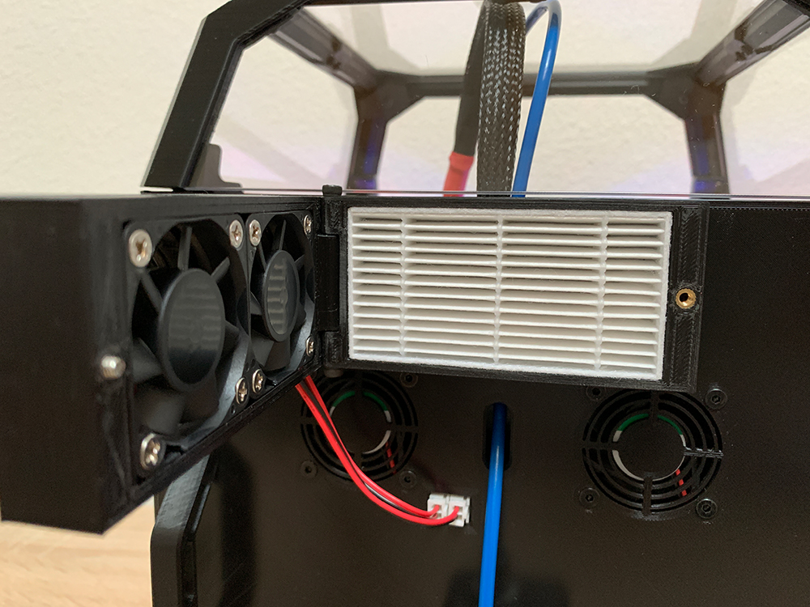

HEPA filter with easy access to change the filter

Carefully drill the 1mm hole to 3mm for the hinge (fan case)
Carefully drill the 1mm hole to 2.5mm and cut an M3 thread into it

Required material:

Filter: https://www.aliexpress.com/item/32788652288.html

Carbon Pad: https://www.amazon.com/EA-Premium-Carbon-Infused-Filter/dp/B07T3PPH4C

9x M3x4mm heat inserts

8x M3x16 countersunk flat head for the fans

1x M3x10 countersunk flat head as door lock

2x M3x20 BHCS as hinge

