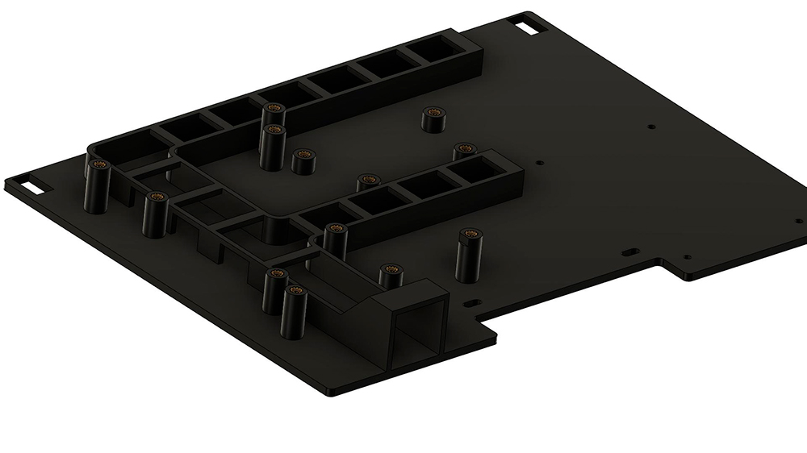
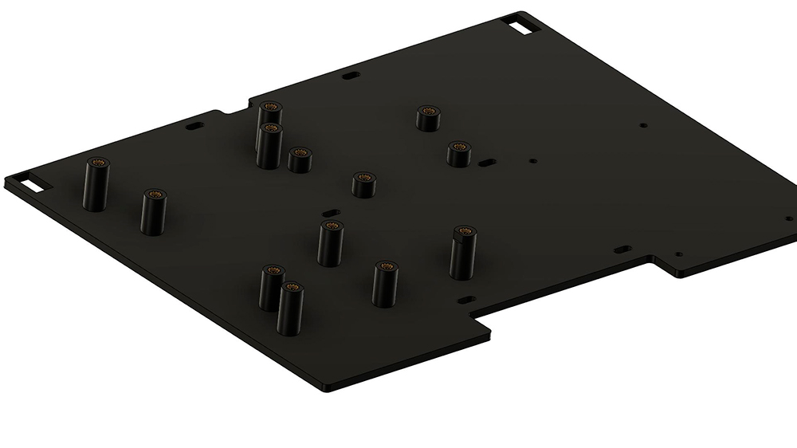

Mid-panel for SKR1.3/1.4 or SKR E3 mini. Once with and once without cable management

Required material:

4x M3x4mm heat inserts for DC/DC Converter

4x M3x6 BHCS

4x M3x4mm heat inserts for SKR1.3/1.4 boards

4x M3x6 BHCS

or

5x M3x4mm heat inserts for SKR E3 mini

5x M3x6 BHCS

