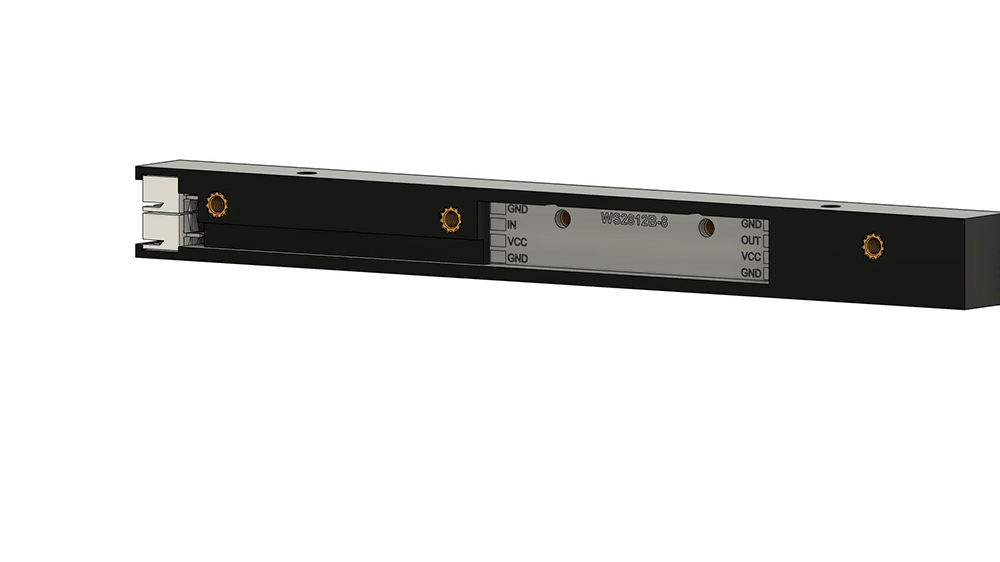
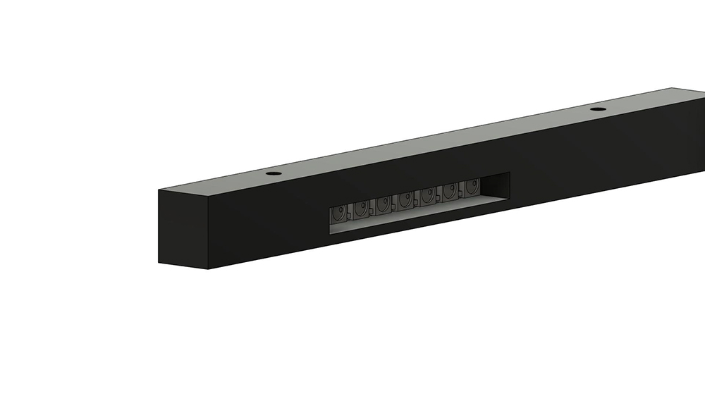
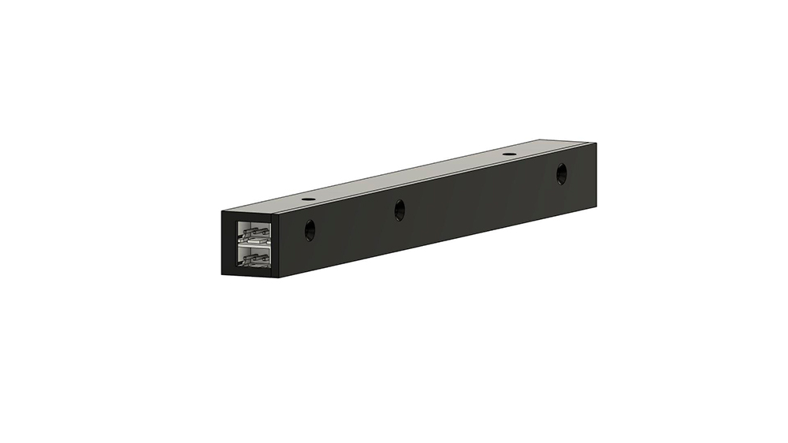

Mounting of neopixels on the Y-rails

Required material:

5x M3x4mm heat inserts

2x M3x6 BHCS for Neopixel

3x M3x6 countersunk flat head for cover

2x M3x8 BHCS for mounting on Y-rails extrusion

