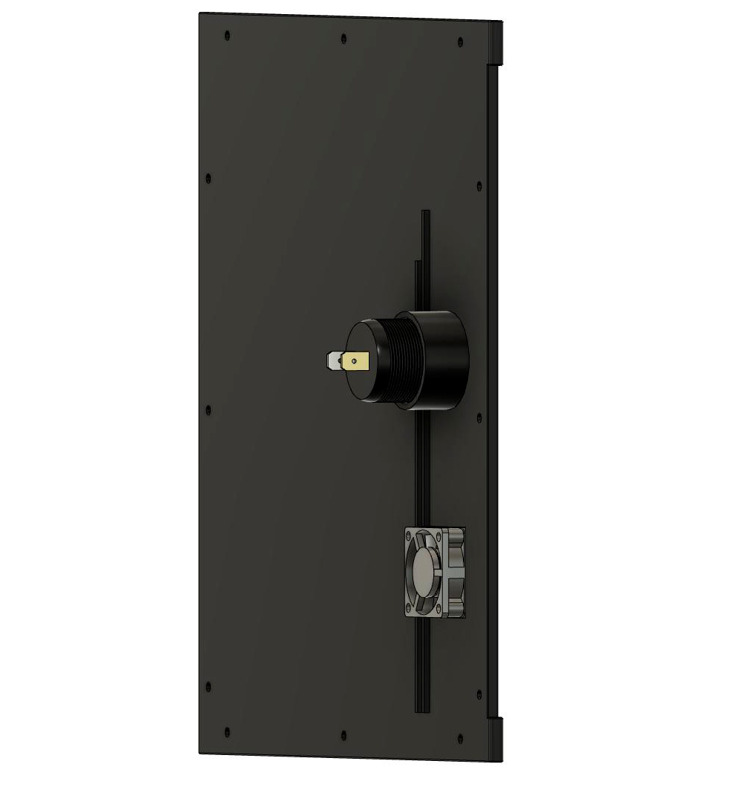
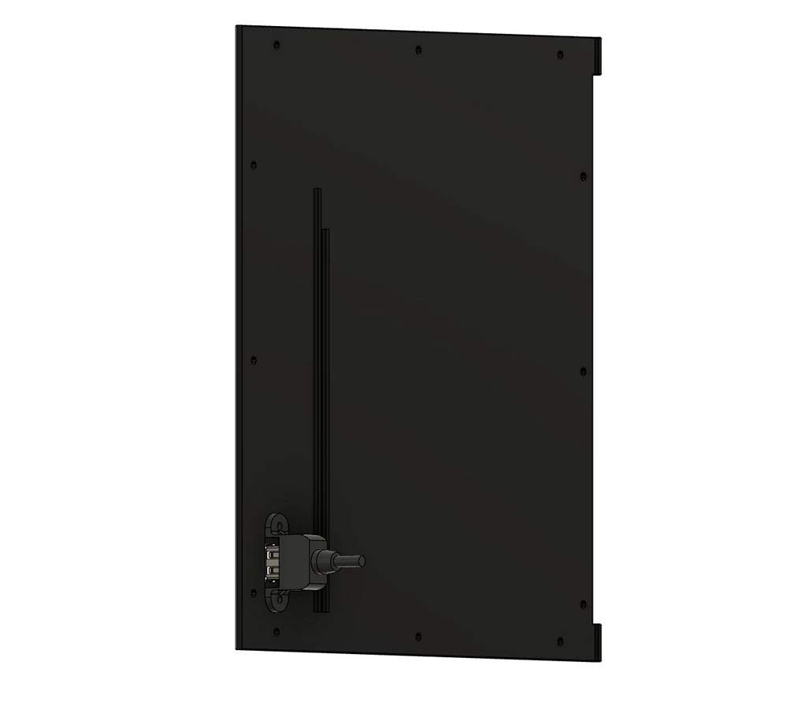

Side panels with integrated hinge.

Carefully drill the 1mm hole to 2.5mm and cut an M3 thread into it

Required material:

2x M3x30 BHCS

1x 30x30x10 5V Fan for Raspberry Pi cooling

1x https://www.amazon.com/ZHSMS-Universal-Replacement-Motorcycle-Waterproof/dp/B08L33RFHY/

1x https://www.amazon.com/Angled-USB3-0-Extension-Industrial-Computer/dp/B07LBFPG16/

