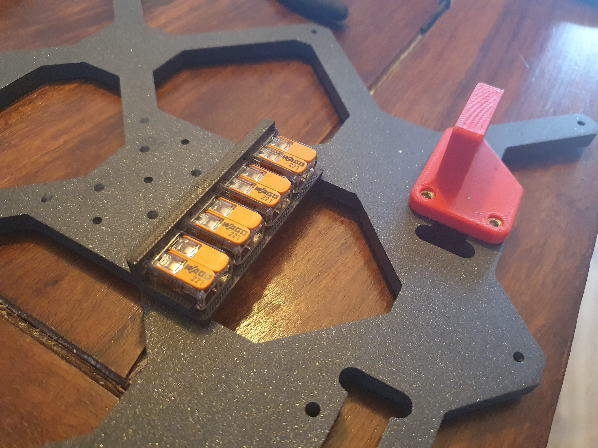
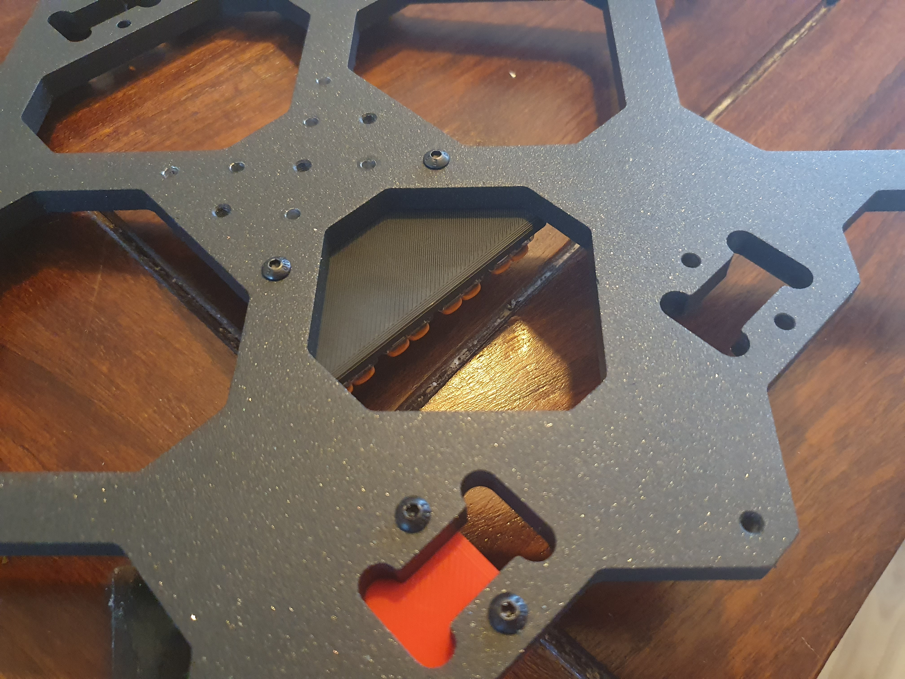

# Wago bed mount for Switchwire

Simple processed Wago bed mount, to make bed disassembly for future projects much easier and use special wires for drag chains as well.

You can use the carriage drill guide from SW repo, just use it the other way around. (https://github.com/VoronDesign/Voron-Switchwire/blob/master/STL/Gantry/Y_Axis/y_carriage_drill_guide.stl)

Print it with standart Voron specs: 

    Layer height: 0.2mm
    Extrusion width: 0.4mm, forced
    Infill pecentage: 40%
    Infill type: grid, gyroid, honeycomb, triangle, or cubic
    Wall count: 4
    Solid top/bottom layers: 5
    Supports: NONE

