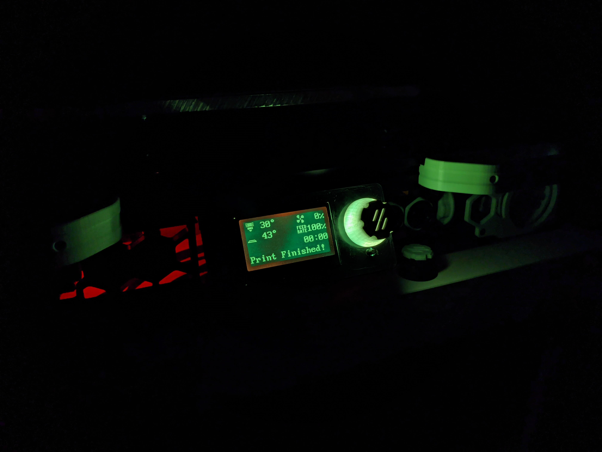
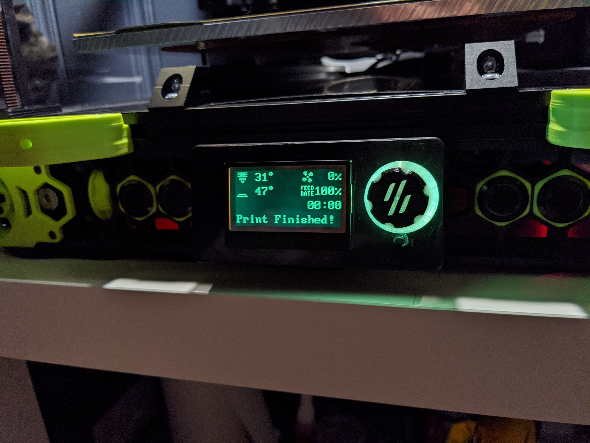

# Mini 12864 LCD Voron Knob

## Images

This is a replacement knob designed for the Mini 12864 Display with RGB LEDs (Fystec).  The knob is designed to be printed in PLA and does not account for any shrinkage when printing with ABS, and may damage the knob if printed in ABS! **YOU HAVE BEEN WARNED!**

The first 3.0mm of the knob is the Voron logo portion, and can be printed in a different color to make it stand out (as shown above).  Best bet is to use the same permiter and infill settings as functional parts for best light diffusion if using clear PLA.

## Instructions
### Clear Dual Color PLA
1. In your slicer of choice, set a filament change after the first 3.0mm.
2. After the first 3.0mm (starting at 3.2mm when using 0.2mm LH), switch from color PLA to clear PLA and continue printing.  For best results, purge any remaining color filament when switching to clear.

### Single-color PLA
1. Load up the STL and print like any other part.