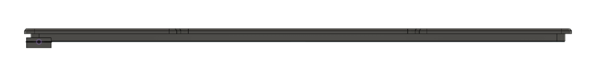
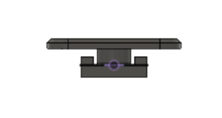
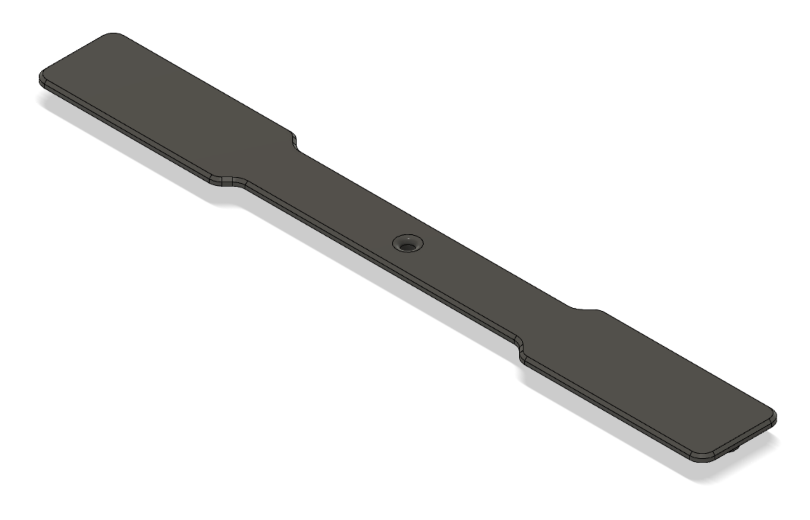
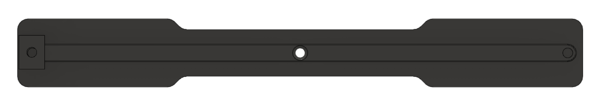
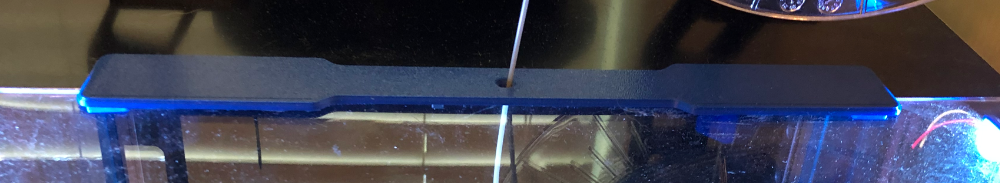
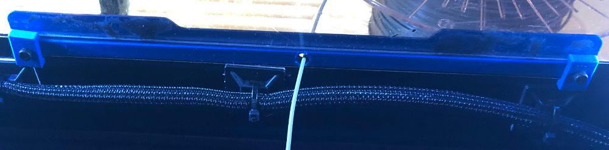

# Voron Switchwire feed slot with filament pass-through

This mod is a replacement for the stock feed_slot.stl, it adds a OD 4mm reverse bowden passthrough hole. It also removes the need for VHB tape with two clamps that screw into heatset inserts.

    
    
    
    

    
    

## Parts Required
 * 2 BOM heatset inserts
 * 2 M3x6 button or socket head

## Printing
- Standard Voron part settings were used but the infill was dropped down to 20%

## Installation
1. Install heatsets on the bottom side of the new filament slot
2. Remove the old feed slot and VHB tape
3. Install the new feed slot and use the two clamps and M3x6 screws to secure

## Note
I designed this orignally for a bowden tube pass-through but at high Z the tube was unmanagable but would love to see if anyone comes up with a solution for this. 