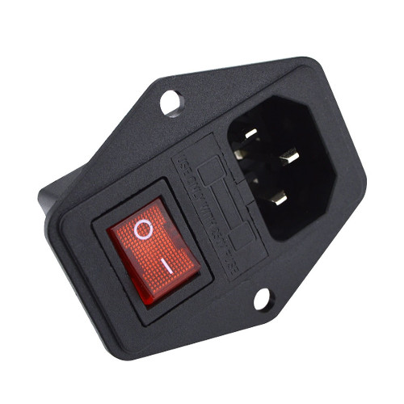
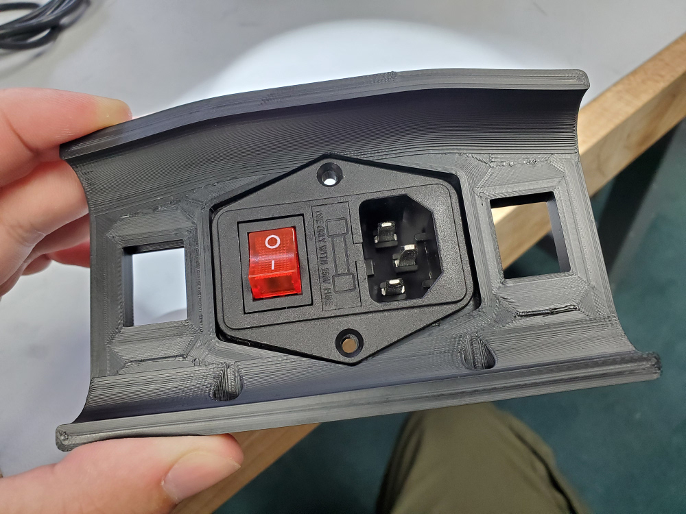

V2.4 Plug Panel Generic Combo
=============================

A modified power plug skirt section which accepts generic amazon plug/switch/fuse combo modules with a hexagonal shape (two mounting holes on flanges on the long sides) such as this:

Fasten with 2x M4x10 self-tapping screws.

