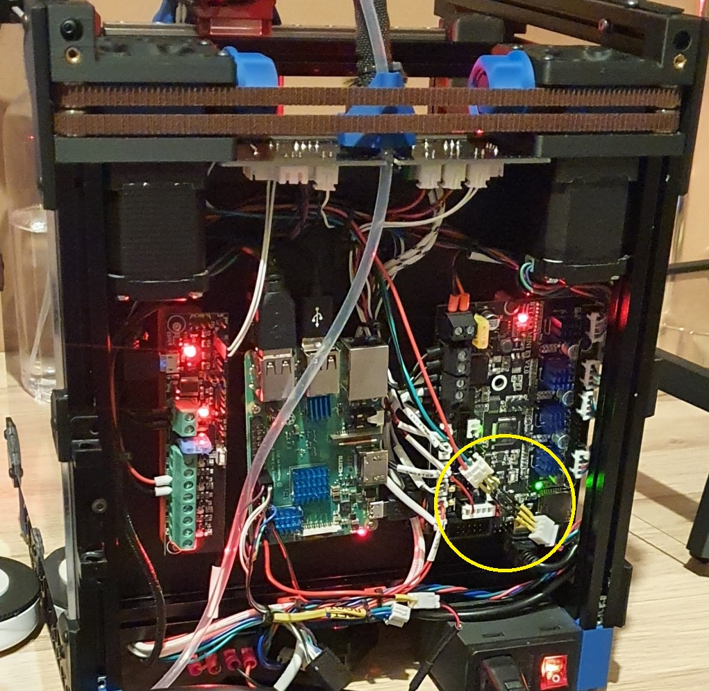
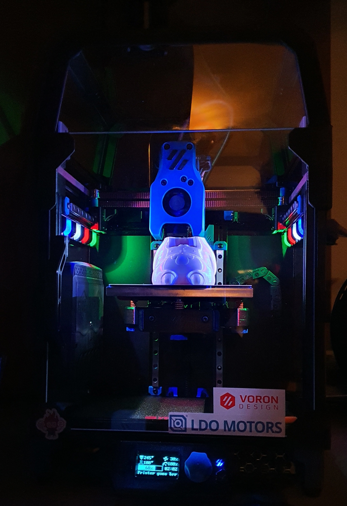

# Snap in 1515 LED mount for WS2812B led strips.


BOM:
- [WS2812BECO Black PCB - 5m 30 IP30](https://www.aliexpress.com/item/2036819167.html "aba")
- Some cables
- A soldering iron
- JST-XH Crimps


Print guide:

Print 9 normal and 9 mirrored.


Mounting:

Push one in, then slide the led strip into it and keep things in the back. Then keep adding one and one until finished. Et voila. Slide the cable over the back panel and into the electronics bay. Wire them in parallel and put them into the BTT SKR Mini E3 V2 neopixel slot.



Klipper config:

```
[neopixel case_lights]
##  Chamber Lighting - In 5V-RGB Position
pin: PA8
chain_count: 4
initial_RED: 0
initial_GREEN: 0
initial_BLUE: 1
```


If this looks familiar contact me so i can credit you. This is based on some other 1515 mount. I just redid the hole for the led strip. It's angled downwards at 5 degrees.



