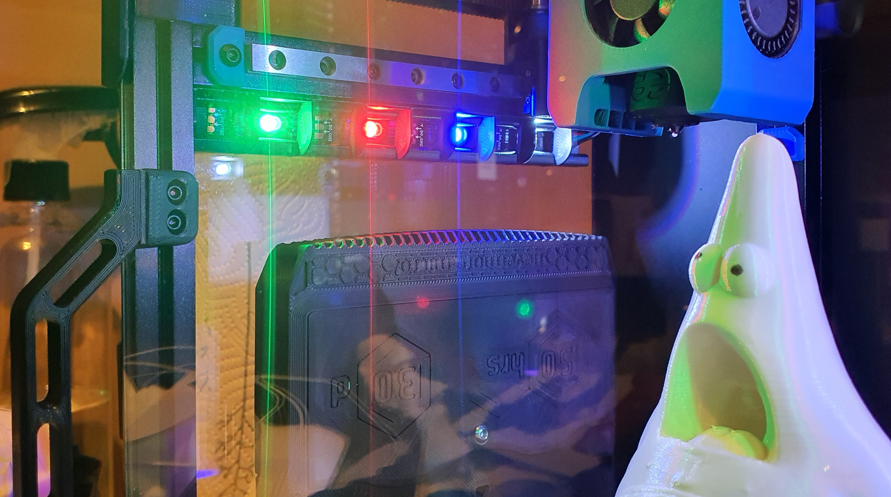

# Snap in 1515 LED mount for WS2812B led strips.


**BOM:**
- [WS2812BECO Black PCB - 5m 60 IP30](https://www.aliexpress.com/item/2036819167.html "aba")
- Some cables
- A soldering iron and some solder
- JST-XH Crimps
Notes about the WS2812: 30 leds per meter fits, but you will only have a led in every second diffuser. 60leds per meter is the perfect fit.


**Print guide:**

Print 9 left and 9 right.


**Preparation:**

I use 9 led's on each side. Solder the cables. Now it's a good idea to test and configure the neopixels too, so you don't have to take it out again after you've mounted it, in case something is wrong.
Just hang them over the spool holder and make sure nothing can short circuit while testing.

**Mounting:**

- Guide the cables through the 1515 extrusion over the mid-panel.
- Push one diffuser in. (Do this in the front with the led strip as far back as possible)
- Slide the diffuser back while guiding the led strip through it. One by one.
- When you get to the last diffuser on either side, you have to partially insert the strip into the diffuser. Then carefully try to bend/align it with the 1515 slot and carefully pop it into place. Having it all the way to the front gives you more leeway to bend without damaging the strip.
- Do the same on the other side.
- After you can wire them in parallel and connect them to the BTT SKR Mini E3 V2 neopixel slot.


**Klipper config for BTT SKR Mini E3 V2:**

```
[neopixel case_lights]
##  Chamber Lighting - In 5V-RGB Position
pin: PA8
chain_count: 9
initial_RED: 1
initial_GREEN: 1
initial_BLUE: 1
```




If this looks familiar contact me so i can credit you. This is based on some other 1515 mount. I just remade the rest. Heavily based on eddie's misumi holders.
