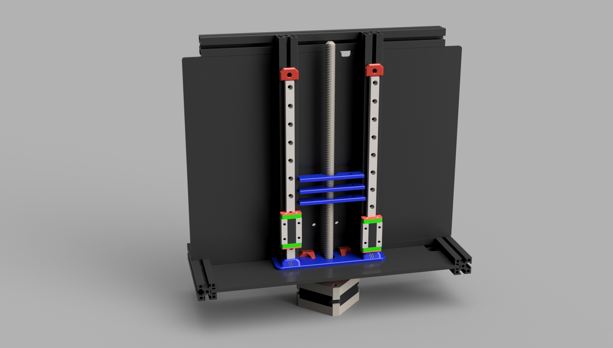

# Z Cover for v0.1

A cover to stop things from dropping down the Z motor and disappearing forever.

**BOM:**
- 2x M3x6 FHCS (Creative users might get away with sandwitching the deck panel inbetween using M3x8 SHCS/BHCS from the bottom)

**Print guide:**

Print the 3 measuring tools to figure out what spacing suits your printer.
Then print the "Bottom_panel_middle_cover_only_X" with the corrensponding letter if you want to just cover the middle.
Or the "Bottom_panel_Z_cover_B" and 2x "Rail_carriage_stopper_x2" if you want the full cover with rail stoppers.

**Preparation:**

Screw the rail stoppers on with the M3x6 FHCS if you went this route.

**Mounting:**

Squish it in at an angle. If you're lucky you'll get it in with some light force. If not, unscrew the rail stoppers and try to attatch those after. Or loosen the z rails and lift them slightly, then put them all the way down again after.
