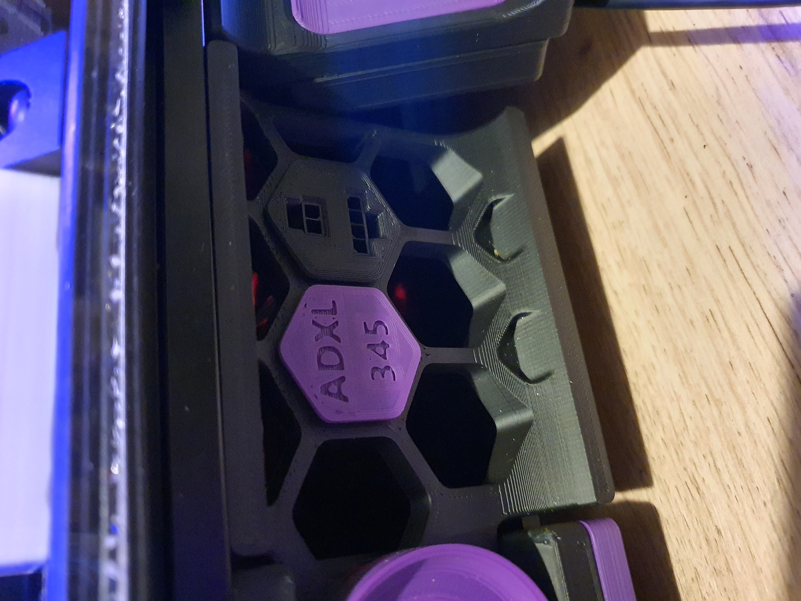

ADXL345 skirt keystone with 2 and 4pin microfit 3.0 connectors. I used what I had laying around.

It's based on alchemyEngine's iteration of the g-code buttons. You can also find assembly instructions there.
https://github.com/alchemyEngine/EnragedRabbitProject/tree/main/usermods/Skirt-Microfit-Inserts

