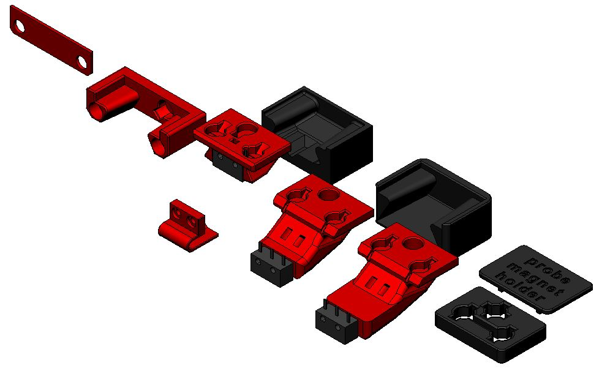

# STL files for common parts for Klicky probe

Here you can find the parts that are common across all printers-

There is no need for supports, all the files are ready to print, they are in the recommended orientation, the standard probe (KlickyProbe_v2.stl) can also be printed with the magnet hole facing down without supports.
You can also use brim on the probes to help with bed adhesion.

- Version 0.1 - initial release
- Version 0.2 - Revised probe and dock to improve the docking fit, remaining components are compatible
  - Thanks to oc_geek for improving the probing of a badly tilted gantry (10º) and the probe and dock attachment, it's much better now
- Version 2
  - Reduced the dock by 2mm, extended the dock mounts by 2mm
  - Added two new probes, one mostly for Voron v0 the oher for Tiny-M, they extend the original by different lengths below the nozzle

The Klicky Probe consists on four different components:
- Toolhead mount, found on the printer specific STL directory
- the probe itself
- probe dock
- Frame dock mount, found on the printer specific STL directory

The recommended printing configuration are:

* initial layer height:0,24
* layer height: 0.2mm
* bottom/top/perimeters: 4
* infill: more than 23%
* infill type: Cubic
* Thin walls: On

