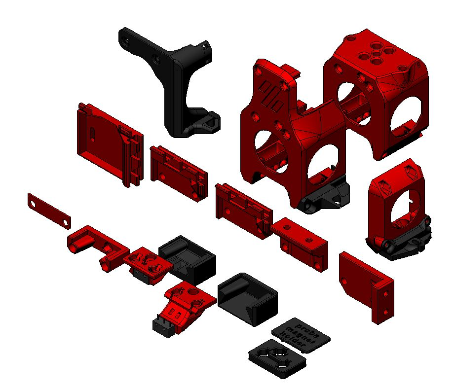

# Klicky Probe for  v0 printers

**This is an intermediate/advanced configuration, it's recommended to first build your Voron to the stock configuration**
That way, you will be better familiarized with the concepts that are presented here and will have a much more enjoyable experience.

With an integrated mount, the bed can be fully used during printing, the bed only cannot be probed (at most) 6mm on the left side, this is due to the design of the probe, that extends below the nozzle.

There are currently two other probes available to use on the V0.1, Slideswipe and Sideswipe.

Above all, have fun and be excellent to one another, the instructions on how to install and setup the klicky probe for  Vorondesign V0(.1) can be found [here](https://github.com/jlas1/Klicky-Probe/tree/main/Printers/Voron/v0).

For me, and for a lot of users, it is working very well, if you decide to use it, give me feedback, either here, or on discord, my discord user is JosAr#0517.

By standing on the shoulders of giants, lets see if we can see further.
