# Klicky Probe for  v0 printers

Here you will find the necessary files and documentation to print and setup your own klicky probe on the v0 (and v0.1)

This directory has the STL files properly oriented for printing and community mods for the respective printer, there are [klipper](https://github.com/jlas1/Klicky-Probe/tree/main/Klipper_macros) macros and [RRF](https://github.com/jlas1/Klicky-Probe/tree/main/RRF_macros) macros on the main repository.

With an integrated mount, the bed can be fully used during printing, the bed only cannot be probed (at most) 6mm on the left side, this is due to the design of the probe, that extends below the nozzle.

There are currently two other probes available to use on the V0.1, Slideswipe and Sideswipe.

Above all, have fun and be excellent to one another, now to the instructions.


## Mounting options

### Probe dock mount

The probe dock is mounted to the front right extrusion, where it minimizes the chance of being removed inadvertently during printing, like this:

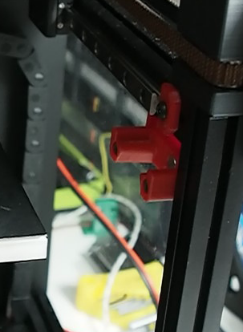

There are several mounting options, depending on your setup:

It can be frustrating on the v0 to add extra m3 nuts on the 1515 extrusion after the assembly is complete, so there are several screwless probe dock options to avoid that scenario.

|                      Screwless variable                      |                            Fixed                             |                       Fixed extrabeef                        |                         Top screws                          |                         Side screws                          |
| :----------------------------------------------------------: | :----------------------------------------------------------: | :----------------------------------------------------------: | :---------------------------------------------------------: | :----------------------------------------------------------: |
|    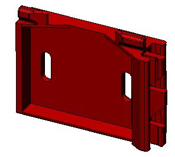     |      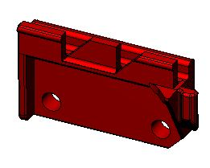      |    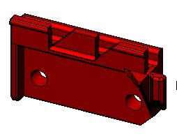    |   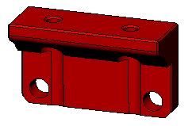    |   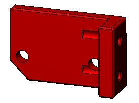    |
| recommended for most setups, does not require extra m3 nuts on the extrusion (v0.0/1) | fixed position, does not require extra m3 nuts on the extrusion (v0.1) | fixed, fits X carriages that are 2mm thicker, does not require extra m3 nuts on the extrusion(v0.1) | fixed, requires 2 extra m3 nuts on the top extrusion (v0.1) | fixed, requires 2 extra m3 nuts on the front extrusion (v0.1) |

### Probe toolhead mount

The v0 toolhead was not designed to use a probe, so there is no inbuilt location to add one, so i designed two options for the v0.1 variant and one for the original v0.

#### Front cowling mount (v0.1)

You can install a mount the attaches to the front of the toolhead cowling, it will need 2/3mm of X space on the front right of the bed to avoid picking the probe up by accident, it is very easy to install, it's ideal to test the concept of probing on the v0.1

|  | 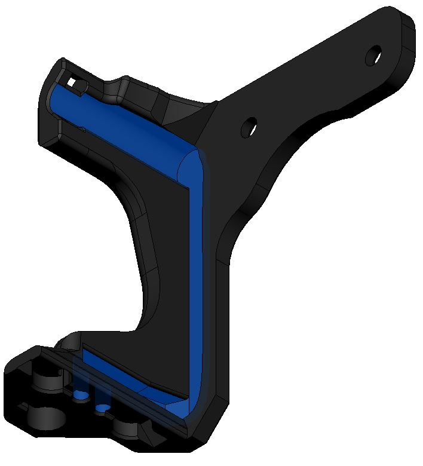 |
| -------------------------------------------------------- | ------------------------------------------------------------ |

You will require 2x M3 x 40mm (BHSC preferably) that are not on the V0(.1) BOM, there is an included wire path with zip tie support, to keep your printer looking good.

#### Integrated cowling (v0.1)

You can replace the cowling with a version that has a cutout to allow the klicky mount to attach, it has no impact on the cooling performance of the probe, it also includes a wire path to the back of the miniAB.

| 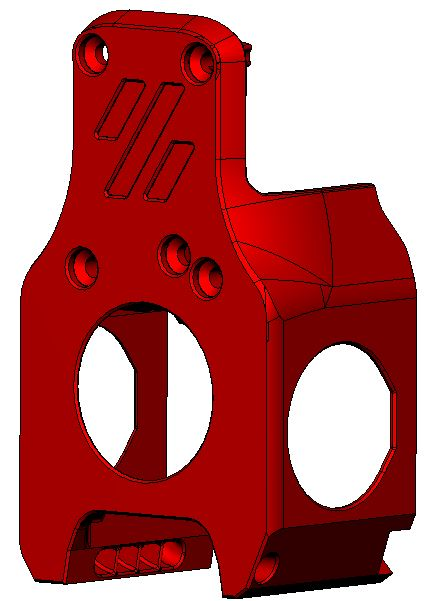 | 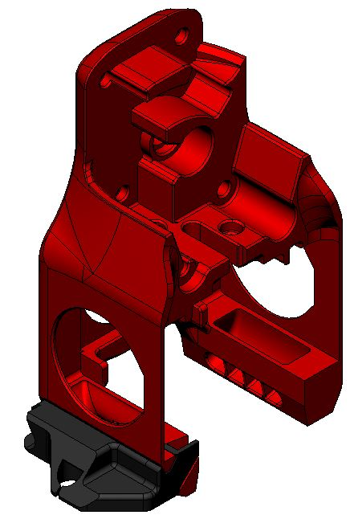 |
| ------------------------------------------------------------ | ------------------------------------------------------------ |

This method allow mounting of different probes on the V0.1, currently only klicky uses this mount, hopefully that can change in the future.

It also allows to pick up the probe at X121, effectively outside the bed, incurring in a no print space lost.

#### Fan duct mount (v0.0)

On the V0.0, you do not need to reprint the entire cowlink, you only need to replace the right fan duct with a version that has a mount for klicky, it has no impact on the cooling performance of the probe, it also includes a wire path to the back of the miniAB.

| 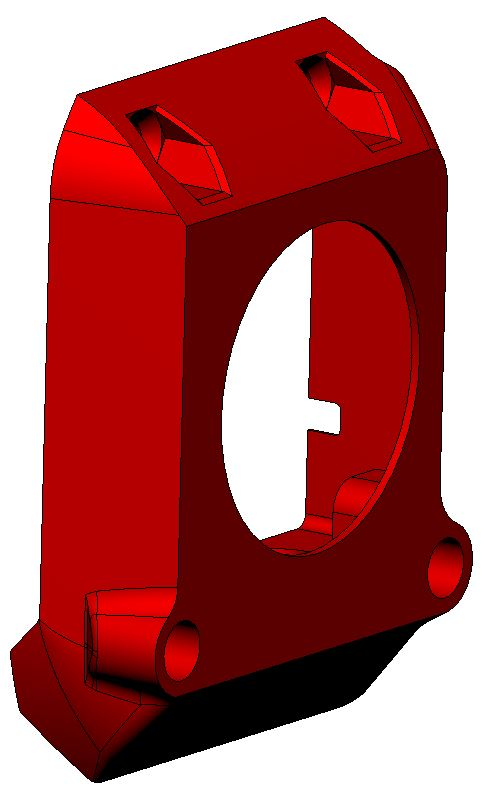 | 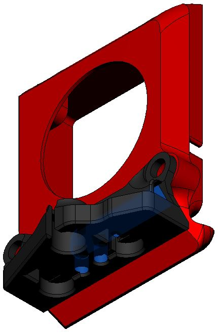 |
| ------------------------------------------------------------ | ------------------------------------------------------------ |

This version has seen little tests because of the lack of a sufficient number of v0.0 to test on.

If you end up using this version, please tell me at what X do you dock and attach the probe.

It is also necessary to use the Screwless variable dock mount 


## Bill of Materials (BOM)

### Tools:

- 1.5mm Drill (optional)
- Multimeter to check for Continuity 
- Super Glue (optional)
- Soldering Iron

### Probe:

- 1x microswitch (the omron D2F-5 or D2F-5L (removing the lever is required), other also work with reduced accuracy or repeatability (mostly anecdotal evidence, needs a proper sudy)
- 2x M2x10 mm self tapping
- 10cm of 22AWG cable (to wire the magnets to the switch)
- 5x 6 mm x 3 mm magnets (N35 magnets work)

### Probe mount:

| Front cowling mount (v0.1)                                   | Integrated cowling mount (v0.1)                              | Fan duct mount (v0.0)                                        |
| ------------------------------------------------------------ | ------------------------------------------------------------ | ------------------------------------------------------------ |
| 4x 6 mm x 3 mm magnets (N35 magnets work)                    | 4x 6 mm x 3 mm magnets (N35 magnets work)                    | 4x 6 mm x 3 mm magnets (N35 magnets work)                    |
| 2x 20cm 22AWG cable (to connect the Klicky Probe to the umbilical termination point) | 2x 20cm 22AWG cable (to connect the Klicky Probe to the umbilical termination point) | 2x 20cm 22AWG cable (to connect the Klicky Probe to the umbilical termination point) |
| two wires to connect the controller to the extruder motor vicinity | two wires to connect the controller to the extruder motor vicinity | two wires to connect the controller to the extruder motor vicinity |
| 2x M3 x 40mm BHSC                                            | 1x M3x6 mm BHSC Screw                                        | 1x M3x6 mm BHSC Screw                                        |
|                                                              | 1x M3 threaded insert M3x5 mmx4 mm                           | 2x M3 threaded insert M3x5 mmx4 mm                           |

### Probe dock:

- 1x 6 mm x 3 mm magnets (N35 magnets work)
- 2x M3x16 mm

### Probe dock mounts:

| Screwless variable (v0.0/1) |            Fixed (v0.1)            |       Fixed extrabeef (v0.1)       |         Top screws (v0.1)          |         Side screws (v0.1)         |
| :-------------------------: | :--------------------------------: | :--------------------------------: | :--------------------------------: | :--------------------------------: |
|          2x m3 nut          | 2x M3 threaded insert M3x5 mmx4 mm | 2x M3 threaded insert M3x5 mmx4 mm | 2x M3 threaded insert M3x5 mmx4 mm | 2x M3 threaded insert M3x5 mmx4 mm |
|                             |                                    |                                    |             2x m3x8 mm             |             2x m3x8 mm             |

## Parts location

The probe STL's are located [here](../../Base_STL).

The printer specific STL's are located [here](./v0_STL).

The CAD with all the parts are [here](../../CAD).

## What to print

### Probe 

* 2x KlickyProbe_Long_v2.stl (keeping a spare is always a good idea)

The KlickyProbe_v2.stl is also compatible, but has a different Y offset and cannot probe all the bed.

#### Helpers to pressfit the probe magnet

* Probe_magnet_pressfit_helper.stl

* Probe_magnet_holder.stl

* Longer_probe_pressfit_helper.stl

### Probe mount

| Front cowling mount (v0.1) | Integrated cowling mount (v0.1)   | Fan duct mount (v0.0)   |
| -------------------------- | --------------------------------- | ----------------------- |
| Front_cowling_mount.stl    | MiniAB_Dragon_Cowling_wKlicky.stl | V0_Fan_duct_wKlicky.stl |
| v0.1_integrated_mount.stl  | v0.1_integrated_mount.stl         | v0_integrated_mount.stl |

There are also other integrated cowlings, check the [STL] folder, namely, the Serpa_Mini_Dragon_Cowling_wKlicky.stl from [Kyrios](https://github.com/KurioHonoo/Mini-AfterSherpa) and the LGX Lite cowling from [Bondtech](https://www.bondtech.se/2021/12/27/voron-v0-1-toolhead-setup-for-lgx-lite/).

### Probe dock

* Probe_Dock_v2.stl

### Probe dock mounts

| Screwless variable (v0.0/1) | Fixed (v0.1)        | Fixed extrabeef (v0.1)  | Top screws (v0.1)       | Side screws (v0.1)       |
| --------------------------- | ------------------- | ----------------------- | ----------------------- | ------------------------ |
| DockMount_variable.stl      | DockMount_fixed.stl | DockMount_extrabeef.stl | DockMount_TopScrews.stl | DockMount_SideScrews.stl |

### Printing instructions

Recommended printing settings:

* initial layer height:0,24
* layer height: 0.2mm
* bottom/top/perimeters: 4
* infill: more than 23%
* infill type: Cubic
* Thin walls: On

It was tested and printed with ABS, might work on other materials, if you try, let me know how it worked out.

### Typical V0.1 components

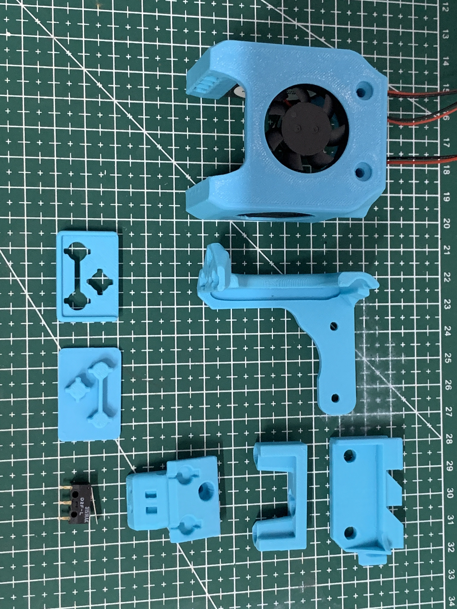

(the images with the green background were provided by user SunB#1489 and are being used with permission).

## Assembly

### Step 1 - Dock mount and Probe Dock assembly 

In this examples, the Fixed dock will be used.

- [ ] 2x M3 threaded insert M3x5 mmx 4 mm
- [ ] 1x 6 mm x 3 mm magnets
- [ ] 2x M3x16 mm
- [ ] Super Glue

Here we will use the Fixed dock as an example, the other docks are very similar.

Install your heat set threaded inserts like you did within your Voron build. 

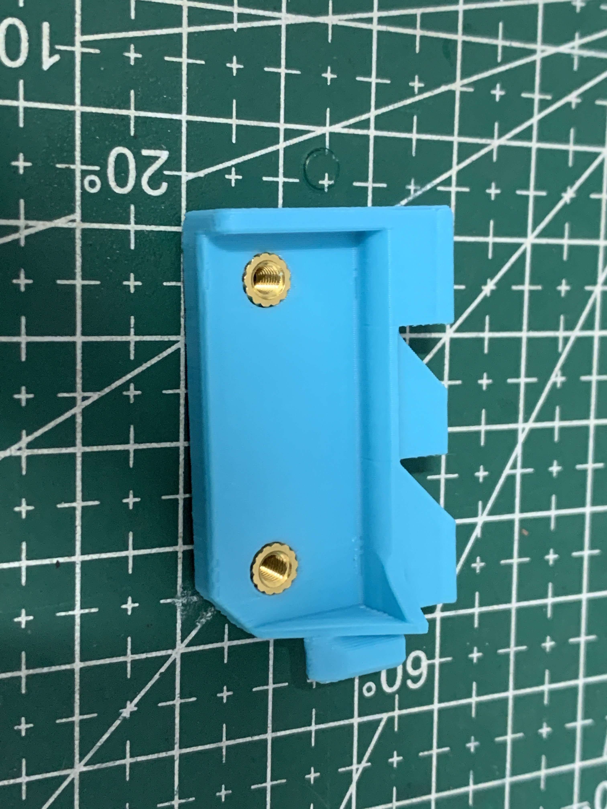

Install the magnet in the Probe dock, make sure that the magnet is fully inserted, it's top should be below the plastic.

Screw the dock onto the Dock mount with the two M3x16mm screws.

Secure the magnet with a dab of super glue (not a lot, just a drop).

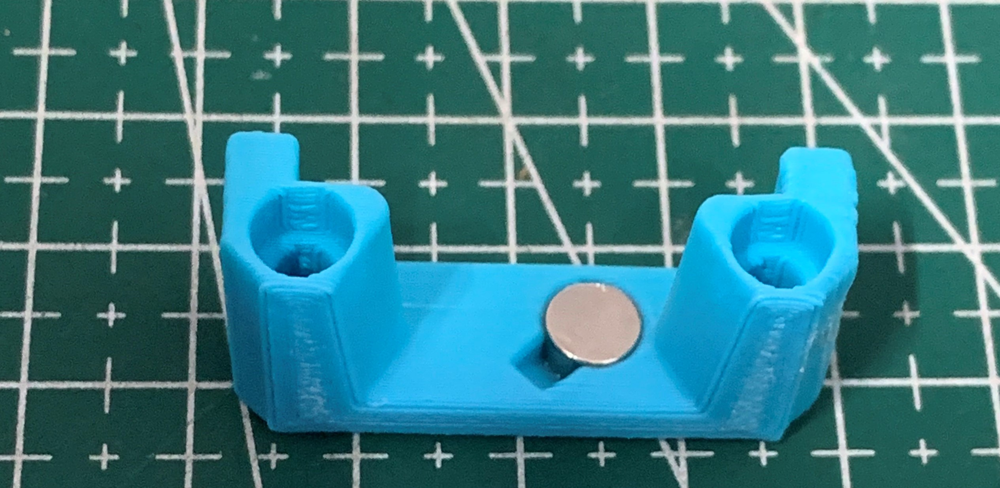

Mount the Probe Dock to the front right extrusion, snap first on the front extrusion, then on the top one (do this after assembling the probe).


### Step 2: Probe Assembly

For the probe assembly you need the following parts:

- [ ] 1x microswitch
- [ ] 2x M2x10 mm self tapping
- [ ] 5x 6 mm x 3 mm magnets
- [ ] 10cm of 22AWG cable
- [ ] 1.5mm Drill (optional)
- [ ] Multimeter to check for Continuity 
- [ ] Super Glue

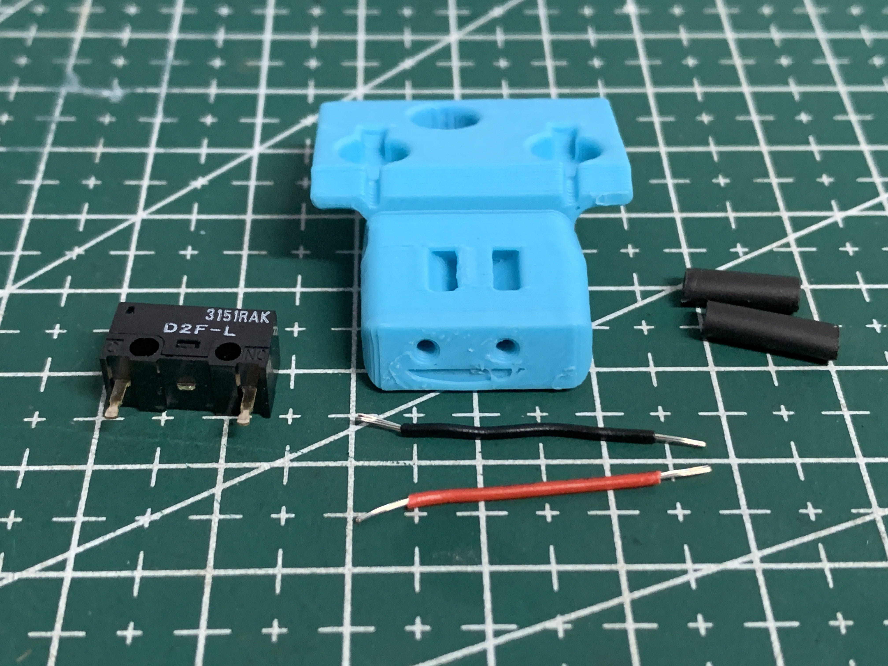

Maybe you need to clear the holes for the microswitch, a 1.5mm drill bit should work fine.

Install the microswitch so that the arrow on the probe body is pointing to the little switch.

The best way to install the back magnet is to attach a magnet to the probe dock and slide the probe on the dock to insert some distance and the insert he remaining with a tool, it should be slightly below the plastic.

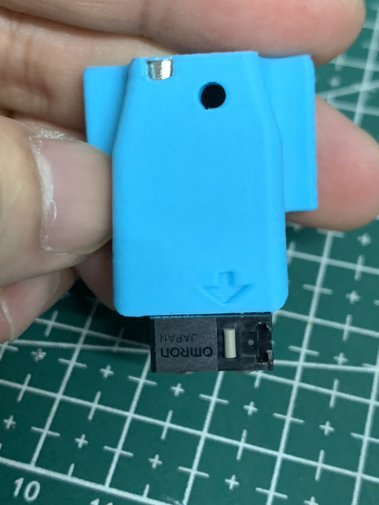

Then take your self tapping screws and screw the microswitch in place, you should also now solder the wires to the outside pins of the switch, that way making this a Normally Connected probe.

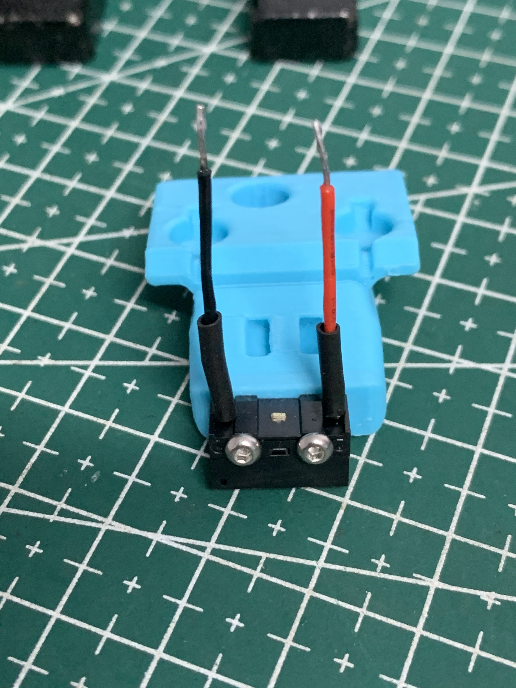

You should place the wires cover outside the ducts to the magnets and install them in the space below the magnets, more like the right wire is on the image below.

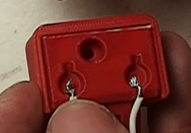

You want to install the magnets in the way that the ones which are connected to the microswitch, have the same polarity.

Before placing the switch magnets, use some super glue on the holes (not a lot, just a drop), avoid the wires and the top of the magnets.

The 3rd magnets (there are two) should have the inverse polarity, wait until the system is complete and assembled before gluing the magnets, they might need adjustment to ensure a good fit on the mount.

You can use the included pressfit helpers to help in securing the probe when you are inserting the magnets.

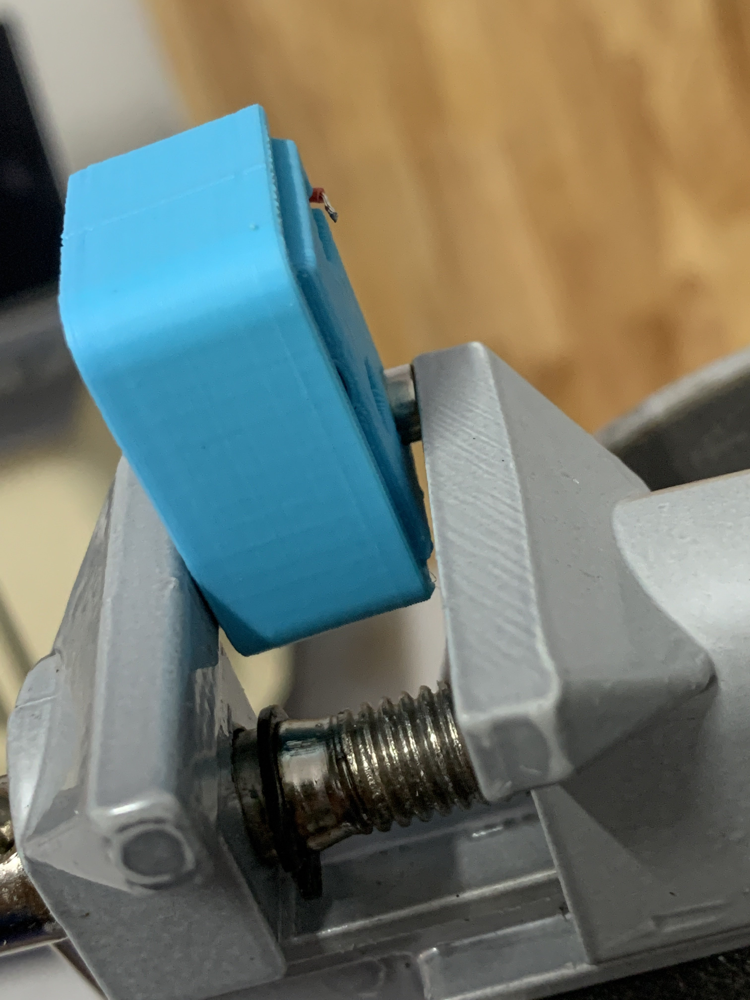

There is no need for soldering, the probe microswitch connectors are press-fit on the magnets, they should remain with the top above the probe plastic.

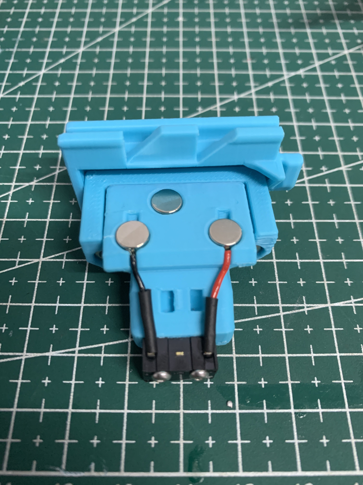

As the last step of the probe assembly check if you have continuity between two magnets that connect to the switch.

If you have a normally closed switch (as you should), then you should have a current flow, so continuity is established. When you press the switch you should lose continuity. When you have a normally open switch then the behavior is the other way around.

### Step 3: Probe mount Assembly

In this example, the Front cowling mount will be used.

For the Front cowling mount assembly you need the following parts

- [ ] 4x 6 mm x 3 mm magnets
- [ ] 2 x 20cm 22AWG cable to connect the Klicky Probe to the Mircofit Terminal
- [ ] two wires to connect the controller to the extruder motor vicinity
- [ ] some microfit or jst hardware
- [ ] 2x M3 x 40mm BHSC 
- [ ] Multimeter to check for Continuity 
- [ ] Super Glue

The probe mount wires are also connected with pressure from the magnets, you can use the probe magnets as a template to insert the probe mount magnets, it is easier that way, so that the magnets are not inserted the wrong way.

again, before placing the wire magnets, use some super glue on the holes (not a lot, just a drop), avoid the wires and the top of the magnets.

The 3rd magnets (there are two) should have the inverse polarity, exacly like on the probe.

Wait until the system is complete and assembled before gluing the 3rd magnets, they might need adjustment to ensure a good fit on the probe.

| 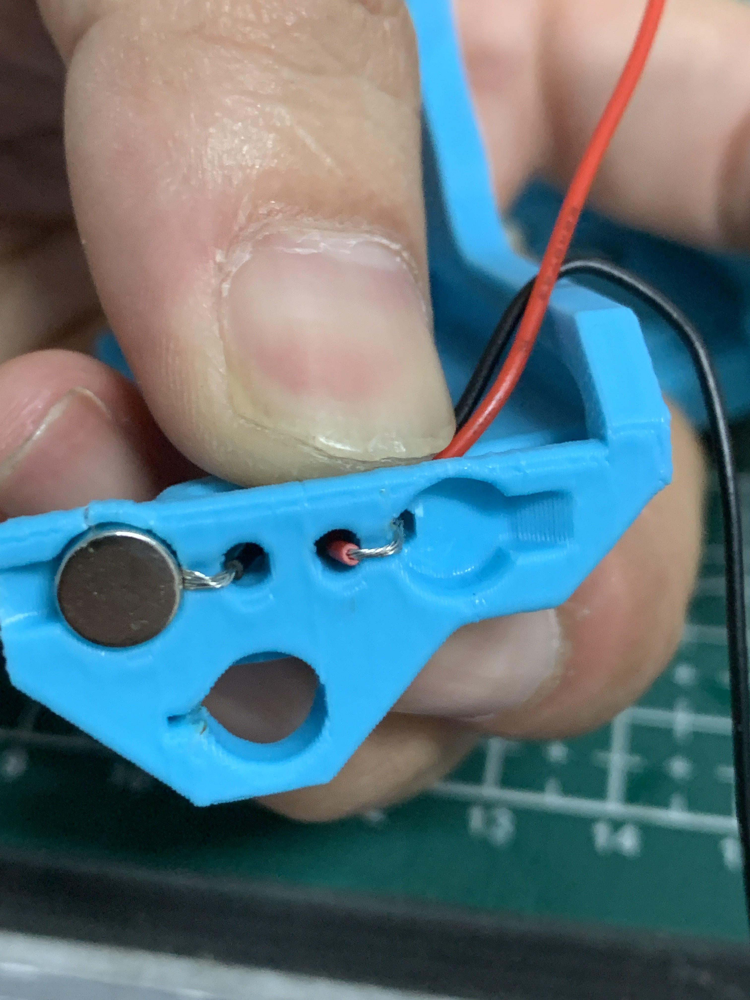 | 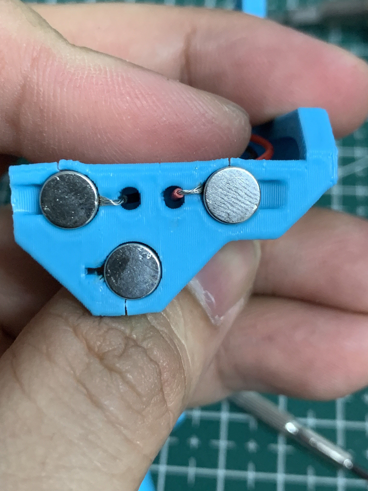 | 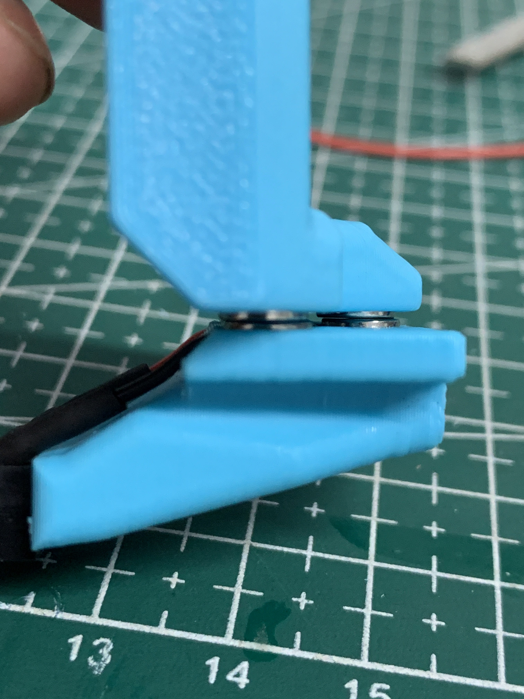 |
| :----------------------------------------------------------: | :----------------------------------------------------------: | ------------------------------------------------------------ |

(The mount has since been improved a bit to avoid cracking)

After everything is assembled let's check again for continuity, this time joining the ends of the cable and testing connectivity on the two wire magnets that have a cable.

### Step 4: Probe Mount installation and wiring

For the installation you need the following parts:

- [ ] 2x M3x40 mm BHSC Screws

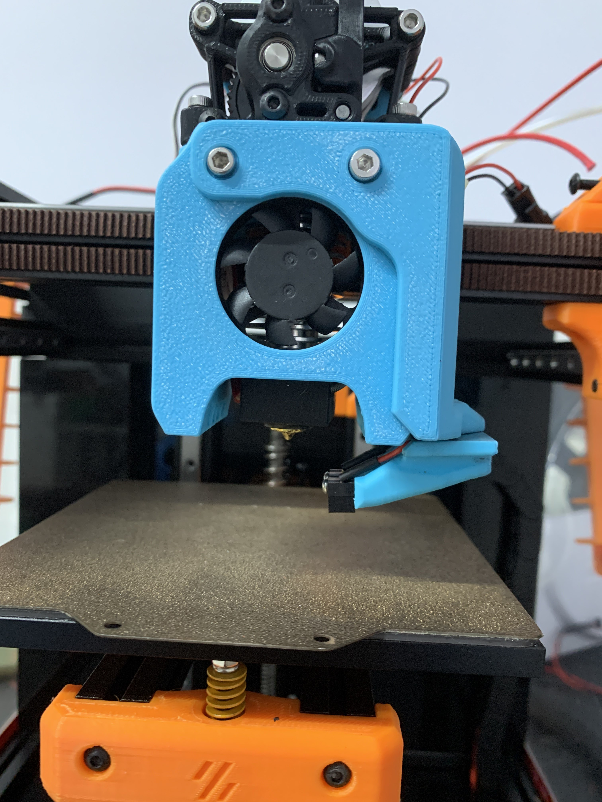

Route the probe mount cables to near the end of the V0 umbilical, install a male terminal in there.

**Before going further, please turn off the printer, the SKR boards are very picky with short circuits.**

Connect a female terminal to the wires that will run in the umbilical from the toolhead to the controller.

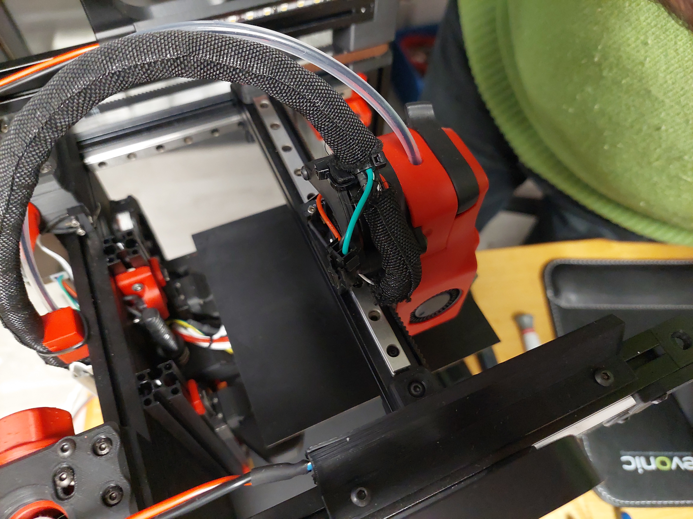

Connect the wires from the Klicky Probe to the Zprobe port, on GND and PC14 bin (I reused the LDO kit connector)

| 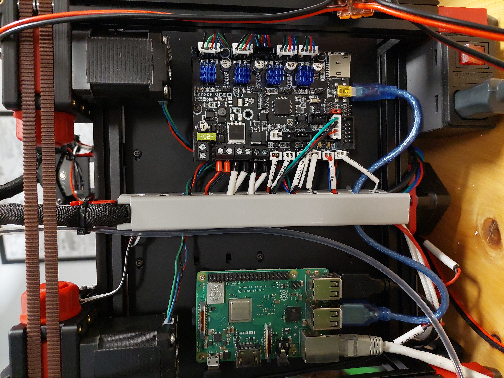 | 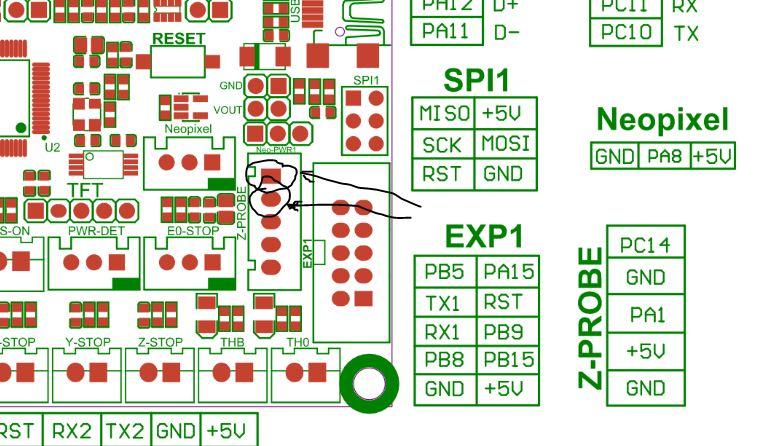 |
| --------------------------------------------------- | ------------------------------------------ |


When testing the docking and attachment of the probe, make sure that the back magnet of the probe and the dock magnet do not touch, if they do, it will make attaching the probe much harder.

### Step 5: klipper configuration

For klipper configuration, please check the updated instructions on the [main repository](https://github.com/jlas1/Klicky-Probe/tree/main/Printers/Voron/v0#step-5-klipper-configuration).

#### Assembled Klicky Probe

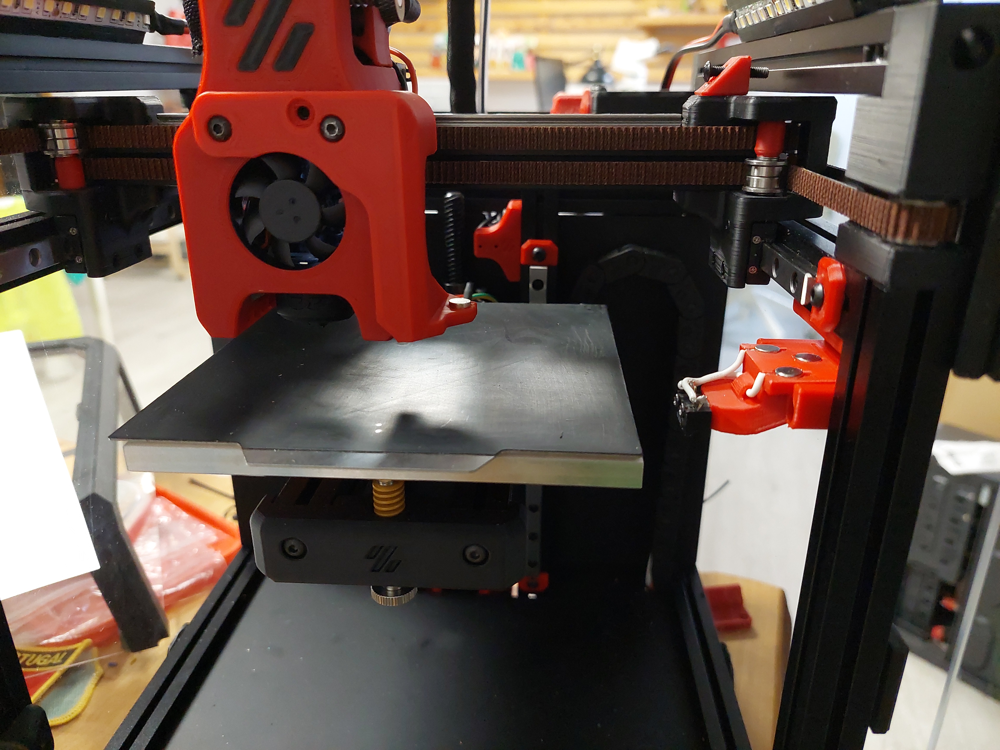


### Step 6: klipper  Dock/Undock  configuration
#### Y max position adjustment

Even in the stock Y endstop with a lever, you normally can add a extra mm of Y travel due to the lever extra trigger distance:

```python
[stepper_y]
position_endstop: 120
position_max: 121
```

#### Adjust Probe Pickup Position

One of the last things we need to do is to adjust the probe pickup position.

Make sure that the x and y axis are homed and the probe is manually attached to mount.

Now manually (with gcode commands) move the toolhead to the probe dock and move it so far to the back that the probe docks, note the Y-Position.

Next, again manually, move the toolhead parallel to the probe dock until the probe it is perfectly aligned with the mount, note the X.Position.

Open your `klicky-variables.cfg` and find the `#dock location` section and edit the following two line

```python
variable_docklocation_x:
variable_docklocation_y:
```

Test now with the ATTACH_PROBE and DOCK_PROBE if it docks and is removed correctly, some common points that can give problems are:

* the dock magnet is touching the back probe magnet, they cannot touch, push them further in
* the probe is hitting the dock arms, please move the toolhead more to the side where the probe does not hit, by 1mm at a time, until it works
* the probe is falling after being release, the dock is too far away, you can insert one or several 1mm spacer to move the dock and solve this

***WARNING when you are doing PROBE_ACCURACY, make sure that the probe is above the bed, the PROBE_ACCURACY macro does not move the toolhead in X or Y.***

Congratulations, your done :).

## Firsts tests

Before starting to test klicky, and from past mistakes, please remove your PEI sheet (the probe works on the magnetic sheet) and if possible, change your printer maximum speed, acceleration and Z current, on klipper with TMC steppers, you can do this:

```python
SET_TMC_CURRENT STEPPER=stepper_z CURRENT=0.2 
SET_VELOCITY_LIMIT ACCEL=1000
SET_VELOCITY_LIMIT VELOCITY=50
```

Enjoy your Klicky Probe!


## Dock and undock video

https://youtu.be/qqRuQJcBS7o

It is working very well, if you decide to use it, give me feedback, either here, or on discord, my discord user is JosAr#0517.

By standing on the shoulders of giants, lets see if we can see further.
