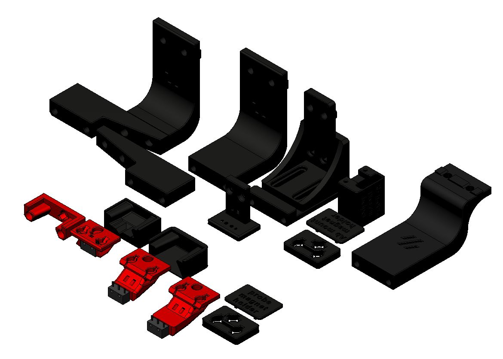

# Klicky Probe for  Vorondesign V1.8,V2.4, Legacy and Trident printers

**This is an intermediate/advanced configuration, it's recommended to first build your Voron to the stock configuration**
That way, you will be better familiarized with the concepts that are presented here and will have a much more enjoyable experience.

Above all, have fun and be excellent to one another, the instructions on how to install and setup the klicky probe for  Vorondesign V1.8,V2.4, Legacy and Trident printers can be found [here](https://github.com/jlas1/Klicky-Probe/tree/main/Printers/Voron/v1.8_v2.4_Legacy_Trident)

For me, and for a lot of users, it is working very well, if you decide to use it, give me feedback, either here, or on discord, my discord user is JosAr#0517.

By standing on the shoulders of giants, lets see if we can see further.
