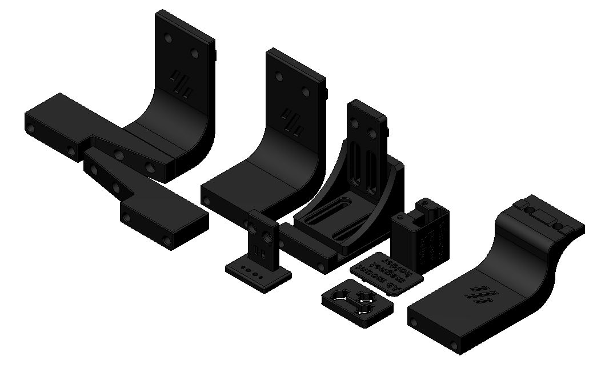

# STL files for Klicky probe on a Voron v1.8,v2.4,Legacy,Trident

Here you can find the parts that are Voron v1.8,v2.4,Legacy and Trident specific.

There is no need for supports, all the files are ready to print, they are in the recommended orientation.

The Klicky Probe consists on four different components:
- Toolhead mount
- the probe itself, found on the initial STL directory
- probe dock, found on the initial STL directory
- Frame dock mount

The recommended printing configuration are:

* initial layer height: 0,24
* layer height: 0.2mm
* bottom/top/perimeters: 4
* infill: more than 23%
* infill type: Cubic
* Thin walls: On

